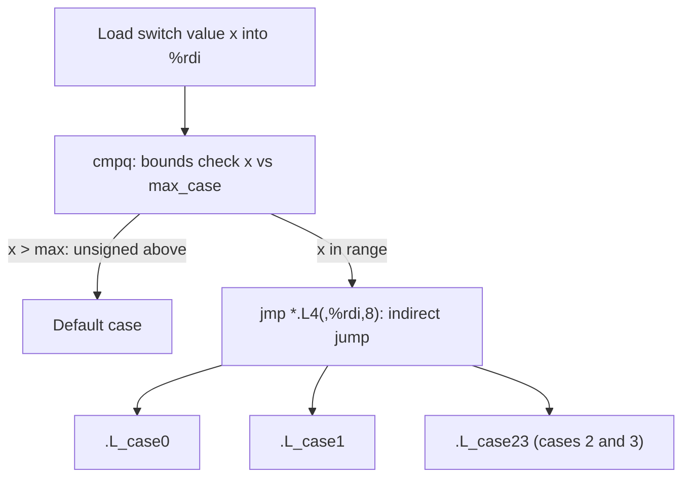

# CSE351: Switch Statements

Switch statements use **jump tables** and **indirect jumps** for efficient multi-way branching. Instead of testing each case sequentially (as a chain of if-else would), the compiler builds an array of code addresses and uses the switch value as an index — making the branch O(1) regardless of the number of cases.

---

## Jump Tables

A **jump table** is an array stored in the read-only data section (`.rodata`), where each entry holds the address of a case's code block.

### Structure

- Array indices correspond to case values (possibly offset by the minimum case value).
- Array entries are pointers to code blocks.
- More efficient than sequential if-else when cases are dense (not too many gaps).
- The compiler emits a **bounds check** first; values outside the valid range jump to the default case.

---

## Indirect Jumps

An **indirect jump** reads the target address from memory or a register, rather than encoding it directly in the instruction.

### Syntax

```assembly
jmp *Loc
```

The **asterisk (`*`)** indicates an indirect jump — the destination is the *value at* or *in* `Loc`, not `Loc` itself.

### Example with Jump Table

```assembly
jmp *.L4(,%rdi,8)
```

- `.L4` = base address of the jump table in memory
- `%rdi` = switch value (the case index)
- `8` = size of each pointer entry (8 bytes on 64-bit)

The effective address formula: `Mem[.L4 + %rdi * 8]` — fetch the pointer at that table slot, then jump to it.

---

## Complete Example

### C Code

```c
switch (x) {
    case 0: return a;
    case 1: return b;
    case 2:
    case 3: return c;
    default: return d;
}
```

### Jump Table (in `.rodata`)

```assembly
.L4:
    .quad .L_case0    # case 0
    .quad .L_case1    # case 1
    .quad .L_case23   # case 2 (same target as case 3)
    .quad .L_case23   # case 3
```

### Assembly

```assembly
cmpq $3, %rdi         # Bounds check: is x > 3?
ja .L_default         # Jump to default if out of range (unsigned "above")
jmp *.L4(,%rdi,8)     # Indirect jump via table

.L_case0:
    movq %rax, %rax
    ret
.L_case1:
    movq %rbx, %rax
    ret
.L_case23:
    movq %rcx, %rax
    ret
.L_default:
    movq %rdx, %rax
    ret
```

---

## Handling Special Cases

| Case | Implementation |
|:---|:---|
| Multiple labels for same code | Two table entries point to the same address |
| Fall-through | Consecutive code blocks with no `ret` or jump between them |
| Default | Non-specified indices (out-of-range) jump directly to default label |
| Sparse cases | Compiler may use if-else instead of a table if gaps would waste too many entries |

---



---

## Related

- [[Jump Instructions|Jump Instructions]]
- [[CSE351/x86-64 Assembly/Conditionals|Conditionals]]
- [[Program Counter|Program Counter]]
- [[CSE351/Data Structures/Arrays|Arrays]]
- [[CSE484/Memory Exploits/Memory Layout|Memory Layout (CSE484)]]

---

## Industry Standard Terms

| Course Term | Industry / Standard Term |
|:---|:---|
| Jump table | Branch table; dispatch table; computed goto |
| Indirect jump (`jmp *`) | Indirect branch; register-indirect jump |
| `.rodata` section | Read-only data segment; constant pool |
| Bounds check before table jump | Range check; guard condition |
| Fall-through in switch | Intentional fall-through; implicit fall-through (a C-specific behavior) |
