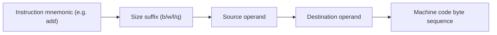

# CSE351: x86-64 Instruction Format

Every x86-64 instruction follows the pattern: **instruction name + size suffix + operands**.

---

## Basic Syntax

```assembly
instr op                # 1 operand: negq %rsi
instr src, dst          # 2 operands: addq %rdi, %rax
```

In AT&T syntax (used by GCC and the course), the **source** always comes before the **destination** — the opposite of Intel syntax.

---

## Instruction Categories

1. **Data transfer** — copying data between locations (e.g., `movq`, `pushq`, `popq`)
2. **Arithmetic and logical** — mathematical and bitwise operations (e.g., `addq`, `subq`, `andq`, `xorq`)
3. **Control flow** — changing execution order (e.g., `jmp`, `call`, `ret`)

---

## Size Specifiers

Every instruction ends with a **size suffix** that specifies how many bytes the operation acts on. The suffix must match the register names used.

| Suffix | Name | Size |
|:---|:---|:---|
| `b` | byte | 1 byte |
| `w` | word | 2 bytes |
| `l` | long word | 4 bytes |
| `q` | quad word | 8 bytes |

### Examples

```assembly
addb %al, %bl      # 1-byte addition
addw %ax, %bx      # 2-byte addition
addl %eax, %ebx    # 4-byte addition
addq %rax, %rbx    # 8-byte addition
```

---



---

## Related

- [[x86-64 Registers|x86-64 Registers]]
- [[x86-64 Memory Operands|Memory Operands]]
- [[x86-64 Operand Types|Operand Types]]
- [[Unsigned Integers|Unsigned Integers]]
- [[Two's Complement|Two's Complement]]

---

## Industry Standard Terms

| Course Term | Industry / Standard Term |
|:---|:---|
| Size suffix (`b/w/l/q`) | Operand size specifier; AT&T syntax suffix |
| AT&T syntax (`src, dst`) | GNU assembler (GAS) syntax; used by GCC |
| Intel syntax (`dst, src`) | NASM/MASM syntax; used in Windows and many textbooks |
| Data transfer instructions | Load/store instructions (RISC terminology) |
