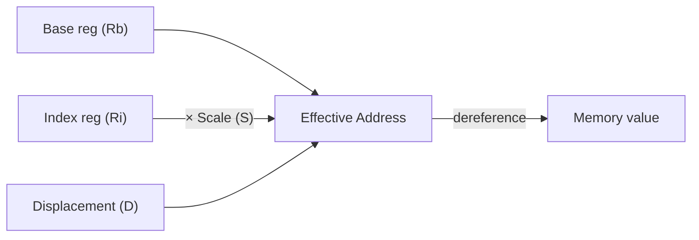

# CSE351: x86-64 Memory Operands

Memory operands use a **general addressing mode** that combines a base register, an index register, a scale factor, and a displacement to compute the effective address. This single form covers simple loads, array indexing, struct field access, and stack references.

---

## General Form: `D(Rb, Ri, S)`

| Component | Description |
|:---|:---|
| **D** | Displacement — a constant (immediate) byte offset |
| **Rb** | Base register — holds the starting address |
| **Ri** | Index register — holds the element index |
| **S** | Scale factor — must be 1, 2, 4, or 8 (matches common data type sizes) |

### Formal Definition

**Effective address** = `Reg[Rb] + Reg[Ri] × S + D`

### Simplified Explanation

Think of `Rb` as a pointer to the start of a data structure, `Ri` as an element index, `S` as the size of each element, and `D` as a fixed field offset. The hardware multiplies the index by the scale and adds everything together to produce the final byte address.

---

## Example

```assembly
movb 8(%rax,%rbx,2), %cl    # Address = %rax + %rbx*2 + 8
```

Copies 1 byte from memory at that address into `%cl`.

---

## Default Values (Omitted Parts)

Any component can be omitted; each defaults to a neutral value:

| Part | Default |
|:---|:---|
| D | 0 |
| Reg[Rb] | 0 |
| Reg[Ri] | 0 |
| S | 1 |

---

## Common Examples

```assembly
(%rsi)              # Mem[%rsi]               — simple dereference
4(%r10,%r11)        # Mem[%r10 + %r11 + 4]   — base + index + offset
(,%rdx,2)           # Mem[%rdx * 2]           — scaled index only
12(%rbp)            # Mem[%rbp + 12]          — frame-relative load
```

---

## Common Patterns

### Array Access

```assembly
# arr[i] where arr in %rdi, i in %rsi (8-byte elements)
movq (%rdi,%rsi,8), %rax
```

The scale `8` corresponds to the size of a `long` or pointer, matching [[CSE351/Data Structures/Arrays|array]] element sizes automatically.

### Stack Operations

```assembly
pushq %rax              # Push onto stack: %rsp -= 8, then write %rax to (%rsp)
popq %rbx               # Pop from stack: read (%rsp) into %rbx, then %rsp += 8
```

**Important:** Always use 64-bit register names in memory operands, since addresses are 8 bytes wide on x86-64.

---



---

## Related

- [[x86-64 Operand Types|Operand Types]]
- [[x86-64 Registers|x86-64 Registers]]
- [[CSE351/Memory Fundamentals/Pointers|Pointer Arithmetic]]
- [[CSE351/Data Structures/Arrays|Arrays]]
- [[Stack Pointer|Stack Pointer]]

---

## Industry Standard Terms

| Course Term | Industry / Standard Term |
|:---|:---|
| `D(Rb,Ri,S)` general form | Base + scaled index + displacement; SIB (Scale-Index-Base) addressing |
| Displacement (D) | Byte offset; constant displacement |
| Scale factor (S = 1,2,4,8) | Element size; stride |
| Effective address computation | Address generation unit (AGU) in CPU microarchitecture |
