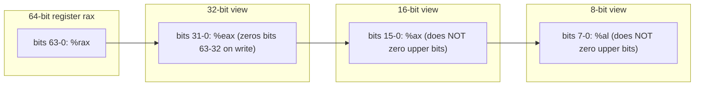

# CSE351: x86-64 Registers

x86-64 provides **16 general-purpose registers**, each 64 bits wide. Every register can be accessed at four widths by using different name prefixes, allowing instructions to operate on 8, 16, 32, or 64-bit sub-values.

---

## Register Names and Sizes

| 64-bit | 32-bit | 16-bit | 8-bit |
|:---|:---|:---|:---|
| `%rax` | `%eax` | `%ax` | `%al` |
| `%rbx` | `%ebx` | `%bx` | `%bl` |
| `%rcx` | `%ecx` | `%cx` | `%cl` |
| `%rdx` | `%edx` | `%dx` | `%dl` |
| `%rsi` | `%esi` | `%si` | `%sil` |
| `%rdi` | `%edi` | `%di` | `%dil` |
| `%rbp` | `%ebp` | `%bp` | `%bpl` |
| `%rsp` | `%esp` | `%sp` | `%spl` |
| `%r8` | `%r8d` | `%r8w` | `%r8b` |
| `%r9` | `%r9d` | `%r9w` | `%r9b` |
| `%r10` | `%r10d` | `%r10w` | `%r10b` |
| `%r11` | `%r11d` | `%r11w` | `%r11b` |
| `%r12` | `%r12d` | `%r12w` | `%r12b` |
| `%r13` | `%r13d` | `%r13w` | `%r13b` |
| `%r14` | `%r14d` | `%r14w` | `%r14b` |
| `%r15` | `%r15d` | `%r15w` | `%r15b` |

---

## Key Points

- Smaller register names refer to the **least significant bytes** of the 64-bit register.
  - `%ax` = lower 16 bits of `%rax`
  - `%al` = lower 8 bits of `%rax`

- **32-bit operations automatically zero the upper 32 bits.** This is intentional by design — it simplifies code generation and prevents stale data from persisting.

```assembly
movl $100, %eax       # Sets %rax = 0x0000000000000064
```

- 8-bit and 16-bit operations do **not** zero the upper bits, which can lead to subtle bugs if the upper bytes are not explicitly cleared.

---

## Special Registers

These registers have dedicated hardware roles and are governed by [[Calling Conventions|calling conventions]]:

| Register | Purpose |
|:---|:---|
| `%rsp` | Stack pointer — always points to the top of the current stack frame |
| `%rbp` | Frame pointer — optional reference point within the current frame |
| `%rip` | Program counter — address of the next instruction to execute |
| `%rax` | Return value — holds the return value of a function call |

---



---

## Related

- [[Calling Conventions|Calling Conventions]]
- [[Register Saving Conventions|Register Saving Conventions]]
- [[Stack Frames|Stack Frames]]
- [[x86-64 Instruction Format|Instruction Format]]
- [[CSE451/Virtualization/Processes/CPUState/CPU State#Registers|Registers (CSE451)]]

---

## Industry Standard Terms

| Course Term | Industry / Standard Term |
|:---|:---|
| General-purpose registers | GPR (general-purpose register) |
| `%rsp` | Stack pointer (SP); RSP in Intel notation |
| `%rbp` | Frame pointer (FP) / base pointer (BP) |
| `%rip` | Instruction pointer (IP); program counter (PC) |
| `%rax` (return value) | Accumulator register; return value register per System V ABI |
| 32-bit op zeroing upper bits | Zero-extension behavior (x86-64 architectural guarantee) |
