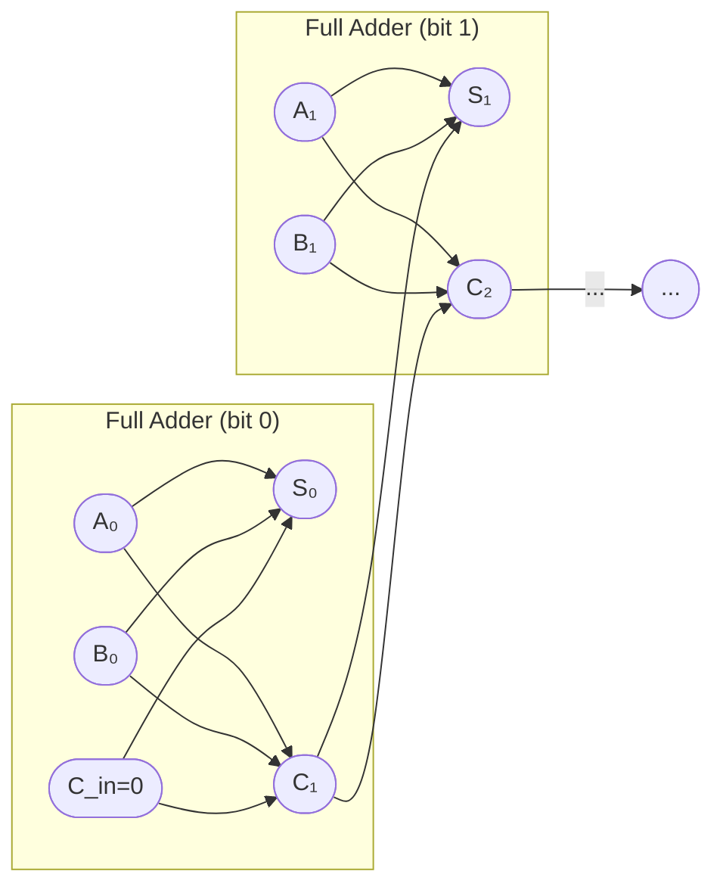

# CSE369: Building Blocks

Complex digital systems are constructed from standard, reusable **building blocks** — well-defined components that abstract away low-level gate logic and can be composed to build larger systems. These blocks fall into two categories: routing elements that select and direct data, and computational elements that transform it.

## Routing Elements

### Multiplexer (MUX)

A **Multiplexer** selects one of several input signals and forwards it to a single output line, based on a set of **select lines**.

- An $n:1$ MUX has $n$ data inputs and $\lceil \log_2 n \rceil$ select lines.
- The select lines form a binary number that indexes which input is passed to the output.
- **Use case**: Selecting between different data sources — for example, choosing between two ALU operands in a datapath, or between the incremented PC and a branch target.

A 2:1 MUX can be expressed as $\text{Out} = S \cdot I_1 + \bar{S} \cdot I_0$, where $S$ is the select line.

MUXes are themselves a universal implementation tool: any Boolean function of $n$ variables can be implemented with a $2^n:1$ MUX by wiring the truth table outputs to the data inputs and using the $n$ variables as select lines.

### Decoder

A **Decoder** converts an $n$-bit binary input code into at most $2^n$ unique output lines, activating exactly one at a time.

- The output is typically **one-hot**: only the output line corresponding to the binary value of the input is driven high; all others are low.
- **Use case**: Memory address decoding (selecting which row/word to access), instruction decoding in CPUs (determining which operation to execute).

A $2:4$ decoder takes a 2-bit input and drives one of four output lines high, corresponding to the four possible values 00, 01, 10, 11.

### Encoder

An **Encoder** is the inverse of a decoder. It converts a one-hot input (one of $2^n$ lines) into an $n$-bit binary code identifying which input is active.

- **Priority Encoder**: Handles the case where multiple input lines are simultaneously high. It encodes the index of the highest-priority (typically the most-significant) active input and ignores the others. Priority encoders are essential in interrupt controller logic.

## Computational Elements

### Adder

Addition in hardware is built up in three stages of increasing capability:

- **Half Adder**: Adds two single bits ($A$ and $B$), producing a **sum** bit ($A \oplus B$) and a **carry** bit ($AB$). Cannot handle a carry coming in from a previous stage.
- **Full Adder**: Adds two bits and a **carry-in** ($C_{in}$), producing a sum and a **carry-out** ($C_{out}$). The sum is $A \oplus B \oplus C_{in}$ and the carry-out is the majority function $AB + AC_{in} + BC_{in}$.
- **Ripple-Carry Adder**: Chains $n$ full adders together to add two $n$-bit numbers. The carry-out of each stage feeds into the carry-in of the next, which is why it is called "ripple." The total propagation delay is proportional to $n$ — $O(n)$ — because the carry must ripple through every stage in the worst case (e.g., adding `0111...1` + `0000...1`).

The ripple carry is the bottleneck. More advanced designs (Carry-Lookahead Adders) reduce this to $O(\log n)$ delay but require more hardware.

### Arithmetic Logic Unit (ALU)

The **Arithmetic Logic Unit (ALU)** is the computational core of a processor. It performs arithmetic operations (ADD, SUB) and logical operations (AND, OR, XOR, NOT) on binary data.

- The **operation** to perform is selected by a set of **control lines** (the ALU opcode), typically routed through a MUX tree inside the ALU.
- In a CPU datapath, the instruction decoder reads the opcode from the instruction and drives the ALU control lines accordingly, selecting the correct operation.
- The ALU outputs both the result and a set of **status flags** (zero, carry-out, overflow, negative) that are used by conditional branch instructions.

## Related

- [[CSE369/Combinational Logic]] — all routing and computational elements are implemented as combinational logic circuits
- [[CSE369/Finite State Machines]] — flip-flops used in FSM state registers; MUXes select next-state sources
- [[CSE369/Timing Constraints]] — adder carry chain length determines the critical path and maximum clock frequency
- [[CSE369/Memory and FPGAs]] — building blocks are instantiated as LUTs on an FPGA

## Industry Standard Terms

| Course Term | Industry / Textbook Equivalent |
|---|---|
| Multiplexer (MUX) | Data selector; multiplexer |
| Decoder | Binary decoder; address decoder |
| Encoder | Binary encoder |
| Priority Encoder | Priority encoder; interrupt encoder |
| Half Adder | Half adder |
| Full Adder | Full adder |
| Ripple-Carry Adder | Ripple-carry adder (RCA); carry-propagate adder |
| Arithmetic Logic Unit (ALU) | ALU; execution unit (EU) in modern CPUs |
| ALU Control Lines | ALU opcode; function select |
| Status Flags | Condition codes; flags register (EFLAGS in x86) |
