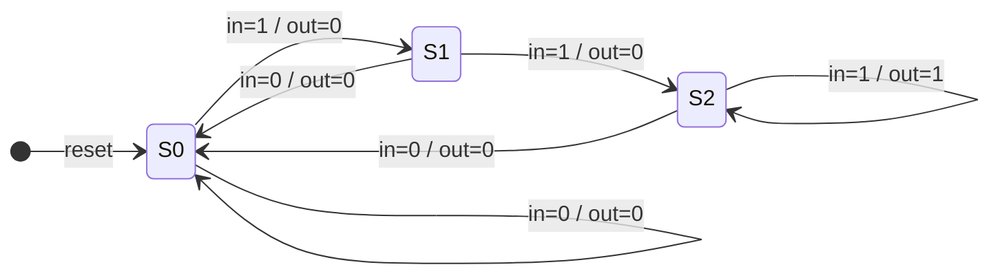
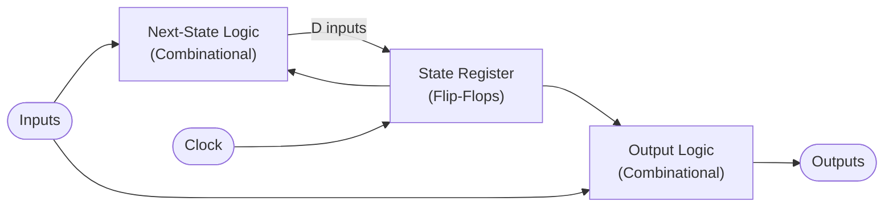

# CSE369: Finite State Machines

A **Finite State Machine** (FSM) is a mathematical model of computation used to design sequential logic circuits. Unlike [[CSE369/Combinational Logic]], which has no memory, an FSM has "memory" provided by state elements — specifically, a bank of **flip-flops** that store the current state. The output and next state are determined by the current state and (optionally) the current inputs.

## Components of an FSM

Every FSM is composed of five elements:

1. **Inputs**: External signals that drive state transitions.
2. **Outputs**: Signals produced by the machine.
3. **States**: The internal "memory" of the machine — the complete set of configurations the system can be in.
4. **State Transitions**: The combinational logic that computes the next state from the current state and inputs.
5. **Output Logic**: Combinational logic that computes outputs from the current state (and optionally inputs).

### Formal Definition

An FSM is formally defined as a quintuple $(Σ, S, s_0, δ, ω)$, where:
- $Σ$ is the **input alphabet** (the set of all possible input values),
- $S$ is the finite **set of states**,
- $s_0 \in S$ is the **initial state**,
- $δ: S \times Σ \rightarrow S$ is the **state-transition function** (next-state logic),
- $ω$ is the **output function** (either $ω: S \rightarrow O$ for Moore, or $ω: S \times Σ \rightarrow O$ for Mealy).

### Simplified Explanation

An FSM is a machine that remembers what it was doing. It stays in a "state" until an input tells it to move to a different state — like a traffic light that advances through Red → Green → Yellow → Red on a timer, or a vending machine that transitions from "idle" to "dispensing" when enough coins are inserted.

## FSM Types

### Moore Machine

In a **Moore machine**, outputs depend *only* on the current state. The output function is $ω: S \rightarrow O$.

- Outputs are stable throughout the entire clock cycle.
- Outputs change only on clock edges, making them easier to use reliably downstream.
- Generally requires more states than an equivalent Mealy machine.

### Mealy Machine

In a **Mealy machine**, outputs depend on *both* the current state and the current inputs. The output function is $ω: S \times Σ \rightarrow O$.

- Can often represent the same behavior with fewer states than a Moore machine.
- Outputs can change asynchronously with inputs within a clock cycle, which makes them more susceptible to glitches if inputs are noisy.

| Property | Moore | Mealy |
|---|---|---|
| Output depends on | State only | State + Inputs |
| Output changes | Only on clock edge | When inputs change |
| State count | Generally more | Generally fewer |
| Glitch risk | Lower | Higher |

## Implementation Steps

Designing an FSM follows a structured pipeline from abstract specification to physical hardware:

1. **State Diagram**: Draw a directed graph with circles for states and labeled arrows for transitions. Arrows are labeled with the input condition that triggers the transition and (for Mealy) the output value. State circles contain the state name and (for Moore) the output value.
2. **State Table**: Convert the state diagram into a tabular form listing current state, input, next state, and output for every combination.
3. **State Encoding**: Assign binary values to each state. Common schemes:
   - **Binary encoding**: $\lceil \log_2 n \rceil$ flip-flops for $n$ states — compact but complex logic.
   - **One-hot encoding**: One flip-flop per state; only one is high at a time — faster transitions, simpler next-state logic, more flip-flops used.
   - **Gray code**: Adjacent states differ by one bit — minimizes transitions and can reduce glitches.
4. **Logic Minimization**: Apply [[CSE369/Karnaugh Maps]] to the state table to find minimal SOP expressions for the next-state and output functions.
5. **Circuit Realization**: Implement the minimized logic using combinational gates, feeding into a register (flip-flop bank) clocked by the system clock.

The diagram above shows a Mealy FSM that detects the sequence "11" in a serial input stream. `out=1` fires on the third state when two consecutive 1s have been seen.

## Hardware Realization

In hardware, an FSM is implemented as two combinational blocks feeding a state register:

The state register captures the next state on each rising clock edge. Between clock edges, the combinational logic propagates and must satisfy the [[CSE369/Timing Constraints]] (setup time constraint) before the next edge arrives.

## Related

- [[CSE369/Combinational Logic]] — next-state and output logic are combinational circuits
- [[CSE369/Karnaugh Maps]] — used to minimize next-state and output functions
- [[CSE369/Timing Constraints]] — the combinational logic paths through the FSM must meet setup and hold time
- [[CSE369/Building Blocks]] — flip-flops (state register) and MUXes are the physical building blocks of FSMs
- [[CSE369/Verilog Fundamentals]] — FSMs are implemented in Verilog using `always_ff` and `always_comb` blocks

## Industry Standard Terms

| Course Term | Industry / Textbook Equivalent |
|---|---|
| Finite State Machine (FSM) | Finite Automaton (FA); State Machine |
| Moore Machine | Moore model FSM |
| Mealy Machine | Mealy model FSM |
| State Encoding | State assignment |
| One-hot encoding | One-hot state assignment |
| State Transition Function ($δ$) | Next-state logic; transition function |
| State Diagram | State machine diagram; state transition diagram |
