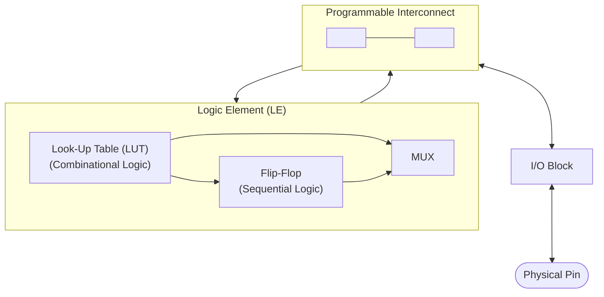
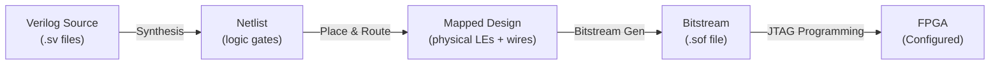

# CSE369: Memory and FPGAs

Memory elements allow digital systems to store and retrieve data, while **Field-Programmable Gate Arrays (FPGAs)** provide a reconfigurable hardware platform for implementing custom digital logic without manufacturing a custom chip. This file covers the memory types used in digital systems and the FPGA architecture and workflow used in CSE369.

## Memory Types

Digital memory is categorized by whether it is volatile (loses data without power) and by how it is accessed and written.

### ROM (Read-Only Memory)

**ROM** is **non-volatile** memory — it retains its contents without power. Data is typically "burned in" at manufacturing time or programmed once in the field.

- **Use case**: Look-up tables (LUTs) for fixed computations (e.g., a sine table), firmware stored in embedded microcontrollers, and constant data such as character fonts or boot code.
- In digital design, a ROM is functionally equivalent to a large combinational logic block: given an address input, it produces a fixed output. Any Boolean function can be implemented as a ROM lookup.

### RAM (Random Access Memory)

**RAM** is **volatile** memory — data is lost when power is removed. It can be read from and written to during normal operation, making it suitable for storing program data and state.

RAM is further divided by its physical storage mechanism:

| Type | Storage Cell | Speed | Density | Refresh Needed | Typical Use |
|---|---|---|---|---|---|
| **SRAM** (Static RAM) | Flip-flop / cross-coupled inverters | Faster | Lower (6 transistors/bit) | No | CPU caches, register files |
| **DRAM** (Dynamic RAM) | Capacitor + transistor | Slower | Higher (1 transistor/bit) | Yes (capacitors leak) | Main memory (DIMM modules) |

SRAM stores each bit in a stable bistable circuit (essentially a latch), so it holds its value as long as power is applied and no periodic refresh is needed. DRAM stores each bit as charge on a tiny capacitor, which leaks over time — the memory controller must periodically refresh every row to prevent data loss.

## FPGAs

### Architecture

An FPGA is an integrated circuit that can be configured after manufacturing to implement arbitrary digital logic. It consists of a large array of programmable resources:

- **Logic Elements (LE)** — also called **Adaptive Logic Modules (ALMs)** on Intel/Altera devices: Each LE contains a small **Look-Up Table (LUT)** and a **Flip-Flop**. The LUT implements arbitrary combinational logic for a small number of inputs (typically 4–6 inputs) by storing the truth table in SRAM. The flip-flop stores state for sequential logic. The combination allows each LE to implement both a combinational function and a register.
- **Programmable Interconnects**: A configurable routing fabric that can connect any LE output to any other LE's inputs. The interconnect is also configured via SRAM cells. This is what makes FPGAs "programmable."
- **I/O Blocks**: Interface between the internal programmable logic and the physical pins on the chip package. They can be configured for different voltage standards and drive strengths.

### Workflow

Implementing a design on an FPGA follows a four-step toolchain:

1. **Design**: Write the circuit description in [[CSE369/Verilog Fundamentals|Verilog]]. This is the hardware description at the register-transfer level (RTL).
2. **Synthesis**: The synthesis tool (e.g., Quartus for Intel FPGAs) converts the Verilog RTL into a **netlist** — a list of logical gates and their connections. Synthesis also performs logic minimization, equivalent to applying [[CSE369/Karnaugh Maps|K-map]] techniques automatically.
3. **Place and Route**: The Place & Route tool maps the netlist onto specific physical LEs on the FPGA die and determines the routing paths through the programmable interconnect. It also performs timing analysis to check that all paths meet [[CSE369/Timing Constraints]].
4. **Bitstream Generation and Programming**: The tool generates a **bitstream** — a binary configuration file that encodes which SRAM cells to set inside the FPGA to realize the specified netlist. The bitstream is loaded into the FPGA over JTAG or another programming interface, configuring every LUT, interconnect switch, and I/O block.

Because the configuration is stored in volatile SRAM, the FPGA loses its programming when powered off and must be reprogrammed on each power-up (or a companion flash chip holds the bitstream and programs it automatically).

## Related

- [[CSE369/Building Blocks]] — MUXes, decoders, adders, and ALUs are the types of circuits implemented in FPGA LUTs
- [[CSE369/Verilog Fundamentals]] — the HDL used to describe designs that are synthesized onto FPGAs
- [[CSE369/Combinational Logic]] — LUTs implement arbitrary combinational logic functions
- [[CSE369/Timing Constraints]] — Place & Route performs static timing analysis to verify setup and hold time

## Industry Standard Terms

| Course Term | Industry / Textbook Equivalent |
|---|---|
| FPGA | Field-Programmable Gate Array; reconfigurable logic device |
| Logic Element (LE) | Logic Element (Intel); Configurable Logic Block (CLB) (Xilinx); Adaptive Logic Module (ALM) (Intel) |
| Look-Up Table (LUT) | LUT; function generator |
| Bitstream | Configuration bitstream; FPGA programming file |
| Place and Route | P&R; implementation (Xilinx term); fitting (Intel/Altera term) |
| Synthesis | RTL synthesis; logic synthesis |
| SRAM (Static RAM) | SRAM; cache SRAM; register-file cell |
| DRAM (Dynamic RAM) | DRAM; main memory; SDRAM; DDR SDRAM |
| ROM | Read-Only Memory; NVM (Non-Volatile Memory); Flash (NAND/NOR) |
