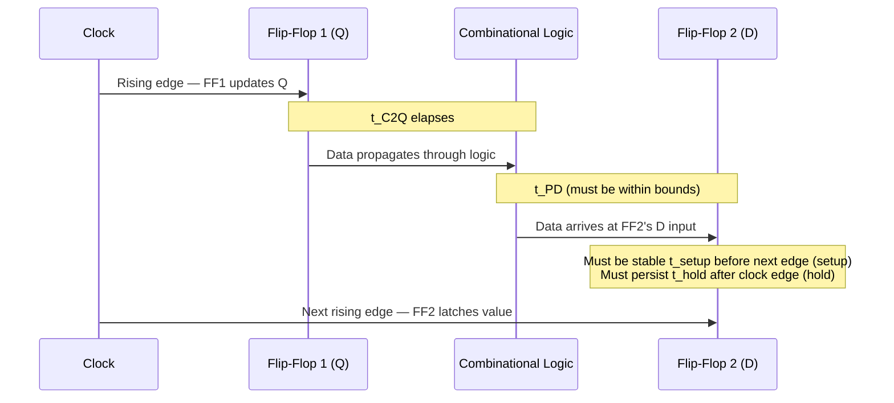

# CSE369: Timing Constraints

In digital design, signals do not propagate instantaneously through logic gates and wires. **Timing analysis** ensures that data is stable and valid at the input of each register exactly when the clock samples it. Violating timing constraints causes incorrect behavior that can be extremely difficult to debug.

## Synchronous Digital Systems

A **Synchronous Digital System (SDS)** is one where all state changes are synchronized to a global **clock** — a periodic square wave that oscillates between high (1) and low (0). On each rising edge of the clock, all flip-flops sample their inputs simultaneously and update their outputs. All combinational logic between two registers must finish computing within one clock period.

### Critical Parameters

Four parameters govern timing in a synchronous system:

| Parameter | Symbol | Definition |
|---|---|---|
| **Setup Time** | $t_{setup}$ | Minimum time data must be *stable before* the clock edge so the flip-flop can reliably sample it |
| **Hold Time** | $t_{hold}$ | Minimum time data must remain *stable after* the clock edge so the flip-flop latches correctly |
| **Clock-to-Q Delay** | $t_{C2Q}$ | Time for the flip-flop's output ($Q$) to change after the clock edge arrives |
| **Propagation Delay** | $t_{PD}$ | Time for a signal to travel through a combinational logic block |

## Timing Requirements

### Setup Time Constraint (Maximum Delay)

The setup time constraint ensures the clock period is long enough for a signal to propagate from one register's output, through all the combinational logic, and arrive at the next register's input with enough margin for that register's setup time.

#### Formal Definition

$$t_{C2Q} + t_{logic,\,\max} + t_{setup} \le t_{period}$$

Where $t_{logic,\,\max}$ is the longest (worst-case) propagation delay through the combinational logic path — the **critical path**.

#### Simplified Explanation

The data needs enough time to travel from the output of one flip-flop, through all the gates in between, and land at the input of the next flip-flop before the clock edge arrives. If it arrives too late, the wrong value gets latched. Rearranging the constraint gives the minimum achievable clock period, and its inverse gives the maximum clock frequency: $f_{max} = \frac{1}{t_{C2Q} + t_{logic,\,\max} + t_{setup}}$.

### Hold Time Constraint (Minimum Delay)

The hold time constraint ensures that data does not change too quickly after a clock edge and corrupt the value just latched by the downstream register.

#### Formal Definition

$$t_{C2Q} + t_{logic,\,\min} \ge t_{hold}$$

Where $t_{logic,\,\min}$ is the shortest (best-case) propagation delay through the combinational logic — the **short path**.

#### Simplified Explanation

The data must not "race through" the combinational logic and arrive at the next flip-flop's input before the clock edge has finished setting the flip-flop. If it arrives too early, the new value overwrites the one that was just being latched. Hold time violations cannot be fixed by slowing down the clock — a slower clock does not help because the data still arrives too quickly on the short path. The fix is to add **buffer** gates to the short path to increase its minimum delay.

## Metastability

**Metastability** is a condition where a flip-flop's output is neither a valid 0 nor a valid 1 — it is in an indeterminate state — because its setup or hold time was violated. This typically occurs at the boundary between two clock domains or when an asynchronous input arrives near a clock edge.

### Formal Definition

A state where a digital signal is neither 0 nor 1, but in an unstable equilibrium. The flip-flop will eventually resolve to a valid state, but the time to resolve is unbounded in theory — it follows an exponential distribution, so the probability of still being metastable decays exponentially with time but never reaches exactly zero.

### Simplified Explanation

It is like trying to balance a ball on the tip of a needle. The ball will eventually fall to one side (0 or 1), but you cannot predict when or which way. If downstream logic samples the metastable signal before it resolves, different parts of the circuit may see different values, causing a system failure. The standard mitigation is a **synchronizer**: two flip-flops in series clocked together, giving the first flip-flop a full clock period to resolve before the second samples it.

## Related

- [[CSE369/Finite State Machines]] — FSMs are sequential circuits where all combinational logic must meet these constraints
- [[CSE369/Building Blocks]] — flip-flops are the state-holding elements subject to setup and hold requirements
- [[CSE369/Combinational Logic]] — the logic between registers is what generates $t_{PD}$ and defines the critical path
- [[CSE369/Verilog Fundamentals]] — synthesis tools use timing analysis to ensure generated circuits meet constraints

## Industry Standard Terms

| Course Term | Industry / Textbook Equivalent |
|---|---|
| Synchronous Digital System (SDS) | Clocked synchronous design; synchronous logic |
| Setup Time ($t_{setup}$) | Setup time; hold margin (before edge) |
| Hold Time ($t_{hold}$) | Hold time; hold margin (after edge) |
| Clock-to-Q Delay ($t_{C2Q}$) | Propagation delay of a flip-flop ($t_{p}$); clock-to-output delay |
| Critical Path | Longest timing path; worst-case path; limiting path |
| Short Path | Shortest timing path; best-case path; hold-time path |
| Metastability | Metastable state; indeterminate state |
| Synchronizer | Metastability synchronizer; dual-flop synchronizer |
