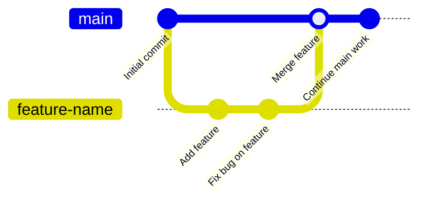

# CSE391: Branching and Merging

One of Git's most powerful features is **branching**, which allows you to create independent lines of development. You can work on a new feature or experiment without affecting the stable `main` branch.

## Managing Branches

### Create a branch
Creates a new pointer to the current commit.
```bash
git branch feature-name
```

### Switch to a branch (Checkout)
Moves the **HEAD** pointer to the specified branch.
```bash
git checkout feature-name
# In newer Git versions:
git switch feature-name
```

### Create and switch in one step
The most common way to start a new task.
```bash
git checkout -b bug-fix
```

### List branches
See which branch you are currently on (it will be marked with an `*`).
```bash
git branch
```

### Delete a branch
Do this after you have finished merging your work.
```bash
git branch -d feature-name
```

---

## Merging Changes

When you have finished working on a branch, you must "merge" it back into the main branch.

### The Standard Merge Workflow

1. Switch to the target branch (usually `main`).
   `git checkout main`
2. Merge the other branch.
   `git merge feature-name`
3. Delete the feature branch (optional).
   `git branch -d feature-name`

## Branch Lifecycle Diagram



---

## Resolving Merge Conflicts

A conflict occurs if you and another person (or another branch) modified the same line in the same file. Git cannot automatically decide which version to keep.

### How to Resolve

1. **Identify the files:** Git will list the files with conflicts.
2. **Edit the file:** Open it and look for the conflict markers:
   ```text
   <<<<<<< HEAD
   Your version (from main)
   =======
   Their version (from feature branch)
   >>>>>>> feature-name
   ```
3. **Choose the version:** Delete the markers and keep only the code you want.
4. **Stage and commit:** `git add <file>` followed by `git commit` to finalize the merge.

## Related
- [[CSE391/Git/Git Fundamentals|Git Core Concepts (Repo, Branch, Commit)]]
- [[CSE391/Git/Four Phases of Git|The Four Phases of Git]]
- [[CSE391/Git/Remote Repositories|Connecting to Remote Servers]]

## Industry Standard Terms
| Course Term | Industry-Standard Equivalent |
| :--- | :--- |
| Branch | Git branch |
| Merge | Git merge — combining two branch histories |
| Merge Conflict | Merge conflict — manual resolution required |
| HEAD | Git HEAD pointer |
| git switch | Modern replacement for `git checkout` (branch switching) |
