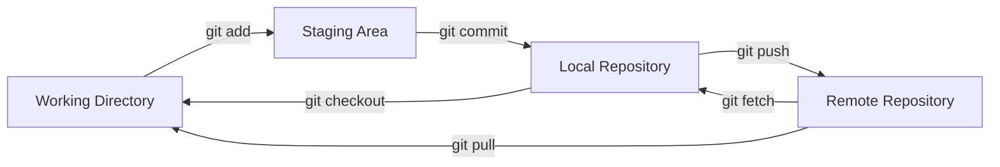

# CSE391: The Four Phases of Git

To use Git effectively, it is crucial to understand that files exist in four different "areas" or "phases." Moving files between these areas is the core of the Git workflow.

## (1) Working Directory

This is your **untracked/modified** area. It contains the actual files you are currently editing on your computer.
- **State:** Modified
- **Action:** Editing files, adding new ones.

## (2) Staging Area (The Index)

A middle ground where you "pre-save" your changes before committing them. This allows you to group related changes together into a single, logical commit.
- **State:** Staged
- **Command:** `git add <file>`
- **Action:** Preparing the next snapshot.

## (3) Local Repository (.git folder)

The history of your project on your own machine. When you commit, Git takes everything in the staging area and saves it permanently in the local repo.
- **State:** Committed
- **Command:** `git commit -m "message"`
- **Action:** Saving a version locally.

## (4) Remote Repository (Server)

A version of your project stored on a server (e.g., **GitLab**). This allows for collaboration and off-site backup.
- **State:** Pushed
- **Command:** `git push`
- **Action:** Sharing your work with others.

---

## Moving Files Between Phases

| Direction | Command | Description |
| :--- | :--- | :--- |
| **Work -> Stage** | `git add` | Prepare files for a commit. |
| **Stage -> Repo** | `git commit` | Save the snapshot permanently. |
| **Repo -> Remote** | `git push` | Upload local commits to the server. |
| **Remote -> Repo** | `git fetch` | Download changes from the server. |
| **Remote -> Work** | `git pull` | Download changes AND merge them into your files. |
| **Repo -> Work** | `git checkout` | Restore files from a previous commit. |

## Phase Diagram

---

## File Life Cycle States

Git also describes files by their status within these areas:
- **Untracked:** A new file that Git does not know about yet.
- **Unmodified:** A file that has not changed since the last commit.
- **Modified:** A file you have edited but not yet staged.
- **Staged:** A file you have marked to be included in the next commit.

## Related
- [[CSE391/Git/Git Fundamentals|Git Core Concepts (Repo, Branch, Commit)]]
- [[CSE391/Git/Git Workflow|The Standard Git Workflow]]
- [[CSE391/Git/Remote Repositories|Connecting to Remote Servers]]

## Industry Standard Terms
| Course Term | Industry-Standard Equivalent |
| :--- | :--- |
| Staging Area | Git index / staging area |
| Local Repository | Local `.git` directory |
| Remote Repository | Git remote (e.g., `origin`) |
| git fetch | Fetch — download remote refs without merging |
| git pull | Pull — fetch + merge |
