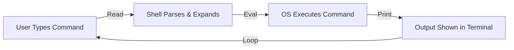

# CSE391: The Shell

A **Shell** is an interactive program that provides a text-based interface to the **[[CSE391/Linux Fundamentals/Operating System|Operating System]]**. It takes commands from the user and gives them to the OS to execute.

## Shell vs. Terminal

These terms are often used interchangeably, but they are different:
- **Terminal (Emulator):** The window you type into (e.g., PuTTY, iTerm2, Windows Terminal).
- **Shell:** The program *inside* that window that actually processes your commands (e.g., Bash, Zsh, Fish).

---

## How a Shell Works (The Life Cycle)

The shell operates in a continuous **REPL** (Read-Eval-Print Loop):

1. **Read:** Takes input from the user (keyboard).
2. **Eval:** Parses the command, expands variables, and executes the code.
3. **Print:** Shows the output (stdout or stderr) to the terminal.
4. **Loop:** Waits for the next command.

---

## Common Shell Environments

| Shell | Description |
| :--- | :--- |
| **Bash** | "Bourne Again Shell." The standard shell for most Linux distributions and the focus of CSE391. |
| **Zsh** | "Z Shell." The default shell on macOS. Very similar to Bash but with more features. |
| **Dash** | A minimal, fast shell used for running scripts quickly in Ubuntu. |
| **Fish** | A user-friendly, modern shell with auto-suggestions and colors by default. |

---

## Shell Built-ins vs. External Commands

- **Built-ins:** Commands that are part of the shell program itself for speed (e.g., `cd`, `echo`, `alias`, `exit`).
- **External Commands:** Separate programs stored as files on your computer (e.g., `ls`, `grep`, `git`). The shell must find these using the **[[CSE391/Users Groups and Permissions/The PATH Variable|PATH variable]]**.

---

## Interaction and Efficiency

The shell provides features to help you work faster:
- **Tab Completion:** Pressing `Tab` to automatically finish a command or filename.
- **History:** Pressing `Up Arrow` to see previous commands.
- **Wildcards:** Using `*` or `?` to select multiple files at once.

## Related
- [[CSE391/Linux Fundamentals/Introduction to Linux|Introduction to Linux]]
- [[CSE391/Users Groups and Permissions/Shell Customization|Shell Customization (.bashrc)]]
- [[CSE391/Users Groups and Permissions/The PATH Variable|The PATH Variable]]
- [[CSE391/Bash Scripting/Bash Scripting Basics|Bash Scripting Fundamentals]]

## Industry Standard Terms
| Course Term | Industry-Standard Equivalent |
| :--- | :--- |
| Shell | Command-line shell / CLI shell (Bash, Zsh, etc.) |
| REPL | Read-Eval-Print Loop |
| Terminal Emulator | Terminal emulator (e.g., iTerm2, GNOME Terminal) |
| Built-in command | Shell built-in |
