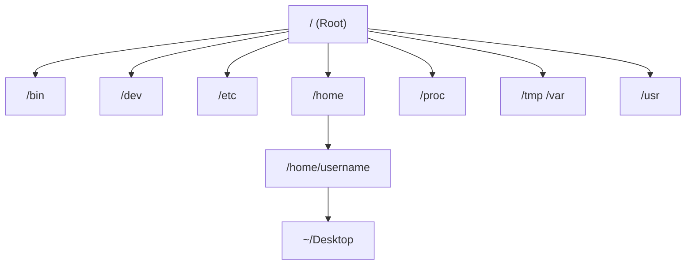

# CSE391: Unix File System

The Unix file system is hierarchical, starting from the **Root Directory** (denoted as `/`).

## Directory Conventions

| Directory | Description |
|-----------|-------------|
| `/`       | Root directory that contains all other directories. |
| `/bin`    | Applications and programs (binary files). |
| `/dev`    | Hardware devices. |
| `/etc`    | System configuration files. |
| `/home`   | Contains users' home directories. |
| `/proc`   | Information about running programs (processes). |
| `/tmp`, `/var` | Temporary and variable files. |
| `/usr`    | Universal system resources. |

## Relative Directory References

- **`.`**: References the current working directory.
- **`..`**: References the parent of the current working directory.
- **`~username`**: References `username`'s home directory.
- **`~/Desktop`**: References your desktop.

## File System Diagram

## Related
- [[CSE391/Linux Fundamentals/Basic Commands|Basic Commands]]
- [[CSE391/Users Groups and Permissions/The PATH Variable|The PATH Variable]]
- [[CSE391/Linux Fundamentals/Introduction to Linux|Introduction to Linux]]

## Industry Standard Terms
| Course Term | Industry-Standard Equivalent |
| :--- | :--- |
| Root Directory (`/`) | Filesystem root / root mount point |
| Home Directory (`~`) | User home directory (`$HOME`) |
| `/etc` | System configuration directory |
| `/proc` | Proc filesystem (procfs) — kernel/process info interface |
