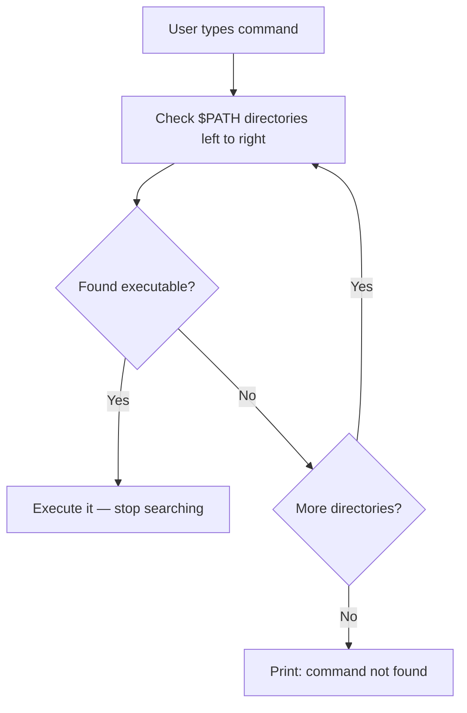

# CSE391: The PATH Variable

The **$PATH** variable is one of the most critical environment variables in Unix/Linux. It tells the **[[CSE391/Linux Fundamentals/Shell|Shell]]** which directories to search for executable programs when you type a command.

## How It Works

When you type a command (e.g., `grep`), the shell follows these steps:
1. It looks at the value of the `$PATH` variable, which is a **colon-separated list** of absolute directory paths (e.g., `/usr/bin:/bin:/usr/local/bin`).
2. It searches each directory in order for an executable file named `grep`.
3. If it finds the file, it executes it and stops searching.
4. If it reaches the end of the list without finding the file, it prints `command not found`.

## PATH Resolution Diagram



---

## Viewing and Locating Programs

### (1) Check your current PATH
Use `echo` to print the value of the variable.
```bash
echo $PATH
# Output: /usr/local/bin:/usr/bin:/bin:/usr/sbin:/sbin
```

### (2) Find where a command is located
The `which` command shows the full path of the executable that would be run.
```bash
which python3
# Output: /usr/bin/python3
```
If `which` returns nothing, the command is not in your path.

---

## Modifying the PATH

You can add new directories to your path to run your own scripts or third-party tools more easily. This is usually done in your `.bashrc` or `.bash_profile`.

### (1) Temporarily add to path (current session only)
```bash
export PATH=$PATH:/home/justin/my_scripts
```

### (2) Permanently add to path
Add the following line to the end of your `~/.bashrc` file.
```bash
# Append a directory (search LAST)
export PATH=$PATH:~/bin

# Prepend a directory (search FIRST)
export PATH=~/my_tools:$PATH
```

---

## Security and Order of Operations

### Order Matters
The shell searches from **left to right**. If you have two versions of a program (e.g., Python 3.8 and Python 3.10) in different directories, the one in the directory that appears *earlier* in the PATH will be the one that runs.

### Security Warning (The Dot Problem)
Never add `.` (the current directory) to the beginning of your `$PATH`.
- **Reason:** A malicious user could place a file named `ls` in a directory. If you `cd` into that folder and run `ls`, you would execute their malicious script instead of the real system command.
- **Better way:** Always run scripts in your current directory explicitly using `./script.sh`.

## Related
- [[CSE391/Users Groups and Permissions/Shell Customization|Shell Customization and .bashrc]]
- [[CSE391/Linux Fundamentals/Commands/ls|ls Command]]
- [[CSE391/Users Groups and Permissions/Unix Permissions|File Permissions (chmod)]]

## Industry Standard Terms
| Course Term | Industry-Standard Equivalent |
| :--- | :--- |
| $PATH | `PATH` environment variable — colon-separated executable search path |
| `which` | `which` — locate a command in PATH |
| `export` | Shell `export` — make variable available to child processes |
