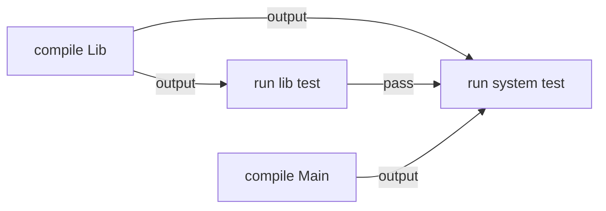

# CSE 403: Build Systems

A **build system** (also called a **build tool**) is a tool for automating software engineering tasks. The core motivation is that every task a developer performs repeatedly — getting source code, installing dependencies, compiling, running static analysis, generating documentation, running tests, creating release artifacts, and shipping — should be handled by automation. The answer to "which of these tasks should be handled manually?" is: **none of them**.

Build systems orchestrate all of these tasks in a controlled, reproducible, and automated way.

## Tasks Are Code

Build configurations and task definitions are first-class code artifacts. They must be:

- **Checked into version control** — just like application source code, so changes to the build are tracked and auditable.
- **Code-reviewed** — build changes can break every developer on the team, so they warrant careful review.
- **Tested** — the build itself should be verified to work correctly.

This principle prevents the build from becoming a fragile, undocumented script that only works on one person's machine.

## Dependencies Between Tasks

Build systems manage not just individual tasks but the **dependency relationships** between them. Consider a project with four source files:

```
ls src/
Lib.java    LibTest.java    Main.java    SystemTest.java
```

This creates four tasks with explicit dependencies between them:

- `compile Lib` — no dependencies (indegree 0)
- `run lib test` — depends on `compile Lib` (indegree 1)
- `compile Main` — no dependencies (indegree 0)
- `run system test` — depends on `compile Lib`, `run lib test`, and `compile Main` (indegree 3)

The `SystemTest` exercises the fully integrated system, so it requires both libraries to be compiled and the unit-level lib test to have passed first.



## Determining Task Order: Topological Sort

In large projects, there can be thousands of tasks. The dependency graph between tasks forms a **Directed Acyclic Graph (DAG)**. The build system must determine a valid execution order — one in which every task's dependencies are already completed before that task runs.

This is solved by **topological sort**: ordering nodes such that all dependencies are satisfied before any dependent task executes.

### Formal Definition

**Topological sort** of a DAG $G = (V, E)$ produces a linear ordering of vertices such that for every directed edge $(u, v)$, vertex $u$ appears before vertex $v$ in the ordering.

### Simplified Explanation

Run tasks with no unmet dependencies first. When a task completes, reduce the dependency counts of its successors, and run any that become free.

### Algorithm: Indegree-Based Topological Sort

The standard implementation tracks the **indegree** (number of incoming edges) of each node.

**Step-by-step walkthrough** for the four-task example:

| Step | Action | Indegrees remaining |
|------|--------|---------------------|
| Initial | Compute indegrees | compile Lib: 0, run lib test: 1, compile Main: 0, run system test: 3 |
| (1) | Run `compile Lib` (indegree 0) | run lib test drops to 0, run system test drops to 2 |
| (2) | Run `compile Main` (indegree 0) or `run lib test` (now 0) — either is valid | ... |
| Final | Run `run system test` last (indegree reaches 0 only after all three predecessors complete) |  |

**Three valid topological orderings** exist for this graph:

1. compile Lib → run lib test → compile Main → run system test
2. compile Main → compile Lib → run lib test → run system test
3. compile Lib → compile Main → run lib test → run system test

The **preferable ordering is #3** (or any that maximizes parallelism): running `compile Lib` and `compile Main` back-to-back before any test exploits the fact that both compilations are independent and could be parallelized, while orderings like #1 interleave compilation and testing unnecessarily.

## Build System Examples

### Gradle

**Gradle** is an open-source build tool and the successor to Apache Ant and Maven.

- Uses a **Groovy or Kotlin DSL** instead of XML, meaning build files are actual source code with real logic — not configuration markup.
- Ships with **many defaults** that follow Maven conventions (standard source layout, standard lifecycle phases), so simple projects need almost no configuration.
- Can query **Maven Central** for dependency resolution — declaring a dependency automatically downloads it and its transitive dependencies.

Example Gradle task definition:

```groovy
task reformat(type: Exec, dependsOn: getCodeFormatScripts, group: 'Format') {
    description 'Format the Java source code'
    // jdk8 and checker-qual have no source, so skip
    onlyIf { !project.name.is('jdk8') && !project.name.is('checker-qual') }
    executable 'python'
    doFirst {
        args += "${formatScriptsHome}/run-google-java-format.py"
        args += "--aosp" // 4 space indentation
        args += getJavaFilesToFormat(project.name)
    }
}
```

Key observations in this example:
- **`dependsOn: getCodeFormatScripts`** explicitly declares the task's dependency — Gradle uses this to place the task correctly in the topological sort.
- **`onlyIf { ... }`** is actual Groovy code, not XML configuration — this is the power of a DSL-based build system.
- In many cases, following conventions and using Gradle's built-in tasks (like `compileJava`, `test`, `build`) is sufficient without writing custom tasks at all.

### Bazel

**Bazel** is the open-source version of Google's internal build tool, called **Blaze**. It is designed for very large monorepos and emphasizes correctness (hermetic builds) and speed (aggressive caching and parallel execution).

## Best Practices

| Practice | Why it matters |
|----------|---------------|
| Automate everything (one-step build) | A build that requires manual steps is a build that will be done inconsistently |
| Always use a build tool | Ad-hoc shell scripts lack dependency tracking and reproducibility |
| Use CI to build and test on every commit | Catches regressions immediately, before they compound |
| Don't depend on anything not in the build file (hermetic) | Non-hermetic builds produce different results on different machines |
| Don't break the build | A broken main branch blocks every team member |

### Hermetic vs. Non-Hermetic Builds

A **hermetic build** depends only on what is explicitly declared in the build file — no implicit assumptions about the host system (no PATH dependencies, no environment variables, no pre-installed tools that aren't declared). The live demo illustrated this contrast:

- **Bad scenario (non-hermetic)**: committing a Gradle migration directly to main that implicitly relies on a system tool not in the build file. This breaks the build for every collaborator making any change.
- **Good scenario (hermetic)**: developing the Gradle migration on a branch, with a hermetic build, backward compatibility maintained, testing, and a code-reviewed pull request before merging to main.

## Related

- [[CSE403/Testing/Testing and Continuous Integration]]
- [[CSE403/Version Control/Git Bisect]]
- [[CSE403/Version Control/Version Control Fundamentals]]
- [[CSE403/Software Process/SDLC Models]]

## Industry Standard Terms

| Course Term | Industry Equivalent |
|-------------|---------------------|
| Build system / build tool | CI pipeline, build automation (Maven, Gradle, Bazel, Make, Webpack) |
| Task | Build target, build step, pipeline stage |
| Hermetic build | Reproducible build, isolated build |
| Dependency graph (DAG) | Build graph, task graph |
| Topological sort | Dependency resolution order |
