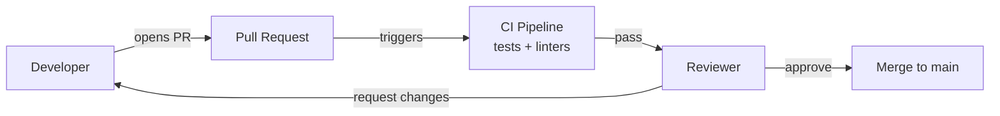

# CSE 403: Code Review Practices

**Code review** is the systematic examination of source code by developers other than the author, with the goal of finding defects, enforcing standards, and sharing knowledge across the team. In CSE 403, code review is discussed in the context of pull requests — the formal mechanism Git-based workflows use to propose and review changes before they reach `main`.

## Role in the Development Workflow

Code review sits at the intersection of [[CSE403/Version Control/Version Control Fundamentals|version control]] and quality assurance. A pull request (PR) provides:

- A **diff view** showing every line the merge will change
- A **comment thread** for review discussion, both inline and at the file level
- **CI status checks** — automated gates (tests, linters, static analysis) that must pass before review begins
- An **approval gate** — one or more reviewers must approve before merge is allowed

## Relationship to Automated Analysis

Code review complements [[CSE403/Program Analysis/Static Analysis]]: automated static analysis and linting catch mechanical defects (null dereferences, style violations, obvious type errors) before the PR even reaches a human reviewer. This frees reviewers to focus on what automation cannot catch — design problems, logic errors, domain-specific correctness, and knowledge transfer.

The principle: **automate the mechanical, humanize the conceptual**.

## Key Practices

- Review the **diff**, not the author — feedback targets the code, not the person
- Keep pull requests **small and focused** — large PRs are harder to review thoroughly and produce more superficial feedback
- Distinguish **blocking issues** (must fix before merge) from **suggestions** (nice to have, non-blocking)
- Reviewers are not the last line of defense — tests, static analysis, and CI share that responsibility

## Related

- [[CSE403/Version Control/Version Control Fundamentals]]
- [[CSE403/Program Analysis/Static Analysis]]
- [[CSE403/Testing/Testing Fundamentals]]

## Industry Standard Terms

| Course Term | Industry / Standard Equivalent |
|---|---|
| Code review | Peer review, PR review, MR review |
| Pull request | PR (GitHub/Bitbucket), Merge Request / MR (GitLab) |
| Approval gate | Required reviewers, CODEOWNERS approval |
| CI status check | Build gate, quality gate |
