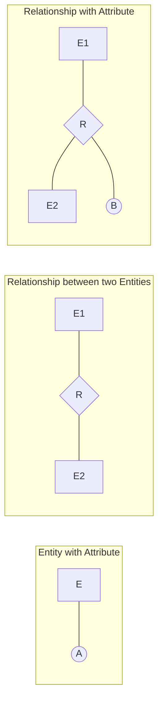
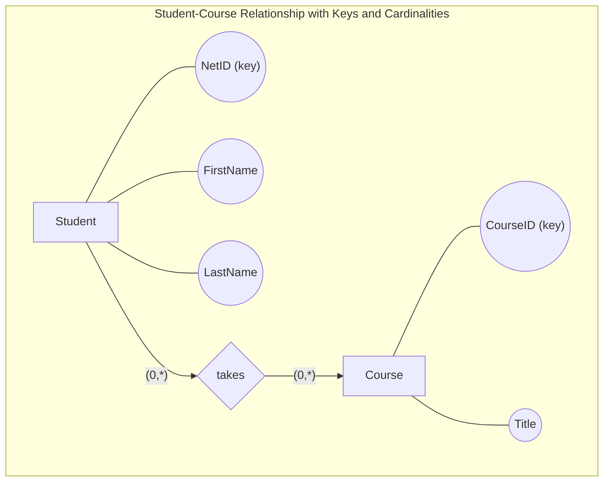
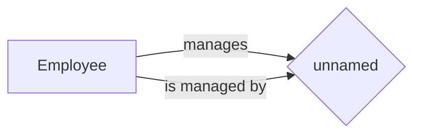
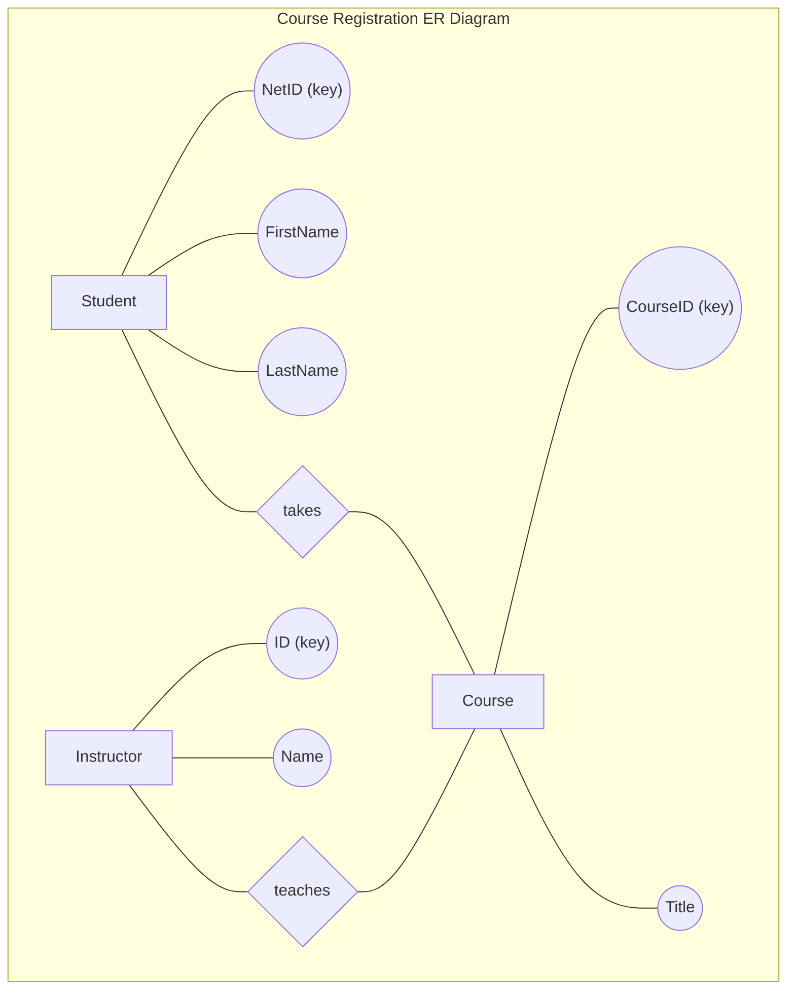
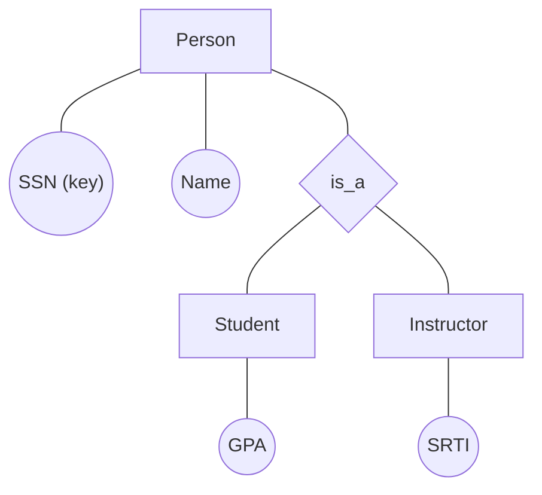

# CSE 403: Data Modelling and ER Diagrams

## From Requirements to System Design

Before any code is written, a software team must translate the **requirements** gathered from the client into a concrete system design. The requirements process is inherently iterative and conversational: the client supplies ideas, target users, and desired behavior; the developer responds with questions, suggestions, diagrams, and feasibility assessments. This back-and-forth loop eventually converges on a stable set of requirements — a shared contract of *what* the system must do.

Once requirements are stable, the team splits into two parallel "how" tracks:

- **Data Model** — a precise description of the data the system must store and the relationships between those data items.
- **SW Architecture and Design** — the structural decomposition of the system into components, interfaces, and interactions.

These two tracks are tightly coupled: the data model constrains what the architecture must store and retrieve, and architectural decisions (e.g., microservices vs. monolith, SQL vs. NoSQL) feed back into how the data model is shaped.

```mermaid
flowchart TD
    subgraph negotiation [Requirements Negotiation]
        C([Client])
        D([Developer])
        C -->|"ideas, target users, desired behavior"| D
        D -->|"questions, suggestions, diagrams, feasibility"| C
    end
    negotiation -->|converges| R[Requirements\n(What)]
    R --> DM[Data Model\n(How)]
    R --> SA[SW Architecture and Design\n(How)]
    DM <--> SA
```

The lecture focuses specifically on the **Data Model** side of this diagram.

---

## Data Modelling

**Data modelling** is the process of formally identifying and structuring the data that a system needs to persist. The goal is to produce an unambiguous, implementation-independent description of what data exists, what its properties are, and how pieces of data relate to one another. The modelling process follows a sequence of steps:

1. **Identify Entities** — the core "things" the system tracks (people, objects, events, concepts).
2. **Identify Attributes** — the properties of each entity.
3. **Identify Relationships** — how entities are connected.
4. **Assign Keys** — designate the attribute(s) that uniquely identify each entity instance.
5. *(Normalization to reduce redundancy)* — optional restructuring to eliminate duplicate data.
6. *(Denormalization to improve performance)* — optional reversal of normalization for query speed.

The common "language" for expressing a data model graphically is the **Entity-Relationship (ER) diagram**. ER diagrams are just one option — the same information can be conveyed in tables or plain text — but the graphical form is widely used because it makes structure immediately visible.

---

## Entity-Relationship (ER) Diagrams: Overview

An **Entity-Relationship (ER) diagram** is a graphical representation of a data model. It shows the relationships between **entities** (e.g., people, objects, events, or concepts) within a system. Crucially, an ER diagram **can be mapped** to a **relational (database) schema** — making it a practical bridge between requirements and implementation.

The value of an ER diagram is that it is precise enough to be unambiguous yet abstract enough that a client or non-technical stakeholder can review it and verify that the model matches their mental picture of the domain.

---

## ER Diagrams: Graphical Syntax

The ER notation uses three shapes, each with a strict meaning:

| Shape | Represents | Drawn as |
|---|---|---|
| **Entity** | A distinct "thing" to be tracked | Rectangle (box) |
| **Attribute** | A property of an entity or relationship | Oval (ellipse) |
| **Relationship** | A named association between two entities | Diamond |

### Entities

An **entity** *E* is drawn as a rectangle labeled with the entity name. Entities correspond to the real-world things the system needs to model — for example, a Student, an Instructor, or a Course.

### Attributes

An **attribute** *A* of entity *E* is drawn as an oval connected to the entity's rectangle by a single line. Attributes describe the data fields associated with an entity. For example, the Student entity might have attributes NetID, FirstName, and LastName.

Attributes can also belong to **relationships** (not just entities). An attribute *B* of relationship *R* is drawn as an oval connected by a line to the relationship's diamond. This is used when a piece of data is a property of the association itself rather than either participating entity — for example, a grade earned by a student in a course is a property of the *takes* relationship, not of the Student or Course independently.

### Relationships

A **relationship** *R* between two entities *E1* and *E2* is drawn as a diamond connected by lines to both entity rectangles. The diamond is labeled with the name of the relationship (e.g., "takes", "teaches").



---

## ER Diagrams: Structural Rules

The shapes cannot be connected arbitrarily. The following rules govern which connections are legal:

**Allowed connections (interconnecting lines):**
- A box (entity) and a diamond (relationship)
- A box (entity) and an oval (attribute)
- A diamond (relationship) and an oval (attribute)

**Disallowed connections:**
- Box to box directly (entities do not connect directly; a diamond relationship must mediate)
- Oval to oval
- Oval to diamond with more than one line (an oval must have **exactly one** connecting line)

**Naming rules:**
- Names of boxes must be **unique across the entire diagram** — you cannot have two entities with the same name.
- Names of ovals must be **unique per box or diamond** — the same attribute name can appear under different entities, but not twice under the same one.

These rules exist to make diagrams unambiguous. If two boxes could share a name, it would be unclear which entity a relationship referred to.

---

## ER Diagrams: Keys and Cardinalities

### Keys

A **key** is an attribute, or a set of attributes, that **uniquely identifies** an entity instance. In ER diagrams, the key attribute is shown **underlined** in its oval. For example:
- Student's key: **NetID** (underlined)
- Course's key: **CourseID** (underlined)

A key can be:
- **Artificial** (also called a surrogate key) — a value invented purely for identification purposes with no real-world meaning, such as a system-generated integer ID. Artificial keys are stable and guaranteed unique, but opaque.
- **Natural** — a value that already exists in the domain and naturally identifies the entity, such as a university NetID or a Social Security Number. Natural keys are meaningful but can change or have edge-case collisions.

The choice between artificial and natural keys is a design decision with real trade-offs: natural keys are human-readable and save a join column, but artificial keys are safer because natural identifiers (like names or emails) can change.

### Cardinalities

**Cardinalities** annotate a relationship edge to specify how many instances of each entity can participate in the relationship. They define whether a relationship is one-to-one, one-to-many, or many-to-many. Cardinalities are essential because they encode real-world constraints — for example, "a course can have many students, and a student can take many courses" (many-to-many), versus "each course section is taught by exactly one instructor at a time" (one-to-many from instructor to course).

There are different notational systems for cardinalities. The course uses the $(min, max)$ pair notation:

| Shorthand | Pair notation | Meaning |
|---|---|---|
| `1` | $(1,1)$ | Exactly one (mandatory, singular) |
| `c` | $(0,1)$ | Zero or one (optional, singular) |
| `m` | $(1,*)$ | One or more (mandatory, many) |
| `mc` | $(0,*)$ | Zero or more (optional, many) |

In the Student–takes–Course example from the slides, both ends of the *takes* relationship are annotated $(0,*)$ meaning: a student may take zero or more courses, and a course may be taken by zero or more students.



---

## ER Diagrams: Weak Entities

A **weak entity** is an entity that cannot exist independently — its existence depends on another entity. The defining property is that a weak entity is only **uniquely identifiable in reference to** the entity it depends on.

The canonical example from the slides: a *Room* entity depends on a *Building* entity. Room 101 exists only within a specific building; if the building is torn down, its rooms disappear. Room numbers are only unique within a building — "Room 101" could exist in many buildings, so RoomNo alone does not uniquely identify a room. The full identity of a room is *(BuildingNo, RoomNo)*.

**Graphical notation for weak entities:**
- The weak entity is drawn with a **double-bordered rectangle** (in slides, shown in red to highlight it).
- The relationship connecting the weak entity to its owner is drawn with a **double-bordered diamond**.
- The weak entity's partial key (the attribute that, combined with the owner's key, produces a unique identifier) is shown **dashed-underlined** in its oval.

```mermaid
flowchart TD
    B[Building] --- BN(("BuildingNo (key)"))
    B --- H{has}
    H ==> R[Room\n&#40;weak&#41;]
    R --- RN(("RoomNo (partial key)"))
```



The double line on the relationship to the weak entity conveys that the weak entity has total participation — it must always be associated with its owner entity.

---

## ER Diagrams: Self-References and Roles

A **self-reference** occurs when an entity participates in a relationship with itself. The classic example is an Employee who manages other Employees. In this case, the same entity box appears on both sides of the relationship conceptually.

Because the same entity is playing two different roles in the same relationship, the connection lines from the entity box to the diamond are annotated with **role labels** to disambiguate which "side" is which. In the Employee–manages example:
- One line is labeled "manages" (the manager role)
- The other line is labeled "is managed by" (the subordinate role)

The physical diagram connects the single *Employee* box to a single unnamed diamond via two lines — one for each role. The naive representation of this (drawing two separate *Employee* boxes connected to the same diamond) is conceptually wrong and must never be drawn, because there is only one Employee entity type.



This is the compact, correct form. The "wrong" form — Employee (box1) -- manages -- diamond -- is managed by -- Employee (box2) — violates the uniqueness rule for box names and misrepresents the data model by implying there are two separate entity types.

---

## Course Registration System: Worked Example

The lecture develops a data model for a simple **course registration system** through three stages.

### Stage 1: Identify Entities

The entities are:
- **Student** — a person registered at the university
- **Instructor** — a person teaching courses
- **Course** — an academic course offering

### Stage 2: Identify Attributes

| Entity | Attributes | Key |
|---|---|---|
| Student | NetID, FirstName, LastName | NetID (underlined) |
| Instructor | ID, Name | ID (underlined) |
| Course | CourseID, Title | CourseID (underlined) |

Note that Student's Name is split into FirstName and LastName rather than a single Name attribute. This is a deliberate modelling choice: splitting enables sorting by last name, searching by first name, and avoids ambiguity when a full name has multiple words.

### Stage 3: Identify Relationships

| Relationship | Entities | Meaning |
|---|---|---|
| *takes* | Student — Course | A student enrolls in a course |
| *teaches* | Instructor — Course | An instructor is assigned to teach a course |



### Stage 4: Augmenting the Model (In-Class Exercise)

The in-class exercise asked students to augment the base diagram with three additional concepts: overall grade for a taken course, course prerequisites, and assignments (and points). This requires deciding for each concept whether it should be modelled as an attribute, a relationship, or a (weak) entity.

**Grade on a taken course:**
A grade belongs to a specific student's enrollment in a specific course — it is a property of the *takes* relationship, not of the Student or Course independently. The correct model is to add a *Grade* attribute to the *takes* relationship diamond.

**Course prerequisites:**
A prerequisite is a relationship between two Courses — "Course A is a prerequisite for Course B." This is a self-reference on the Course entity. Two role-annotated lines connect the Course box to a *prerequisite* diamond, distinguishing the "is prerequisite of" role from the "has prerequisite" role.

**Assignments:**
An assignment exists only in the context of a course — if a course is deleted, its assignments disappear. This is the hallmark of a **weak entity**. Assignment's identity is only meaningful relative to its course (e.g., "Assignment 1 of CSE 403"). Points earned on an assignment by a student would then be an attribute of the relationship between Student and Assignment.

---

## Generalization in ER Diagrams (Additional Material, Not Discussed in Class)

An **is_a relationship** represents a generalization (or inheritance) relationship between two entities, analogous to class inheritance in object-oriented programming. The parent entity holds attributes shared by all subtypes, and each child entity holds attributes specific to it.

Properties of is_a:
- **Attributes (including keys) are inherited** — the child entity implicitly has all attributes of the parent.
- **Additional attributes** specific to the subtype can be defined on the child entity.

Example: *Person* is_a generalization with subtypes *Student* and *Instructor*.
- Person has attributes: SSN (key), Name
- Student inherits SSN and Name, and additionally has: GPA
- Instructor inherits SSN and Name, and additionally has: SRTI (student rating of teaching instruction)



The is_a relationship graphically looks like a diamond labeled "is_a" with lines fanning out from the bottom to multiple child entity boxes, forming a triangle or tree shape.

---

## Related

- [[CSE403/Requirements/Requirements Elicitation]] — the client-developer negotiation process that produces requirements
- [[CSE403/Software Design and Architecture/Software Architecture Patterns]] — structural patterns for decomposing the system, the parallel design artifact produced alongside the data model
- [[CSE403/Software Design and Architecture/Software Design Theory]] — the theoretical foundations underlying architectural and design decisions
- [[CSE344/Database Design/Entities, Relationships, and ER Diagrams]] — deeper treatment of ER diagrams and mapping to relational schemas
- [[CSE344/Database Design/Normalization]] — the normalization step referenced in the data modelling process
- [[CSE344/Database Design/Functional Dependencies (FDs)]] — the theoretical foundation for normalization

---

## Industry Standard Terms

| Course Term | Industry-Standard Equivalent |
|---|---|
| Entity-Relationship (ER) diagram | Entity-Relationship diagram (same); also called an ER model or data model diagram |
| Data model | Domain model; persistence model |
| Key | Primary key (in relational databases); identifier |
| Artificial key | Surrogate key |
| Natural key | Natural/business key |
| Weak entity | Dependent entity; child entity (in some notations) |
| is_a relationship | Inheritance / subtype-supertype relationship; generalization |
| Cardinality | Multiplicity (UML term); cardinality (relational DB term) |
| Normalization | Database normalization (same); also referred to as achieving normal forms (1NF, 2NF, 3NF, BCNF) |
| Self-reference | Recursive relationship; unary relationship |
| Relationship attribute | Associative attribute; junction table column (in relational implementations) |
