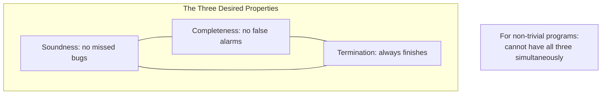

# CSE 403: Static and Dynamic Analysis

When reasoning about program correctness, there are two fundamentally different approaches: observe the program by running it on actual inputs, or reason about the program without running it at all. These two paradigms — **dynamic analysis** and **static analysis** — have complementary strengths and weaknesses, and understanding the trade-offs between them is essential to choosing the right tool for a given task.

## Dynamic Analysis

**Dynamic analysis** is based on some program executions. The program is compiled and run on concrete inputs, and properties are observed about its actual behavior at runtime. Because dynamic analysis observes what literally happens, its conclusions are always about real executions.

### Properties

- **Precise (no false positives)**: When dynamic analysis reports a bug, it is a real bug. The program actually did something wrong on the observed execution — there is no ambiguity or approximation. This makes dynamic analysis results immediately actionable.
- **Unsound (may have false negatives)**: Dynamic analysis only observes a subset of all possible program behaviors — the subset covered by the chosen inputs. A bug that only manifests on a specific, untested input will not be discovered. Dynamic analysis cannot guarantee the absence of bugs; it can only find bugs that are actually triggered.
- **Terminates**: Running a program on a finite set of inputs always takes finite time.

### Examples

- **Unit testing and integration testing**: Manually or automatically written tests that run specific inputs and check outputs against expected values.
- **Fuzzing**: Automatically generating large numbers of random or mutated inputs to find crashes or assertion violations.
- **Profiling**: Running the program and measuring actual resource usage (CPU time, memory allocation) on representative workloads.
- **Delta debugging**: Running the program on progressively smaller failing inputs to isolate the minimal input that triggers a bug.

Dynamic analysis is covered in depth in the testing and delta debugging portions of CSE 403. See also [[CSE403/Program Analysis/Program Analysis Overview]] for how testing fits into the broader program analysis landscape.

## Static Analysis

**Static analysis** reasons about the program without executing it. Instead of running the program on inputs and observing outputs, a static analysis tool reads the source code (or compiled bytecode) and builds an **abstract model** of all possible program states — an over-approximation that covers every execution, including those on inputs that were never tested. For a detailed treatment of static analysis techniques including linting, dataflow analysis, and model checking, see [[CSE403/Program Analysis/Static Analysis]].

### Properties

- **Sound (no false negatives)**: If a bug of the type being analyzed is possible in any execution of the program, the static analysis will flag it. A sound analysis never silently misses a real error. This guarantee is only meaningful for the specific property the analysis checks (e.g., a null pointer analysis is sound for null pointer dereferences but says nothing about logic errors).
- **Imprecise (may have false positives)**: Because the abstract model over-approximates reality, it may include states that cannot actually arise in any concrete execution. This causes the analysis to report potential bugs that are, in fact, impossible. These false positives must be manually triaged.
- **Terminates**: Static analyses are designed to always terminate on any input program, even though running the program itself might not terminate.

### Examples

- **Type checking**: The Java or Python type checker reasons statically about the types of expressions to ensure no type-incompatible operation is ever applied. It never runs the program.
- **Null pointer analysis**: Tools like the Checker Framework or IntelliJ's inspections reason about which variables might be null at each program point.
- **Taint analysis**: Security-focused static analysis that tracks whether user-controlled data (the "taint source") can flow into sensitive operations (the "taint sink") without sanitization.
- **Abstract interpretation**: A general framework for building sound static analyses by reasoning over abstract domains (see [[CSE403/Program Analysis/Program Analysis Overview#Abstract Interpretation (Primer)]]).

## The Soundness–Completeness–Termination Trilemma

An ideal program analysis would be sound (no false negatives), complete (no false positives), and always terminate. For any non-trivial property of programs running on a Turing-complete language, it is mathematically impossible to have all three simultaneously. This is a consequence of **Rice's theorem**, which states that any non-trivial semantic property of programs is undecidable.

In practice:

| Property | Dynamic Analysis | Static Analysis |
|---|---|---|
| Soundness (no false negatives) | No — misses bugs on untested inputs | Yes — flags all possible bugs |
| Completeness (no false positives) | Yes — every reported bug is real | No — may report impossible bugs |
| Termination | Yes | Yes |

This table reveals the fundamental trade-off: **static analyses sacrifice completeness to achieve soundness**; **dynamic analyses sacrifice soundness to achieve completeness**. Neither can achieve all three.

### Why Completeness is Sacrificed in Static Analysis

A static analysis that tries to be sound must over-approximate: it must consider all possible behaviors, including ones that cannot actually occur. This over-approximation is what generates false positives. To reduce false positives, you would need to prove that certain abstract states are actually unreachable — but this is equivalent to solving the halting problem for arbitrary programs, which is undecidable. So in practice, static analyses accept some false positives as the price of soundness.

### Why Soundness is Sacrificed in Dynamic Analysis

A dynamic analysis can only ever observe the inputs it is given. No matter how many test cases are generated, there is always a potentially infinite set of inputs that have not been tried. A bug hiding in one of those untested inputs will not be found. Achieving soundness through dynamic analysis would require exhaustive enumeration of all possible inputs — which is infinite for most programs.

## Comparison Table

| Dimension | Dynamic Analysis | Static Analysis |
|---|---|---|
| Execution required | Yes — runs the program | No — reads source code |
| What it observes | Actual runtime behavior | Abstract model of all behaviors |
| False positives | None — every reported bug is real | Possible — may flag impossible bugs |
| False negatives | Possible — untested inputs missed | None — all possible bugs flagged |
| Scalability | Scales with test suite size | Can be expensive on large codebases |
| Examples | Unit tests, fuzzing, profiling | Type checking, null analysis, taint analysis |

---

## Related

- [[CSE403/Program Analysis/Program Analysis Overview]]
- [[CSE403/Program Analysis/Static Analysis]]
- [[CSE403/Program Analysis/Z3 and SMT Solvers]]

## Industry Standard Terms

| CSE 403 Term | Industry / Research Equivalent |
|---|---|
| Dynamic analysis | Dynamic program analysis, runtime analysis |
| Static analysis | Static program analysis, static code analysis |
| Soundness (no false negatives) | Soundness (standard term) |
| Completeness (no false positives) | Completeness / precision (standard term) |
| False positive | False alarm, spurious warning |
| False negative | Missed bug, unsound result |
| Abstract model | Abstract interpretation, program abstraction |
| Rice's theorem | Rice's theorem (standard term) |
