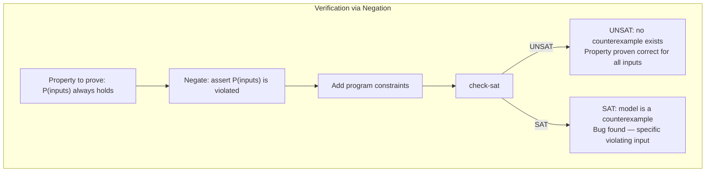

# CSE 403: Z3 and SMT Solvers

Solver-aided reasoning is a powerful approach to program verification and bug finding. Rather than manually constructing a mathematical proof, you encode the program's semantics as logical constraints and hand them to an automated solver. The solver either finds a solution — which corresponds to a concrete program behavior — or proves no solution exists — which proves the absence of that behavior. The key tool for this approach in CSE 403 is **Z3**, an industrial-strength solver developed by Microsoft Research.

## SAT Solvers

The foundation is the **Boolean Satisfiability Problem (SAT)**. A SAT solver takes a propositional logic formula — a formula built from boolean variables and connectives (AND, OR, NOT) — and either:

- Returns **SAT** along with a **model**: a satisfying assignment of `true`/`false` to every boolean variable that makes the entire formula evaluate to `true`.
- Returns **UNSAT**: no assignment of truth values to variables can make the formula `true` — the formula is logically unsatisfiable.

SAT is the canonical NP-complete problem, meaning no known polynomial-time algorithm exists for it in the worst case. However, modern SAT solvers (using algorithms like DPLL and CDCL) are remarkably effective in practice on the kinds of formulas that arise from programs.

## SMT Solvers and Z3

**Z3** is an **SMT solver** (Satisfiability Modulo Theories). SMT extends SAT by adding **background theories** — built-in knowledge about richer data types and structures beyond plain booleans. The SMT architecture works by combining a SAT core (which handles the boolean structure of the formula) with specialized **theory solvers** (which handle constraints over richer types).

The theories supported by Z3 include:

- **Linear integer arithmetic**: constraints like `x + y > 5`, `2*x = y`, `x >= 0` where `x`, `y` are integer variables.
- **Linear real arithmetic**: the same over real-valued variables.
- **Strings**: string equality, concatenation, regular expression membership.
- **Arrays**: a theory of arrays with `select(a, i)` (read element at index `i`) and `store(a, i, v)` (write value `v` at index `i`).
- **Bit vectors**: reasoning about fixed-width integers including overflow behavior — directly models how hardware integers work.
- **Uninterpreted functions**: functions whose internal behavior is left unspecified; only their functional consistency (same inputs give same output) is enforced.

The key insight is that SMT = SAT + background theories. Z3 translates the richer constraints into a form the SAT core can process, delegates theory-specific reasoning to the appropriate solver, and combines the results.

## SMT-LIB: The Input Language

**SMT-LIB** is a standardized s-expression language (similar to Lisp syntax) used to communicate with Z3 and other SMT solvers. Understanding this language is essential to using Z3 directly.

### Core Commands

```scheme
; Declare a constant (variable) of a given type
(declare-const x Int)       ; x is an integer variable
(declare-const y Bool)      ; y is a boolean variable
(declare-const z Real)      ; z is a real-valued variable

; Assert a constraint — add it to the set of requirements
(assert (> x 0))            ; require x > 0
(assert (= (+ x 5) 10))    ; require x + 5 = 10

; Check satisfiability — is there an assignment satisfying all assertions?
(check-sat)                 ; outputs "sat" or "unsat"

; If satisfiable, retrieve the concrete values Z3 found
(get-model)                 ; outputs the satisfying assignment
```

### Example Interaction

```scheme
(declare-const x Int)
(declare-const y Int)
(assert (> x 0))
(assert (> y 0))
(assert (= (+ x y) 10))
(check-sat)   ; sat
(get-model)   ; e.g., x = 3, y = 7
```

Z3 finds any assignment satisfying all constraints — it does not find the unique solution, just *a* solution. If multiple solutions exist, Z3 returns one arbitrarily.

## Using Z3 for Bug Finding: Existential Claims

To check whether a program can ever produce a particular output (an **existential claim** — "there exists an input such that..."), you:

1. Declare Z3 constants representing the function's inputs.
2. Assert constraints encoding the function body's computation step by step, using equalities to introduce intermediate variables.
3. Assert the target outcome (the output value you want to test for).
4. Call `(check-sat)`.

If the result is **SAT**, Z3's model gives you the exact concrete input that triggers the behavior — this is a bug-finding witness. If the result is **UNSAT**, the function can never produce that output for any input.

### Example: Can `simpleMath(a, b)` Return 1?

Suppose `simpleMath(a, b)` computes `result = (a * 2) + b - 3`. To check if it can return 1:

```scheme
(declare-const a Int)
(declare-const b Int)
(declare-const result Int)

; Encode the function body
(assert (= result (- (+ (* 2 a) b) 3)))

; Assert the target output
(assert (= result 1))

(check-sat)
; If SAT: the model gives specific a, b values that produce result = 1
; If UNSAT: no input can ever produce result = 1
```

This is an existential query: "Does there exist `(a, b)` such that `simpleMath(a, b) = 1`?"

## Using Z3 for Verification: Universal Claims

To prove that a program **never** does something bad — a **universal claim** ("for all inputs, the program satisfies property P") — the strategy is to use **negation**:

1. Encode the property you want to prove as a constraint.
2. **Negate** it: assert that the property is violated.
3. Add the constraints encoding the program's semantics.
4. Call `(check-sat)`.

The logical reasoning:
- If `(check-sat)` returns **UNSAT**: there is no input that causes the violation. Therefore, the property holds for all inputs — the program is verified correct.
- If `(check-sat)` returns **SAT**: the model is a **counterexample** — a specific input that actually violates the property, demonstrating a bug.

This negation strategy is the heart of solver-aided verification. You do not try to prove correctness directly; instead, you try to find a disproof, and if no disproof exists, correctness is established.



### Example: Program Equivalence

A powerful application is proving two programs equivalent. To prove that `programA` and `programB` always produce the same output on every input:

1. Declare shared input variables.
2. Assert the computation of both programs.
3. Assert that their outputs are **different**: `(assert (not (= outputA outputB)))`.
4. Call `(check-sat)`.

If **UNSAT**: no input makes them differ — the programs are equivalent.
If **SAT**: the model is an input on which they produce different outputs — the programs are not equivalent, and you have a concrete witness.

```scheme
(declare-const x Int)
; Program A: result = x * 2
(declare-const outA Int)
(assert (= outA (* x 2)))
; Program B: result = x + x
(declare-const outB Int)
(assert (= outB (+ x x)))
; Assert they differ
(assert (not (= outA outB)))
(check-sat)   ; unsat — they are equivalent
```

## Limitations and Practical Challenges

### Modeling

The hardest part of using Z3 is accurately encoding the program's semantics as SMT constraints. This requires careful translation:

- Each assignment `x = expr` becomes an assertion `(assert (= x expr))` where `x` is a fresh Z3 constant for the new value.
- Control flow (if/else) requires introducing boolean guards.
- **Loops** cannot be directly encoded as SMT constraints, because the number of iterations may be unknown or infinite. Two approaches exist:
  - **Loop unrolling**: assert the loop body's constraints for a fixed, bounded number of iterations. This is sound only for that bounded depth — bugs requiring more iterations will be missed.
  - **Loop invariants**: supply a loop invariant as an additional assertion and verify it separately (verify base case and inductive step). This is more powerful but requires human insight.

### Decidability and Timeouts

Z3 can solve many constraint systems efficiently, but some theories push into undecidable territory:

- **Non-linear integer arithmetic** (e.g., `x * y = z` where both `x` and `y` are free variables) is undecidable in general. Z3 may time out or return `unknown`.
- **Quantifiers** (∀ and ∃ in the formula itself) dramatically increase complexity.

### Scalability

Even for decidable theories, SMT solving is NP-hard in the worst case. Real programs with thousands of variables and complex control flow may be intractable to verify completely. Solver-aided reasoning is therefore most powerful for:
- Verifying small but critical functions (e.g., cryptographic primitives, safety-critical controllers).
- Finding bugs in bounded domains where the search space is manageable.
- Proving equivalence between refactored versions of simple functions.

The key practical insight: solver-aided reasoning is not a silver bullet for arbitrary large programs, but it is an extremely precise and powerful tool in its applicable domain.

---

## Related

- [[CSE403/Program Analysis/Program Analysis Overview]]
- [[CSE403/Program Analysis/Static and Dynamic Analysis]]
- [[CSE403/Program Analysis/Static Analysis]]

## Industry Standard Terms

| CSE 403 Term | Industry / Research Equivalent |
|---|---|
| Z3 | Z3 SMT solver (Microsoft Research); also CVC5, Yices2 |
| SMT solver | Satisfiability Modulo Theories solver |
| SAT solver | Boolean satisfiability solver (MiniSat, Glucose) |
| Model (from `get-model`) | Satisfying assignment, witness, counterexample |
| Existential claim | Existential query, bug-finding query |
| Universal claim | Universal verification query |
| Negation strategy | Proof by contradiction / refutation-based verification |
| Counterexample | Counterexample (standard term) |
| Loop unrolling | Bounded model checking |
| Solver-aided verification | Formal verification, solver-based verification |
| SMT-LIB | SMT-LIB2 standard (standard term) |
