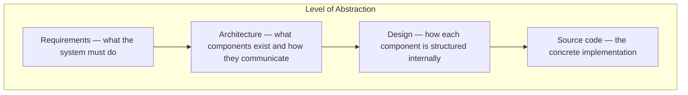
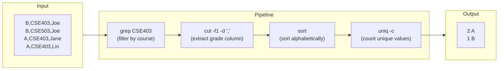
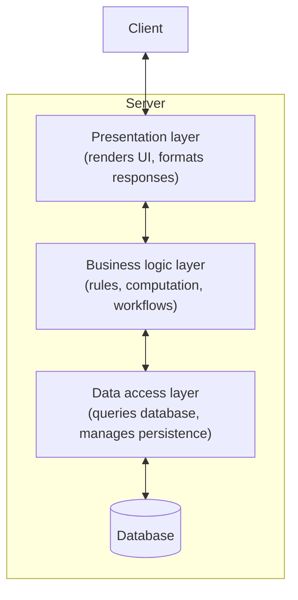
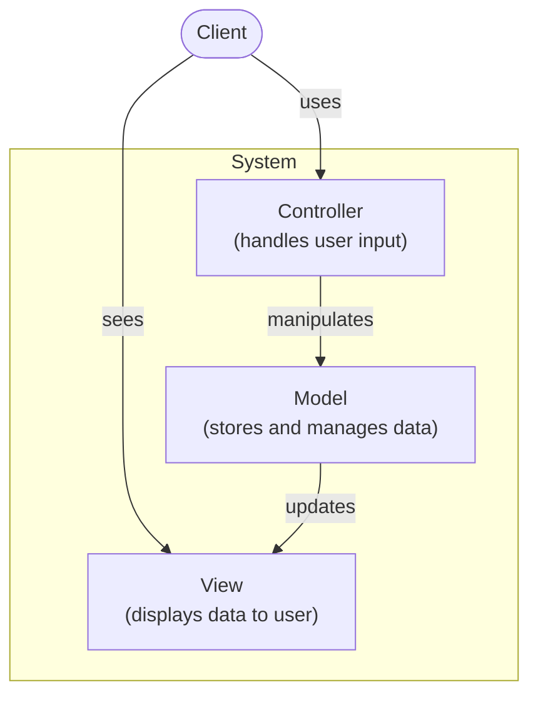
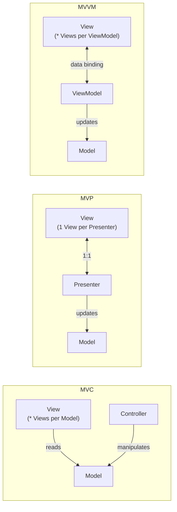

# CSE 403: Software Architecture Patterns

**Software architecture** is the high-level structure of a software system — the decisions about what components exist, what protocols they use to communicate, and what storage mechanisms they employ. Architecture answers the question "what is built?" before the question "how is each piece built?" is addressed. Understanding architectural patterns gives engineers a vocabulary for discussing, designing, and critiquing the structure of large systems.

## Architecture vs. Design

The boundary between architecture and design is a level of abstraction, not a sharp line. Both exist on a spectrum from source code (lowest abstraction) to requirements (highest abstraction), with design in the middle and architecture above it.



| Dimension | Architecture | Design |
|---|---|---|
| Question answered | What is developed? | How are the components developed? |
| Focus | High-level view of the overall system | Individual components |
| Concerns | What components exist? What protocols? What storage? | Data representation, interfaces, class hierarchies |
| Analogy | Blueprint of a building | Furniture arrangement in a room |

The analogy to physical buildings is direct: **architecture** is the building's floor plan — which rooms exist, how they connect, where the load-bearing walls are — while **design** is how each room is furnished and used. Both matter, but changing the architecture (moving a load-bearing wall) is far more disruptive than changing the design (rearranging furniture).

### Why Architecture Matters

The goals of software architecture are **separation of concerns** and **modularity**:

- **Components and interfaces**: defining clear boundaries allows components to be understood, communicated to other engineers, and reused independently.
- **Managing complexity**: modularity prevents any single part of the system from becoming a "god object" that must understand everything.
- **Process support**: a clear architecture allows effort estimation and progress monitoring — work can be divided along component boundaries.

A key warning from Tony Hoare applies here: systems that are made complex enough to obscure their deficiencies tend to fail in catastrophic and hard-to-diagnose ways. Good architecture aims for the first kind of simplicity.

## Abstraction as a Tool

Large codebases are incomprehensible at the source code level. The Linux kernel has 16 million lines of code — reading it raw tells you almost nothing about its structure. **Abstraction** is the process of building a representation of reality that ignores insignificant details and focuses on the most important properties.

Different viewpoints require different levels of abstraction:

- **Communication**: an architecture diagram for a team meeting must be readable on a whiteboard.
- **Component interfaces**: an interface specification needs to be precise enough to program against.
- **Verification and validation**: a formal model needs to be rigorous enough to reason about correctness.

Two standard abstractions for the Linux kernel illustrate this:
- A **call graph** shows which functions call which — revealing dependency structure.
- A **layer diagram** shows the subsystem hierarchy (Hardware → Device drivers → Kernel → System call interface → GNU C library → User applications) — revealing the component architecture.

## Pipe and Filter Architecture

**Pipe and filter** is an architectural pattern in which a series of **filters** (processing components) are connected by **pipes** (data channels). Each filter reads input from its incoming pipe, transforms it in some way, and writes the result to its outgoing pipe. Filters are typically stateless and independent of each other.

The Unix shell exemplifies this pattern. To group and count CSE403 letter grades from a CSV file:

```
grep CSE403 grades.csv | cut -f1 -d ',' | sort | uniq -c
```

Each stage is a filter; the `|` character is the pipe. The data flows left to right:



### Why Pipe and Filter is an Architecture Pattern (not a Design Pattern)

Pipe and filter is an **architecture** pattern because it describes the high-level structure of the overall system — what components exist (the filters), how they communicate (pipes carrying data streams), and what protocol is used (each filter reads stdin and writes stdout). It does not specify the design or implementation of any individual filter. The `grep` filter could be implemented as a finite automaton, a backtracking regex engine, or any other mechanism — the architecture is indifferent to that choice. This distinction is fundamental: architecture constrains the system structure; design fills in the component internals.

### Properties of Pipe and Filter

- Filters are independent and can be developed, tested, and replaced separately.
- The pipeline can be composed in arbitrary combinations to solve new problems.
- Data flows unidirectionally, making the system easy to reason about.
- Filters cannot easily share state, which can be a limitation for tasks requiring global context.

## Client-Server / N-Tier Architecture

**Client-server** (and its generalization, **n-tier**) architecture separates the system into a client that makes requests and a server that fulfills them. In an n-tier architecture, the server side is itself stratified into multiple layers, each with a distinct responsibility.

A standard 3-tier architecture:



| Layer | Responsibility |
|---|---|
| Presentation layer | Render the user interface; format data for display |
| Business logic layer | Implement the domain rules and computations |
| Data access layer | Communicate with the database; abstract storage details |

### Benefits

- **Reusability**: the business logic layer can be reused by multiple clients (web browser, mobile app, API consumers) because it is decoupled from the presentation.
- **Exchangeability**: the database can be replaced (e.g., switching from MySQL to PostgreSQL) by modifying only the data access layer.
- **Distribution**: different tiers can run on different physical machines, enabling horizontal scaling.

## Model-View-Controller (MVC)

**Model-View-Controller (MVC)** is an architectural pattern that separates a system into three components with distinct responsibilities. It is widely used in graphical user interfaces and web frameworks.



| Component | Responsibility |
|---|---|
| Model | Stores and manages the application's data; notifies View when data changes |
| View | Renders the data from the Model in a form the user can see |
| Controller | Receives user input and translates it into commands to the Model |

The MVC pattern separates three concerns that would otherwise be tangled:
- **Data representation** (Model) is independent of how it is displayed.
- **Visualization** (View) is independent of how data is modified.
- **Client interaction** (Controller) is independent of both storage and rendering.

### Concrete Example: Weather Station

A simple weather station displays the current temperature in Fahrenheit and Celsius, a 30-day historical graph, and min/max temperatures. It has a Reset history button. The MVC decomposition:

- **Model**: the raw temperature measurements from the sensor — a log of timestamped temperature readings (e.g., `01/01,8am,0`). The Model stores this data and makes it available.
- **View**: the display panels — the current temperature readout in F and C, the graph of historical temperatures, the min/max table. The View reads from the Model and renders it.
- **Controller**: the Reset button. When the user clicks Reset, the Controller receives the event and commands the Model to clear its history.

One subtle but important point: in MVC, the Model can have **multiple Views** (one Model feeds both the numeric readout and the graph). Each View is independently updated when the Model changes.

## MVC vs. MVP vs. MVVM

MVC is the original pattern, but two common variants address specific weaknesses:



| Pattern | Key Difference |
|---|---|
| MVC | Model can be observed by multiple Views; Controller handles input separately |
| MVP (Model-View-Presenter) | Presenter has a strict 1:1 relationship with its View; Presenter mediates all interaction between View and Model |
| MVVM (Model-View-ViewModel) | ViewModel exposes the Model's data in a View-friendly form; View binds directly to ViewModel properties (data binding) |

**MVP** addresses testability: because the Presenter has no dependency on the UI framework, it can be unit-tested without rendering a screen. The View is made as "dumb" as possible — it only knows how to display what the Presenter tells it.

**MVVM** is dominant in frameworks with rich data binding support (Angular, SwiftUI, WPF). The ViewModel transforms Model data into a form optimized for display, and the View updates automatically when ViewModel properties change, without explicit update calls.

## Git Conventions (Related to Architecture Concepts)

The 04/23 lecture also covered conventions for using Git effectively in a team context. These are team-level practices that enforce architectural separation at the workflow level — feature branches maintain separation of concerns in the commit history, just as architectural layers maintain separation of concerns in the code.

- Use **feature branches** — never modify `main` directly. This keeps `main` always in a releasable state.
- Don't merge to `main` directly — open a **pull request (PR)** and request code reviews from colleagues before merging. Code review catches bugs and enforces standards.
- **Commit and push often** — frequent commits create a detailed history and reduce the risk of large, conflicting changes.
- Write **good commit messages** — a commit message is documentation of why a change was made, not just what changed.
- Avoid **long-running feature branches** — the longer a branch diverges from `main`, the more difficult merging becomes.
- Do **`git pull` often** to stay up to date with changes from teammates and avoid large merge conflicts.
- Maintain **good communication** with colleagues to prevent merge conflicts before they happen — knowing who is working on what prevents simultaneous modification of the same files.

### Merge Strategies

Three distinct strategies exist for integrating a feature branch into `main`:

| Strategy | What it does | When to use |
|---|---|---|
| **Merge** (`git merge`) | Creates a merge commit preserving full branch history | When full audit trail is desired |
| **Rebase** (`git rebase main`) | Re-applies feature branch commits on top of latest `main`, creating linear history | Before submitting a PR to clean up history |
| **Squash and merge** (GitHub only) | Combines all feature branch commits into a single new commit on `main` | When feature branch has many noisy intermediate commits |

**Rebase warning**: `git rebase` rewrites commit history. If anyone else has a copy of the pre-rebase commits (because the branch was pushed to the remote), they will have diverged history that is very difficult to reconcile. The rule is: **do not rebase public branches**. Only rebase local, private branches before pushing them for the first time.

---

## Related

- [[CSE403/Software Design and Architecture/Software Design Theory]]
- [[CSE403/Software Design and Architecture/UML Class Diagrams]]

## Industry Standard Terms

| CSE 403 Term | Industry / Research Equivalent |
|---|---|
| Architecture | Software architecture (standard term) |
| Design | Software design (standard term) |
| Pipe and filter | Pipeline architecture, Unix philosophy |
| Filter (pipe and filter) | Processor, transformer, stream processor |
| Client-server / n-tier | Multi-tier architecture, layered architecture |
| Presentation layer | View layer, UI layer, frontend |
| Business logic layer | Service layer, application layer, domain layer |
| Data access layer | Repository layer, persistence layer, DAO layer |
| MVC | Model-View-Controller (standard term, used in Rails, Spring, Django) |
| MVP | Model-View-Presenter (standard term, used in Android) |
| MVVM | Model-View-ViewModel (standard term, used in WPF, Angular, SwiftUI) |
| Squash and merge | Squash merge (standard GitHub/GitLab term) |
