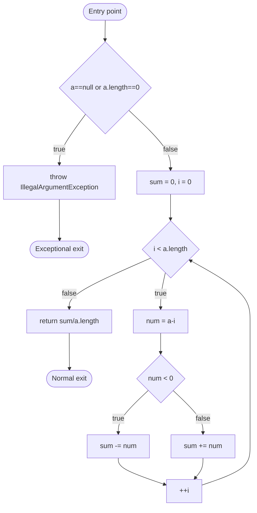

# CSE 403: Coverage-Based Testing

**Coverage-based testing** (also called **structural code coverage**) is a family of **test adequacy criteria** that measure how thoroughly a test suite exercises the structure of the code under test. Coverage metrics answer the question: *is my test suite sufficient?* They do not prove correctness, but they provide a measurable, tool-checkable signal for test completeness.

See [[CSE403/Testing/Testing and Continuous Integration]] for context on why test adequacy matters.

## The Control Flow Graph (CFG)

All structural coverage criteria are defined with respect to the **Control Flow Graph (CFG)** of the program. The CFG is a directed graph where:

- **Nodes** represent basic blocks of statements (sequences of code with no branches).
- **Edges** represent possible transfers of control between blocks (branches taken or not taken).
- There is an **entry point** node (the function starts here) and one or more **exit nodes** (normal return, exceptional exit).

**Running example** — the `avgAbs` method computes the average of the absolute values of an array of doubles:

```java
public double avgAbs(double ... numbers) {
    // We expect the array to be non-null and non-empty
    if (numbers == null || numbers.length == 0) {
        throw new IllegalArgumentException("Array numbers must not be null or empty!");
    }
    double sum = 0;
    for (int i=0; i<numbers.length; ++i) {
        double d = numbers[i];
        if (d < 0) {
            sum -= d;
        } else {
            sum += d;
        }
    }
    return sum/numbers.length;
}
```



This CFG makes the program's decision structure explicit and is the foundation for all coverage metrics that follow.

## Code Coverage Tools

Coverage tools instrument the code at the bytecode (or source) level and record which nodes and edges are visited during a test run. The lecture shows two tools:

- **Cobertura**: an older Java coverage tool that produces line and branch coverage reports.
- **JaCoCo** (Java Code Coverage): the modern standard, integrated with Gradle via the `jacoco` plugin. Reports line coverage, branch coverage, and cyclomatic complexity. Available at `github.com/rjust/testing-mock`.

## Statement Coverage

### Formal Definition

**Statement coverage** (also called **line coverage** or **node coverage**) requires that every statement (node in the CFG) in the program is executed at least once.

$$\text{Statement Coverage} = \frac{\text{number of statements executed}}{\text{total statements}} \times 100\%$$

### Simplified Explanation

Every line of code must be touched by at least one test. If a statement is never reached, the test suite has not exercised that code path at all.

**Equivalence**: given the CFG, statement coverage is equivalent to **node coverage** — every node must be visited.

**Minimum test suite for `avgAbs`**: two tests suffice:
- Test 1: pass `null` or an empty array (exercises the `throw` branch and the exceptional exit).
- Test 2: pass `{-1.0, 2.0}` (exercises the normal path including both the negative and non-negative branches).

Statement coverage does **not** require that both outcomes of every decision be tested. A decision that always evaluates to `true` in all tests achieves 100% statement coverage — the `false` branch is never taken.

## Decision Coverage

### Formal Definition

**Decision coverage** (also called **branch coverage** or **edge coverage**) requires that every decision (boolean expression at a branch point) takes on **all possible outcomes** (true and false) at least once.

### Simplified Explanation

Every `if`, `while`, `for`, and `switch` must be exercised in both directions — the branch must be taken and also not taken. This is strictly stronger than statement coverage because it forces both arms of every conditional to be executed.

**Equivalence**: given the CFG, decision coverage is equivalent to **edge coverage** — every directed edge must be traversed.

**Minimum test suite for `avgAbs`**:
- Test 1: null input (exercises `a==null||a.length==0` → true; exceptional exit).
- Test 2: non-empty array with at least one negative and one non-negative element (exercises `a==null||a.length==0` → false; `i<a.length` → true and false; `num<0` → true and false).

## Condition and Decision: Terminology

The slides establish precise terminology before introducing the more refined criteria:

- **Condition**: a boolean expression that **cannot be decomposed** into simpler boolean expressions — it is atomic. Examples: `a==null`, `a.length==0`, `num<0`, `i<a.length`.
- **Decision**: a boolean expression that **is composed** of one or more conditions joined by logical connectors (`&&`, `||`, `|`, `&`, `!`). A decision with zero logical connectors is just a single condition. Example: `a==null || a.length==0` is a decision composed of two conditions.

In `if (a | b)`:
- `a` and `b` are **conditions**.
- `a | b` is the **decision**.

## Condition Coverage

### Formal Definition

**Condition coverage** requires that every **condition** in the program takes on all possible outcomes (true and false) at least once. This is independent of whether the encompassing decision's outcome changes.

### Simplified Explanation

Every atomic boolean sub-expression must be true in some test and false in some other test. This is evaluated per condition, not per decision.

**Critical insight**: condition coverage does **not** imply decision coverage. Consider `if (a || b)` with test cases `(a=true, b=false)` and `(a=false, b=true)`:
- Both conditions take on both values. Condition coverage is satisfied.
- But the decision `a || b` is always true in both tests. Decision coverage is NOT satisfied (the false outcome of the decision is never taken).

## Subsumption Relationships

**Subsumption** is the formal relationship between coverage criteria: criterion A **subsumes** criterion B if and only if satisfying A automatically guarantees satisfying B.

| Question | Answer | Explanation |
|----------|--------|-------------|
| Does statement coverage subsume decision coverage? | No | You can reach every statement without exercising both outcomes of every branch |
| Does decision coverage subsume statement coverage? | Yes | Exercising both outcomes of every branch necessarily visits every reachable statement |
| Does decision coverage subsume condition coverage? | No | A decision can take both outcomes without each individual condition taking both values (short-circuit evaluation) |
| Does condition coverage subsume decision coverage? | No | Each condition can take both values without the overall decision taking both values (as shown above) |

## Modified Condition/Decision Coverage (MC/DC)

**MC/DC** (Modified Condition/Decision Coverage) is a stronger criterion that combines and extends decision and condition coverage. It requires all three of the following simultaneously:

1. **Every decision** takes on all possible outcomes (true and false) at least once.
2. **Every condition** takes on all possible outcomes (true and false) at least once.
3. **Each condition** has been shown to **independently affect** its decision's outcome — i.e., there exist two test cases that differ only in that condition's value, while all other conditions are held fixed, and the decision's outcome changes.

### Formal Definition

For a decision $D$ with conditions $c_1, c_2, \ldots, c_n$, MC/DC requires for each condition $c_i$: there exist two test inputs $t_1$ and $t_2$ such that:
- All conditions $c_j$ ($j \neq i$) have the same value in $t_1$ and $t_2$
- $c_i$ differs between $t_1$ and $t_2$
- $D(t_1) \neq D(t_2)$ — the decision's outcome changes

### Simplified Explanation

You must show that each individual condition actually matters — flipping it alone changes the overall decision. This guards against conditions that are masked by short-circuit evaluation or by other conditions always dominating.

**MC/DC is required for safety-critical systems** under standard DO-178B/C (avionics software certification).

### MC/DC Example: `if (a | b)` (bitwise OR — evaluates both)

Truth table for `a | b`:

| a | b | Outcome |
|---|---|---------|
| 0 | 0 | 0 |
| 0 | 1 | 1 |
| 1 | 0 | 1 |
| 1 | 1 | 1 |

To satisfy MC/DC, choose tests that independently demonstrate each condition's influence:

- **Show `a` matters**: pick rows where `b` is fixed. Rows (a=0,b=0) and (a=1,b=0): `b=0` is fixed, `a` changes, decision changes (0→1). Valid pair.
- **Show `b` matters**: pick rows where `a` is fixed. Rows (a=0,b=0) and (a=0,b=1): `a=0` is fixed, `b` changes, decision changes (0→1). Valid pair.

Minimal MC/DC-adequate suite: `{(0,0), (0,1), (1,0)}` — 3 tests instead of all 4 combinations.

**MC/DC is cheaper than exhaustive testing** while being stronger than decision or condition coverage alone.

### MC/DC Example: `if (a || b)` (short-circuit OR)

The short-circuit `||` operator stops evaluating when `a=true` — `b` is never evaluated in that case. This means rows where `a=1` appear as `(1, --)` in the truth table. The value of `b` cannot be independently varied when `a=1`, so those rows cannot contribute to showing `b`'s independence. **Short-circuiting operators may make it impossible to independently vary all conditions**, complicating MC/DC analysis.

### MC/DC Constraint: Infeasible Combinations

Consider `if (!a) ... if (a || b)` — two decisions sharing condition `a`. Because `!a` is checked first, when `a=true`, the second decision is never reached, meaning the rows `(a=1, b=0)` and `(a=1, b=1)` for the second decision are **infeasible** — they cannot occur in any execution. **Not all combinations of conditions may be achievable in real programs**, and MC/DC analysis must account for infeasible combinations by marking them as unreachable.

### MC/DC Complex Expressions

MC/DC scales to more conditions: for a decision with $n$ conditions, MC/DC requires between $n+1$ and $2n$ test cases (depending on the structure), always far fewer than the $2^n$ combinations needed for exhaustive testing.

**Exercise from slides** — provide MC/DC-adequate test suites for:
1. `a | b | c`
2. `a & b & c`

For `a | b | c`, the minimum MC/DC suite needs 4 tests (n+1 = 3+1 for non-short-circuit OR). For `a & b & c`, similarly 4 tests.

## Summary

| Criterion | CFG Equivalent | Strength | Industry Use |
|-----------|---------------|---------|-------------|
| Statement coverage | Node coverage | Weakest | Minimum bar; easy to measure |
| Decision coverage | Edge coverage | Stronger than statement | Common in industry (JaCoCo branch coverage) |
| Condition coverage | Per-condition true/false | Incomparable to decision | Less common standalone |
| MC/DC | Combined + independence | Strongest practical criterion | Required for DO-178B/C safety-critical systems |

Key takeaways from the lecture:
- Code coverage is **easy to compute** (tools do it automatically) and has an **intuitive interpretation**.
- Code coverage **in industry**: Google has published on using coverage as a signal (reference: "Code Coverage at Google").
- Code coverage by itself is **not sufficient** — 100% coverage does not mean zero bugs, because coverage only tracks which code was executed, not whether the assertions were correct. [[CSE403/Testing/Mutation Testing]] addresses this gap by measuring whether tests can distinguish the program from subtly broken versions.

## Related

- [[CSE403/Testing/Testing Fundamentals]]
- [[CSE403/Testing/Test Design Techniques]]
- [[CSE403/Testing/Testing and Continuous Integration]]
- [[CSE403/Testing/Mock-Based Testing]]
- [[CSE403/Testing/Mutation Testing]]
- [[CSE403/Testing/UI Testing and WebDriver]]
- [[CSE403/Program Analysis/Static and Dynamic Analysis]]

## Industry Standard Terms

| Course Term | Industry Equivalent |
|-------------|---------------------|
| Statement coverage / line coverage | Line coverage (Istanbul, JaCoCo, Coverage.py) |
| Decision coverage | Branch coverage |
| Condition coverage | Condition coverage (less commonly reported by tools) |
| MC/DC | Modified Condition/Decision Coverage — DO-178B/C standard |
| Control Flow Graph (CFG) | Control flow graph (same term in industry) |
| Test adequacy criterion | Coverage criterion, coverage metric |
| Subsumption | Coverage hierarchy, coverage strength |
| Cobertura / JaCoCo | Code coverage tools |
