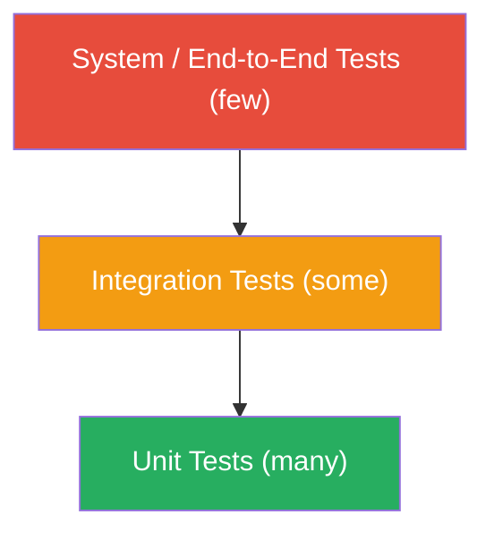

# CSE 403: Testing Fundamentals

**Software testing** is the process of executing a program with the intent of finding defects. This definition — due to Glenford Myers — is important: the goal of testing is to *find* bugs, not to demonstrate that none exist. A test that passes without revealing a bug may be valueless if it was not designed to stress the system. A test that fails is valuable because it has revealed a real problem.

Testing sits at the intersection of theory and practice. It has formal underpinnings (coverage criteria, oracle specifications) and deeply practical concerns (how to write maintainable test suites, how to run them fast enough to be useful).

---

## Verification vs. Validation

These two terms are frequently confused:

**Verification**: Are we building the product right? — Does the software conform to its specification? Verification asks whether the implementation matches the design documents. A program that correctly implements its spec is *verified*, even if the spec itself is wrong.

**Validation**: Are we building the right product? — Does the software actually satisfy the user's real needs? Validation requires running the software against actual user expectations, not just documents.

The distinction matters because a system can be fully verified (matches the spec) but completely wrong (the spec did not reflect what users needed). Both activities are necessary.

---

## The Fundamental Testing Problem: Oracles

A **test oracle** is the mechanism used to determine whether a test has passed or failed. For a given input, you need to know the correct expected output to compare against the program's actual output.

Oracles are harder to construct than they appear:

- For simple functions (e.g., `sqrt(4) == 2.0`), the oracle is obvious
- For complex systems (a compiler, a game, a recommender system), constructing a complete oracle is itself a hard problem
- For concurrent or non-deterministic systems, even defining "correct output" for a given input may be ambiguous

**Test oracle automation** — writing oracle logic as assertions in code — is one of the primary technical challenges of testing.

---

## Terminology: Fault, Error, Failure

Precise terminology matters in testing:

- **Fault** (or **defect** or **bug**): A static flaw in the source code — a wrong expression, a missing condition, an off-by-one in a loop bound. The fault is in the code.
- **Error**: An incorrect internal state caused by a fault executing. The program's memory, registers, or variables have taken on a wrong value.
- **Failure**: An observable incorrect behavior — the program produces wrong output, crashes, or takes an incorrect action. The failure is what the user sees.

The chain is: fault → (when executed) → error → (when propagated) → failure.

This chain explains why some faults never cause observed failures: the error may be overwritten before it affects observable output, or the code path containing the fault may never be executed.

---

## Testing Levels

Testing is organized into levels corresponding to the scale of what is being tested:

### Unit Testing

**Unit testing** tests individual units of code — typically a single method or class — in isolation. Dependencies are replaced with **test doubles** (mocks, stubs, fakes) so that the unit under test is the only real code executing.

- Scope: one method or class
- Speed: very fast (milliseconds)
- Isolation: complete (no real DB, no real network)
- Purpose: verify that individual logic is correct

Unit tests are the foundation of the test pyramid. They should be the most numerous and run on every code change.

### Integration Testing

**Integration testing** tests the interaction between two or more real components. Dependencies are NOT mocked — real databases, real file systems, and real network calls may be involved.

- Scope: multiple modules working together
- Speed: slower (seconds to minutes)
- Purpose: verify that components integrate correctly and interfaces work as expected

Integration tests catch problems that unit tests cannot: mismatched API assumptions, incorrect data serialization, schema mismatches.

### System Testing

**System testing** tests the entire system end-to-end, in an environment as close to production as possible.

- Scope: full system
- Speed: slowest (minutes to hours)
- Purpose: verify that the system as a whole meets its requirements

### Acceptance Testing

**Acceptance testing** involves validating the system against user requirements, often with end users or clients executing scripted scenarios. **User Acceptance Testing (UAT)** is a formal variant where the client formally signs off on the system.

---

## The Test Pyramid

The **Test Pyramid** describes the recommended distribution of tests across levels:

Many unit tests form the wide base — they are fast, cheap to write, and run constantly. Fewer integration tests sit in the middle. A small number of system-level tests sit at the top — they are slow and expensive to maintain, so there should be few of them.

Inverting the pyramid (many system tests, few unit tests) creates a fragile, slow test suite — sometimes called an **ice cream cone anti-pattern**.

---

## Black-Box vs. White-Box Testing

**Black-box testing** (also called **specification-based testing**) tests the program by treating it as a black box: the tester only knows the inputs and expected outputs from the specification. No knowledge of the internal implementation is used.

- Advantage: not biased by implementation — tests what the spec says should happen
- Disadvantage: cannot target specific code paths or internal states

**White-box testing** (also called **structural testing** or **glass-box testing**) uses knowledge of the internal code structure to design tests. The goal is to exercise specific paths, branches, or conditions inside the implementation.

- Advantage: can ensure specific risky code paths are tested
- Disadvantage: tests only what the code does, not what the spec says it should do — a bug in the code that also manifests in the test design may go undetected

Both approaches are necessary. Black-box testing ensures correctness with respect to specification; white-box testing ensures thorough execution of the actual code.

---

## Coverage Criteria

**Coverage criteria** are metrics that measure how thoroughly a test suite exercises a program. They are used to identify undertested portions of the code.

See [[CSE403/Testing/Coverage-Based Testing]] for a full treatment of coverage criteria, the control flow graph, and MC/DC.

### Statement Coverage

**Statement coverage** (also called **line coverage**) measures the fraction of statements in the code that are executed by the test suite.

### Formal Definition

$$\text{Statement Coverage} = \frac{\text{number of statements executed}}{\text{total number of statements}} \times 100\%$$

### Simplified Explanation

Of all the lines of code in the program, what percentage did the tests actually run? If a test suite achieves 80% statement coverage, 20% of the code was never touched during testing.

### Branch Coverage

**Branch coverage** measures whether each possible outcome (true/false) of every conditional branch has been exercised. This is strictly stronger than statement coverage: 100% branch coverage implies 100% statement coverage, but not vice versa.

Consider `if (x > 0) { ... }` with no else clause. Statement coverage only requires executing the if-body once (x = 5). Branch coverage requires both the true case (x = 5) and the false case (x = -1).

### Path Coverage

**Path coverage** requires that every possible execution path through the program is executed. This is theoretically the strongest criterion but is practically infeasible for any non-trivial program — the number of paths grows exponentially with the number of branches (and may be infinite if loops are involved).

### Coverage as a Tool, Not a Goal

Achieving 100% statement or branch coverage does not mean the program is correct — it means the test suite has executed those lines. A test without a proper oracle (assertion) contributes to coverage but cannot catch bugs. Coverage is a useful indicator of **untested code**, not a proof of correctness.

---

## Test-Driven Development (TDD)

**Test-Driven Development** is a practice in which tests are written *before* the implementation they test. The cycle is:

1. Write a failing test (Red)
2. Write just enough code to make the test pass (Green)
3. Refactor both test and production code while keeping tests green (Refactor)

The primary benefit of TDD is not the tests themselves — it is the **design pressure**. Writing a test first forces you to think about how the unit will be used before implementing it, which tends to produce cleaner, more modular interfaces.

See [[CSE403/Software Process/SDLCModelsComponents/Agile and Scrum Details]] for more on TDD in the XP context.

---

## Regression Testing

A **regression** is a defect introduced by a change to the code — something that worked before now fails. **Regression testing** is the practice of re-running the full test suite after every change to ensure no regressions have been introduced.

Regression testing is only practical if the test suite is automated. Manual regression testing does not scale.

**Continuous Integration (CI)** systems automate regression testing: every commit triggers a full test run, and failures are immediately surfaced to the team. See [[CSE403/Testing/Automated Testing and CI]] and [[CSE403/Testing/Testing and Continuous Integration]] for how CI is configured and operated in practice.

---

## Mutation Testing

**Mutation testing** evaluates the quality of a test suite by introducing small artificial bugs (**mutants**) into the code and checking whether the test suite detects them. See [[CSE403/Testing/Mutation Testing]] for a full treatment of mutation operators, mutation score, and equivalent mutants. A mutant is a version of the source code with a single small change — flipping `>` to `>=`, changing `+` to `-`, removing a negation.

- A **killed mutant**: at least one test in the suite fails on the mutant (the suite detected the bug)
- A **surviving mutant**: all tests pass on the mutant (the suite missed the bug)

The **mutation score** is the fraction of mutants that were killed. A high mutation score means the test suite is good at detecting small code changes — a proxy for its effectiveness at finding real bugs.

---

## Related

- [[CSE403/Testing/Test Design Techniques]]
- [[CSE403/Testing/Coverage-Based Testing]]
- [[CSE403/Testing/Mutation Testing]]
- [[CSE403/Testing/Automated Testing and CI]]
- [[CSE403/Testing/Testing and Continuous Integration]]
- [[CSE403/Software Process/SDLC Models]]
- [[CSE403/Program Analysis/Static and Dynamic Analysis]]

---

## Industry Standard Terms

| Course Term | Industry / Standard Term |
|---|---|
| Unit Testing | Component Testing |
| Test Double | Mock, Stub, Fake, Spy (subtypes of test double) |
| Black-box Testing | Specification-based Testing, Behavioral Testing |
| White-box Testing | Structural Testing, Glass-box Testing |
| Branch Coverage | Decision Coverage |
| Statement Coverage | Line Coverage |
| Test Oracle | Assertion, Expected Result |
| Regression Testing | Regression suite, Smoke test (subset) |
| UAT | User Acceptance Testing, Beta Testing (informal) |
| Mutation Testing | Mutation Score, Mutation Analysis |
| CI | Continuous Integration, CI/CD |
