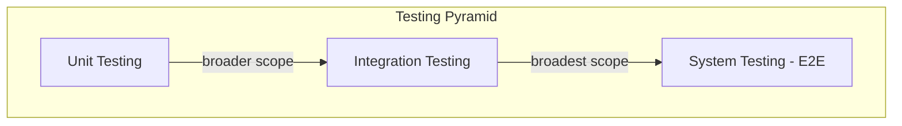
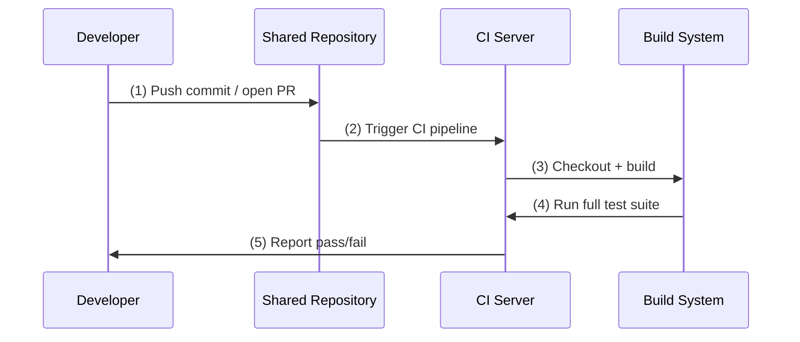

# CSE 403: Testing and Continuous Integration

## Software Testing vs. Software Debugging

**Software testing** and **software debugging** are complementary but distinct activities.

- **Testing** asks: *is there a bug?* A test provides concrete inputs, runs the code, and asserts that the observed output matches the expected output. The test framework mechanically verifies the assertion.
- **Debugging** asks: *where is the bug, and how do we fix it?* Debugging begins after a test has already revealed that a bug exists.

**Example** — a buggy average function:

```java
double avg(double[] nums) {
    int n = nums.length;
    double sum = 0;
    int i = 0;
    while (i < n) {
        sum = sum + nums[i];
        i = i + 1;
    }
    double avg = sum * n;  // bug: should be sum / n
    return avg;
}
```

A test catches the bug:

```java
@Test
public void testAvg() {
    double[] nums = new double[]{1.0, 2.0, 3.0};
    double actual = Math.avg(nums);
    double expected = 2.0;
    assertEquals(expected, actual, EPS);
    // Fails: testAvg failed: 2.0 != 18.0
}
```

The test reveals the symptom (`18.0` instead of `2.0`). Debugging then locates the fault (line 11: `*` instead of `/`) and fixes it. Testing and debugging are therefore sequential: test first to detect, then debug to diagnose.

## Types of Software Tests

Software tests are organized in a **testing pyramid** with three levels, ordered from most numerous and fastest to least numerous and slowest:



**Unit testing**: Does each unit work as specified?
- Tests a single unit of code (a method, a class) in isolation.
- Fast, precise, easy to pinpoint failures.
- Open question from lecture: *What exactly is a unit? Is it possible and desirable to test units in isolation?* (This motivates mock-based testing — see [[CSE403/Testing/Mock-Based Testing]].)

**Integration testing**: Do the units work when put together?
- Tests that two or more components collaborate correctly.
- Catches interface mismatches and assumption violations that unit tests miss.

**System testing (End-to-End, E2E)**: Does the system work as a whole?
- Exercises the entire stack from the user's perspective.
- Slowest, most expensive, but provides the highest confidence that the complete product is correct.
- UI testing with [[CSE403/Testing/UI Testing and WebDriver]] is a form of system testing.

## Testing Best Practices

### Motivating Example

Consider a method that computes the average of the absolute values of an array of doubles:

```java
public double avgAbs(double ... numbers) {
    // We expect the array to be non-null and non-empty
    if (numbers == null || numbers.length == 0) {
        throw new IllegalArgumentException("Array numbers must not be null or empty!");
    }
    double sum = 0;
    for (int i=0; i<numbers.length; ++i) {
        double d = numbers[i];
        if (d < 0) {
            sum -= d;
        } else {
            sum += d;
        }
    }
    return sum/numbers.length;
}
```

The question "what tests should we write for this method?" motivates the best practices below.

### Test Atomicity

Each test should test **one thing** and only one thing. An atomic test has a single clear assertion and a single clear failure mode. When a test fails, you know immediately which behavior is broken without reading through a long test body.

The contrasting anti-pattern is a "god test" that verifies many behaviors sequentially — when it fails, you cannot tell which assertion triggered the failure without re-reading the code.

### Table-Based Testing

Instead of writing one test method per case, express the test inputs and expected outputs as a table of data. The test runner iterates over the table, invoking the method under test for each row and checking the expected output.

This makes it trivial to add new cases (add a row to the table) and makes the full coverage intent visible at a glance.

### Parameterized Unit Tests

**Parameterized unit tests** are the framework-level mechanism for table-based testing. In JUnit 5, for example, a single `@ParameterizedTest` method accepts its inputs from a source (a `@CsvSource`, `@MethodSource`, etc.) and runs once per supplied value set. This eliminates copy-paste duplication across test methods that differ only in their inputs.

### Desirability and Effectiveness of Tests

Example — a `compareTo` implementation:

```java
public class CompTest {
    @Test
    public void testSmaller() {
        Comp c1 = new Comp(10);
        Comp c2 = new Comp(20);
        assertEquals(c1.compareTo(c2), -1);
    }
}
```

This test has a single input combination (`c1 < c2`). It is **not sufficient**: it does not test equality (`c1 == c2`) or the reverse (`c1 > c2`). A table-based parameterized test covering all three cases would be more effective.

## Continuous Integration

**Continuous Integration (CI)** is the practice of automatically building and testing the project's source code on every change committed to the shared repository.

### CI vs. CD

| Practice | Definition |
|----------|-----------|
| **Continuous Integration (CI)** | Integrates code into a shared repository; builds and tests each change automatically; complements local developer workflows (developers run a subset of tests locally, CI runs the full suite) |
| **Continuous Deployment (CD)** | Builds on top of CI; software is always in a deployable state; automatically pushes passing changes to production |

CSE 403 focuses on establishing good CI practices. CD is beyond the scope of the course.

### How CI Works



The CI server checks out the code at the new commit, invokes the build system (e.g., `./gradlew build`), runs all tests, and reports the result back to the developer and any reviewers. A failing CI check on a pull request signals that the change must be fixed before merging.

### CI Examples Used in Class

- **Travis CI**: a hosted CI service that reads a `.travis.yml` configuration file from the repository root.
- **GitHub Actions**: GitHub's integrated CI/CD system; workflows are defined as YAML files in `.github/workflows/`. Used extensively in the CSE 403 course assignments.

## Related

- [[CSE403/Testing/Automated Testing and CI]]
- [[CSE403/Testing/Coverage-Based Testing]]
- [[CSE403/Testing/Mock-Based Testing]]
- [[CSE403/Testing/Mutation Testing]]
- [[CSE403/Testing/UI Testing and WebDriver]]
- [[CSE403/Testing/Testing Fundamentals]]
- [[CSE403/Build Systems/Build Systems]]

## Industry Standard Terms

| Course Term | Industry Equivalent |
|-------------|---------------------|
| CI | Continuous Integration (CI) — Jenkins, GitHub Actions, CircleCI, Travis CI |
| CD | Continuous Deployment / Continuous Delivery |
| System testing (E2E) | End-to-end testing |
| Parameterized unit tests | Data-driven testing, parameterized tests |
| Test atomicity | Single assertion principle, single responsibility for tests |
