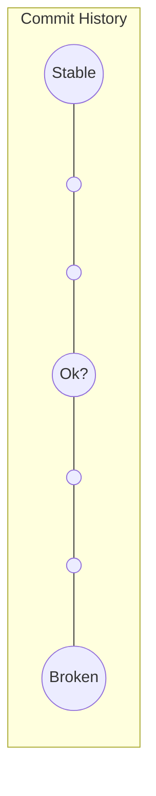

# CSE 403: Git Bisect

**git bisect** is a Git command that performs a **binary search through commit history** to find the specific commit that introduced a bug. It is one of Git's debugging tools, described in the Git Book under section 7.10 "Git Tools - Debugging with Git."

## Core Concept

The premise of git bisect is that you have a linear sequence of commits where at some point the code transitioned from working to broken. You know one commit that is "good" (stable, known to work) and one commit that is "bad" (broken). Every commit in between is unknown. Git bisect finds the exact transition point.



The midpoint commit (labeled "Ok?") is checked out and the developer tests it. Based on the result, the search range is cut in half — exactly like binary search on a sorted array.

## Mechanism

**Step-by-step workflow:**

1. Start bisect session: `git bisect start`
2. Mark the known-broken commit: `git bisect bad` (usually HEAD)
3. Mark a known-good commit: `git bisect good <commit-or-tag>` (e.g., `git bisect good v1.0.0`)
4. Git checks out the midpoint commit between good and bad.
5. Test the code (manually or via `./gradlew build`).
6. Report the result: `git bisect good` or `git bisect bad`
7. Git halves the remaining search range and repeats from step 4.
8. When only one commit remains, Git reports: "Commit `<hash>` is the first bad commit."
9. End session: `git bisect reset` (returns HEAD to its original position)

The exercise used **Basic Statistics** — a Java-based GUI program — as the target repository, with `./gradlew build` as the test command.

## Time Complexity

### Formal Definition

Given $n$ commits in the search range, git bisect requires at most $\lceil \log_2 n \rceil$ test steps.

### Simplified Explanation

Each test cuts the remaining candidates in half. After the first test, at most $n/2$ commits remain. After the second, at most $n/4$. This guarantees **O(log n)** steps regardless of where the bad commit is located.

**Key property**: the time complexity is *always* O(log n) — not average case, always. This is because binary search always halves the search space, guaranteed, unlike [[delta debugging]] which can degrade to linear in unfavorable input distributions.

## git revert vs. git reset

Once the bad commit is identified, you need to undo its changes. Git provides two fundamentally different mechanisms with very different safety properties.

```mermaid
graph LR
    subgraph revert_side [git revert - additive]
        R1(( )) --- RX[bad commit] --- R2(( )) --- R3((HEAD: inverted diff applied])
    end
    subgraph reset_side [git reset - destructive]
        S1(( )) --- S2(( )) --- SB((bad)) --- SX[X - removed from history]
    end
```

### git revert

**git revert `<commit>`** creates a **new commit** that applies the **inverted diff** of the target commit. The bad commit remains in history — it is not erased — but a new commit on top of it undoes its changes.

**Example**: if the bad commit changed `**Summary of our project**` to `**Summary**` (a deletion), the revert commit applies the inverse: it changes `**Summary**` back to `**Summary of our project**` (an addition).

- **Safe for shared/public branches** — it does not rewrite history, so collaborators' local histories remain consistent.
- The commit graph grows forward; the bad commit is preserved for audit purposes.

### git reset

**git reset `<commit>`** moves the HEAD (and the branch pointer) **backward** to an earlier commit, effectively removing all commits after that point from the branch's history.

- **`git reset --soft`**: moves HEAD, keeps changes staged.
- **`git reset --mixed`**: moves HEAD, unstages changes (default).
- **`git reset --hard`**: moves HEAD and **discards all local changes** in the working directory — data can be permanently lost.
- **Rewrites history** — dangerous for shared branches because collaborators' histories diverge. Force-pushing after a reset requires all collaborators to re-sync.

| Aspect | git revert | git reset |
|--------|-----------|-----------|
| History | Preserved (additive) | Rewritten (destructive) |
| New commit created | Yes | No |
| Safe for shared branches | Yes | No (requires force push) |
| Undo mechanism | Inverted diff as new commit | HEAD pointer moved backward |

## git rev-list

**`git rev-list v1.0.0..HEAD`** (equivalently: `git rev-list HEAD ^v1.0.0`) lists all commits reachable from HEAD that are **not** reachable from `v1.0.0`.

### Formal Definition

The `..` operator selects commits in the range: commits reachable from the right-hand side (HEAD) minus commits reachable from the left-hand side (v1.0.0). In set notation:

$$\text{rev-list}(A..B) = \text{ancestors}(B) \setminus \text{ancestors}(A)$$

### Simplified Explanation

It answers: "what has changed since the v1.0.0 release?" The left side is excluded (v1.0.0 and its ancestors are not shown). The right side is included (HEAD and everything leading up to it that is after v1.0.0 is shown).

```mermaid
graph LR
    subgraph excluded [Before v1.0.0]
        A(( )) --- B(( ))
    end
    subgraph included [After v1.0.0 - shown by rev-list]
        C(( )) --- D(( )) --- E((HEAD - bad commit])
    end
    B -->|v1.0.0 tag| C
```

Common uses:
- Counting commits since a release: `git rev-list v1.0.0..HEAD | wc -l`
- Providing the search range for `git bisect` — the bad commit is somewhere in this range.

## Related

- [[CSE403/Version Control/Version Control Fundamentals]]
- [[CSE403/Build Systems/Build Systems]]

## Industry Standard Terms

| Course Term | Industry Equivalent |
|-------------|---------------------|
| git bisect | Binary search debugging (industry term is the same) |
| git revert | Safe undo / non-destructive undo |
| git reset --hard | Destructive history rewrite (use with caution on shared branches) |
| git rev-list A..B | Commit range query, changelog generation |
