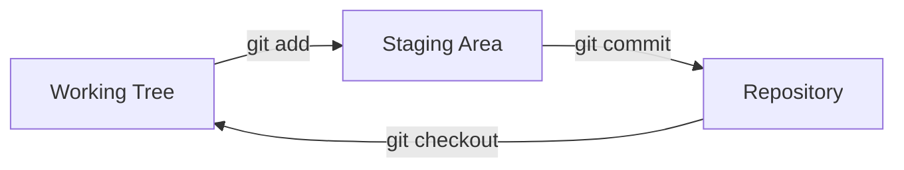
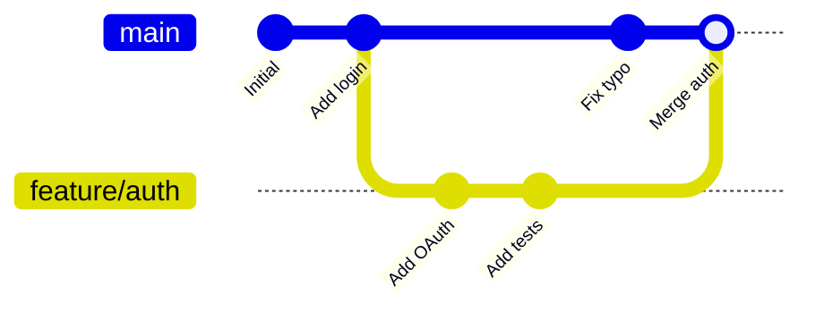
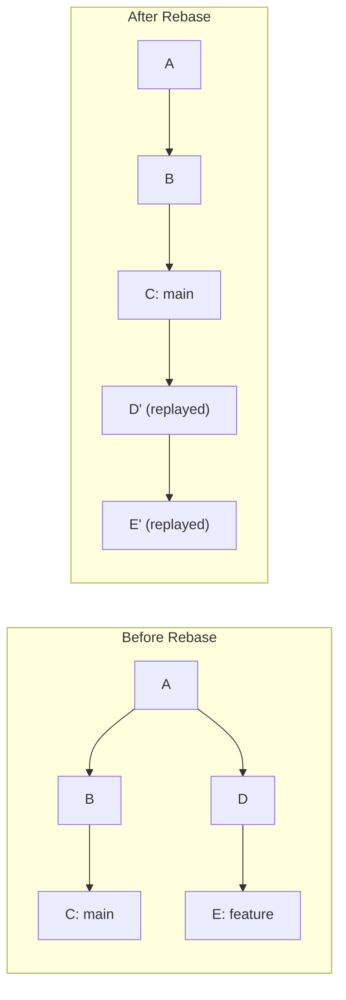

# CSE 403: Version Control Fundamentals

**Version control** (also called **source control** or **revision control**) is the practice of tracking and managing changes to source code over time. A **Version Control System (VCS)** records every change to a codebase, who made it, when, and why. This history is the foundation of collaborative software development.

Without version control, team development degenerates into emailing zip files, naming files `final_v2_REAL_FINAL.java`, and losing work when a bad edit cannot be undone. Version control solves all of these problems and is a non-negotiable practice in professional software development.

---

## Core Concepts

### Repository

A **repository** (repo) is the database that stores all versions of all files in a project, along with the complete history of every change. The repository is the single source of truth for the codebase.

### Commit

A **commit** is a snapshot of the repository at a specific point in time. Each commit records:
- The changes made to files (the **diff** or **delta**)
- The commit **message** — a human-readable description of why the change was made
- The **author** (who made the change) and **timestamp**
- A pointer to the parent commit(s)

Commits are identified by cryptographic hashes (in Git, SHA-1 hashes). This means commit identities are globally unique and any corruption of history is detectable.

### Working Tree and Staging Area

In Git:
- The **working tree** is the set of files on disk that you are actively editing
- The **staging area** (also called the **index**) is a buffer between the working tree and the repository — it holds the set of changes that will be included in the next commit
- The **commit** records what is in the staging area



The staging area allows you to craft precise, logical commits even when your working tree has multiple unrelated changes in progress.

---

## Centralized vs. Distributed VCS

### Centralized VCS

In a **Centralized VCS (CVCS)** (e.g., SVN, CVS), there is one central server containing the repository. Developers **check out** working copies from the server and **commit** directly back to it. The complete history lives only on the server.

Drawbacks:
- Single point of failure — if the server is down, no one can commit
- Network required for most operations (diff, history, branching)
- Large operations (branch, merge) require server round-trips

### Distributed VCS

In a **Distributed VCS (DVCS)** (e.g., Git, Mercurial), every developer's machine holds a complete copy of the entire repository including full history. There is no inherent single central server — though in practice teams designate one (e.g., GitHub) as the canonical remote.

Advantages:
- All operations (commit, branch, history, diff) are local — no network required
- No single point of failure
- Offline work is fully supported
- Branching and merging are first-class, cheap operations

---

## Git: Core Operations

**Git** is the dominant DVCS, created by Linus Torvalds in 2005 for Linux kernel development.

### Branching

A **branch** in Git is a lightweight, movable pointer to a commit. Creating a branch does not copy any files — it creates a 40-byte pointer. This makes Git branching essentially free.



The `main` (or `master`) branch represents the stable, deployable state of the codebase. Feature branches isolate work in progress from `main` until it is complete and reviewed.

### Merging

When a feature branch is complete, it is **merged** back into `main`. Git's merge algorithm finds the **common ancestor** of the two branches and applies both sets of changes from that ancestor forward.

**Fast-forward merge**: If `main` has not moved since the branch was created, Git simply moves the `main` pointer to the tip of the feature branch. No merge commit is created. The history remains linear.

**Three-way merge**: If `main` has diverged (new commits on both `main` and the feature branch since their common ancestor), Git performs a three-way merge — comparing both heads to their common ancestor — and creates a **merge commit** that has two parents.

### Merge Conflicts

A **merge conflict** occurs when both branches modified the same region of the same file in incompatible ways. Git cannot resolve this automatically; it marks the conflicting region in the file and requires a human to resolve it manually.

Conflict markers:
```
<<<<<<< HEAD
code from current branch
=======
code from branch being merged
>>>>>>> feature/auth
```

The developer edits the file to produce the correct combined version, removes the conflict markers, stages the file, and completes the merge commit.

### Rebasing

**Rebasing** is an alternative to merging. Instead of creating a merge commit, rebasing replays the commits from the feature branch on top of the current tip of `main`, rewriting them with new commit hashes.



The result is a **linear history** with no merge commits, which is easier to read. The trade-off is that rebasing rewrites commit hashes — this is safe for local branches but should never be done on shared branches that others have checked out (**the golden rule of rebasing**).

---

## Workflows

A **Git workflow** is a convention for how a team uses branches. Different workflows suit different team sizes and release cadences.

### Feature Branch Workflow

The simplest structured workflow:
- `main` is always in a deployable state
- Every new feature or bug fix gets its own branch (e.g., `feature/login`, `bugfix/null-pointer`)
- Branches are merged into `main` via a **pull request** after review
- Branches are deleted after merging

### Gitflow

**Gitflow** is a more structured workflow with defined long-lived branches:

| Branch | Purpose |
|---|---|
| `main` | Production releases only |
| `develop` | Integration branch; features merge here |
| `feature/*` | Individual features branch from `develop` |
| `release/*` | Release preparation branches off `develop` |
| `hotfix/*` | Emergency production fixes branch from `main` |

Gitflow is appropriate for projects with scheduled releases and explicit version numbers. It adds overhead that may not be worth it for teams that deploy continuously.

### Trunk-Based Development

**Trunk-Based Development (TBD)** is a high-discipline workflow where all developers commit directly to `main` (the "trunk") multiple times per day. Feature branches, if used, are very short-lived (hours to days). Incomplete features are hidden behind **feature flags** rather than long-lived branches.

TBD is the workflow recommended by the DevOps Research and Assessment (DORA) organization as a predictor of high-performing engineering organizations. It only works with strong CI and comprehensive automated testing.

---

## Pull Requests and Code Review

A **pull request (PR)** (called a **merge request** in GitLab) is a formal proposal to merge a branch into `main`. Pull requests provide:
- A diff view showing all changes the merge will introduce
- A comment thread for review discussion
- CI status checks (did the tests pass?)
- An approval gate — reviewers must approve before merge

Pull requests are the primary vehicle for [[CSE403/Code Review/Code Review Practices]].

---

## Commit Messages

Good commit messages are crucial for maintainability. The convention established by open-source communities:

```
Short summary line (50 chars or less)

More detailed explanation if needed. Wrap at 72 characters.
Explain WHY the change was made, not what (the diff shows what).
Reference issue tracker tickets: Fixes #123.
```

A good commit message answers: "If applied, this commit will..."

Bad: `fix bug`, `update stuff`, `wip`
Good: `Fix race condition in connection pool shutdown`, `Add retry logic for transient S3 errors`

---

## .gitignore

The `.gitignore` file lists patterns of files that should never be committed to the repository:
- Build artifacts (`*.class`, `*.o`, `target/`, `build/`)
- IDE configuration files (`.idea/`, `.vscode/`)
- Secrets and credentials (`.env`, `*.key`, `credentials.json`)
- Dependency directories (`node_modules/`, `vendor/`)

Committing build artifacts bloats the repository; committing secrets is a security incident.

---

## Related

- [[CSE403/Code Review/Code Review Practices]]
- [[CSE403/Testing/Automated Testing and CI]]
- [[CSE403/Software Process/SDLC Models]]

---

## Industry Standard Terms

| Course Term | Industry / Standard Term |
|---|---|
| Version Control System | VCS, SCM (Source Code Management) |
| Repository | Repo |
| Pull Request | PR, Merge Request (MR in GitLab) |
| Feature Branch | Topic branch, Development branch |
| Trunk-Based Development | TBD, Continuous Integration branching model |
| Gitflow | Git branching model (Nvie model) |
| Merge Conflict | Conflict, Edit conflict |
| Fast-forward Merge | FF merge |
| Staging Area | Index (Git internal term) |
| Working Tree | Working directory, Working copy |
