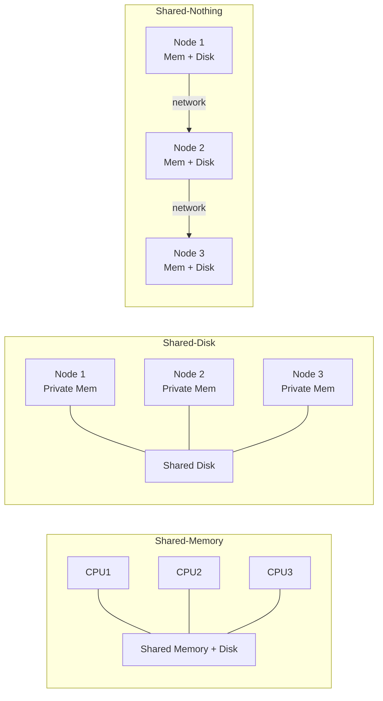

# CSE444: Intro to Parallel DBMS

## How to Scale the DBMS

Modern applications separate web servers, application servers, and the database tier. When load increases, we need to handle more connections without degrading performance — but the three tiers scale very differently.

- Web servers and application servers can be replicated easily: each client gets its own server instance, and a load balancer distributes traffic. Sub-connections can be made that all connect to the database, but this does not solve the connection problem at the database layer.
- **The database server cannot be replicated easily**, because the database represents a single, consistent source of truth. Simply adding copies introduces consistency problems.
  - Performance does not scale as the database grows.
  - Query latency becomes the bottleneck.
- We need to design ways to scale up the DBMS itself.

---

## Building a Parallel DBMS

There are two distinct scaling goals that motivate parallel database design, corresponding to two different workload types.

### Scaling Transactions Per Second — OLTP

**Online Transaction Processing (OLTP)** workloads are characterized by high volumes of short, concurrent read/write transactions (e.g., bank transfers, e-commerce orders).

- The goal is to increase **transaction throughput** (transactions per second).
- Scaling requires distributing the transaction load across many nodes.

### Scaling Single-Query Response Time — OLAP

**Online Analytical Processing (OLAP)** workloads are characterized by complex queries that scan large portions of the dataset (e.g., business intelligence, reporting).

- The entire parallel system works together to answer one query.
- The goal is to improve **query runtime** for a single large query.
- The primary use case is analysis of massive datasets.

### Big Data Considerations

Volume alone is not the issue — relational databases do parallelize reasonably well through:
- **Data partitioning**: distributing rows across nodes.
- **Parallel query processing**: executing query operators concurrently.

The real challenge breaks down into two regimes:

| Regime | Analytics Type | Status |
|---|---|---|
| Big volumes, small analytics | OLAP queries: joins, GROUP BY, aggregates | Handled well by today's RDBMSs |
| Big volumes, large analytics | Machine Learning, click prediction, topic modeling, SVM, k-means | Requires additional innovation beyond SQL |

---

## Architecture

Three hardware architectures define the design space for parallel database systems, each making different trade-offs between cost, scalability, and implementation complexity.

### Shared-Memory Architecture

All processors share a single main memory and disk subsystem.

- **Pros**: Easiest to implement — the DBMS sees one large memory space and can use standard concurrency primitives.
- **Cons**: Memory bus and interconnect become bottlenecks; expensive to scale beyond a certain size because shared hardware is costly.

![[CSE444/Screenshots/Shared Memory Architecture.png]]

### Shared-Disk Architecture

Each processor has its own private memory, but all processors share a common disk (or storage array).

- **Pros**: No memory contention across nodes; high availability because any node can access any data on disk.
- **Typical scale**: 1–10 machines.
- **Cons**: Still expensive; the shared disk can become a bottleneck under heavy I/O.

![[CSE444/Screenshots/Shared Disk Architecture.png]]

### Shared-Nothing Architecture

Each node has its own private memory and private disk. Nodes communicate exclusively over a network.

- **Pros**: Uses cheap commodity hardware; no contention for memory or disk; theoretically can scale to an unlimited number of nodes.
- **Cons**: Hardest to implement — the DBMS must manage all data distribution, routing, and fault tolerance explicitly.

![[CSE444/Screenshots/Shared-Nothing Architecture.png]]

---

## Shared-Nothing Execution Basics

In a shared-nothing cluster, multiple DBMS instances (processes) — also called **nodes** — run on separate machines. The system assigns one of two roles to each node:

- **Coordinator**: The node the user connects to and submits their query to. It is responsible for parsing, planning, and distributing work.
- **Workers**: All other nodes. They execute the portions of the query plan assigned by the coordinator.

Workers execute queries under the following rules:
- Typically, all workers execute the same query plan (but on different data partitions).
- Workers can execute multiple queries simultaneously.

The central design question is: **where does each row of data live?** The answer is determined by the chosen **partitioning scheme**, which distributes rows across the nodes.

---

## Data Partitioning Schemes

### Unpartitioned Table

The entire table lives on a single node in the cluster.

- **Consequence**: Any query that touches this table bottlenecks at that one node — no parallelism is achievable.
- **Use case**: Used only for simplicity or for very small reference tables that don't need parallelism.

### Block Partitioning

Tuples are horizontally (row-level) partitioned by block size, with no ordering of the data considered.

- Rows are split evenly between nodes, round-robin style.
- No data skew — each node receives roughly the same number of rows.
- **Trade-off**: Because there is no ordering, range queries or selective predicates cannot be routed to a specific node; every node must be consulted.

![[CSE444/Screenshots/Block Partitioning.png]]

---

## Related

- [[CSE444/Transactions/Transaction Fundamentals|Transaction Fundamentals]] — background on concurrency and consistency that motivates the shared-nothing design
- [[CSE444/Replication and distribution/Distributed Databases|Distributed Databases]] — deeper treatment of shared-nothing vs. shared-disk, MPP, sharding, and distributed joins
- [[CSE444/Query Evaluation/Query Execution & Algorithms|Query Execution]] — the query processing pipeline that parallel DBMS extends

---

## Industry Standard Terms

| Course Term | Industry / Real-World Equivalent |
|---|---|
| Shared-Nothing Architecture | Massively Parallel Processing (MPP); also used in Apache Spark, Amazon Redshift, Google BigQuery |
| Shared-Disk Architecture | Shared storage cluster; used in Oracle RAC, Azure Synapse |
| Shared-Memory Architecture | SMP (Symmetric Multiprocessing); single-server scale-up |
| Coordinator Node | Query coordinator / driver node (Spark), master node |
| Worker Node | Executor node (Spark), compute node (Redshift) |
| Block Partitioning | Round-robin partitioning |
| OLTP | Online Transaction Processing — short, high-frequency read/write transactions |
| OLAP | Online Analytical Processing — complex analytical queries over large datasets |
