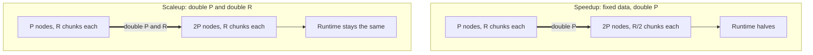

# Parallel: Speedup and Scaleup

Speedup and scaleup are the two metrics used to reason about how a parallel DBMS behaves as we add resources. Consider the aggregate query $\gamma_{A, \text{sum}(C)}(R)$, whose runtime is **dominated by reading chunks from disk** (so total work is proportional to the number of chunks each server must read).

## Speedup
**Speedup** holds the data fixed and adds nodes.

- **If we double the number of nodes $P$, what is the new running time?**
  - Roughly **half**, because each server now holds $1/2$ as many chunks to read.

## Scaleup
**Scaleup** grows the data and the nodes together.

- **If we double both $P$ and the size of $R$, what is the new running time?**
  - **The same**, because each server still holds the same number of chunks.

## Diagram

---

## Related

- [[CSE444/Parallel/Parallel Query Execution|Parallel Query Execution]] — parent hub for parallel operators
- [[CSE444/Parallel/Data Partitioning Schemes|Data Partitioning Schemes]] — block partitioning is what spreads the chunks evenly so adding nodes reduces per-node work

---

## Industry Standard Terms

| Course Term | Industry / Real-World Equivalent |
|---|---|
| Speedup | Strong scaling |
| Scaleup | Weak scaling |
