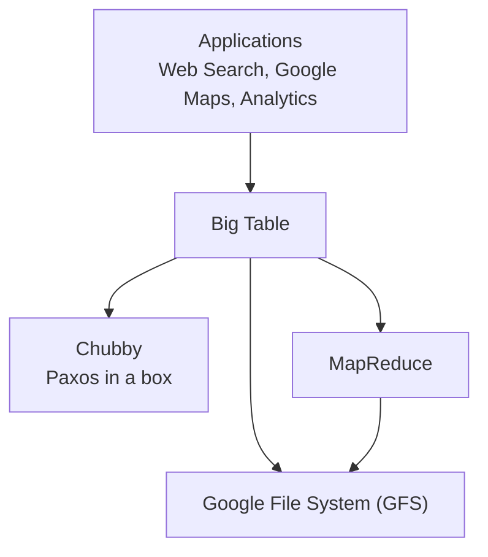
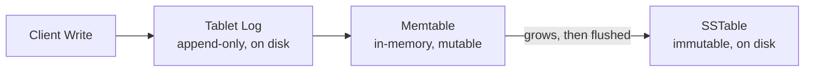

# CSE452: Big Table

**Big Table** is Google's storage system for structured data, and it is the closest real-world system to what we will have built once we finish the distributed systems lab. The paper assumes you already work with Google's services or have read their previous work, because Big Table is layered on top of several of them.

A key takeaway: **not every system needs to implement [[CSE452/Paxos/Paxos|Paxos]] itself** — a system can instead rely on a separate service that already implements it (in Big Table's case, **Chubby**).

## Google Stack

Big Table does not stand alone; it sits in the middle of a stack of Google infrastructure services.



- **Applications**: all of these apps use Big Table.
	- Web search — crawling the internet, storing, and indexing it.
	- Google Maps.
	- Analytics.
- **Big Table**: built on top of GFS, Chubby, and MapReduce.
- **Google File System (GFS)**: the underlying distributed file system (now outdated).
- **Chubby**: "Paxos in a box" — a coordination service that packages Paxos as a reusable service. Big Table stores data here so it is able to recover.
- **MapReduce**: a batch-processing system that itself uses GFS.

## Goals of Big Table

Big Table is a storage system for **structured data**. It resembles a database but does **not** support a relational database model. Google built it with these goals in mind:

- **Control over data layout** — Google wanted direct control over how data is physically laid out.
- **Control over locality** — control over which data is stored near which other data.
- **Non-relational** — it deliberately avoids the relational model.
- **Performance at scale**.

## Data Model

Big Table's data model is a **3-dimensional table**. Conceptually, a lookup has the signature:

```cpp
string data_model(string row, string col, int64_t time) {...}
```

The three dimensions are:

- **Row** — at most 64KB; row names are short.
- **Column** — unbounded size, so names are potentially longer. Colons separate **column families**; a family changes infrequently (e.g. `anchor:consi.com`, where `anchor` is the family).
- **Timestamp** — provides version control within the same cell.

Because each cell is versioned by timestamp, this model allows you to do more mutations and changes than a traditional DBMS.

## API

- Read and write rows.
- Reads are **[[CSE452/Consistency/Definitions/Linearizability|linearizable]]** — but only for a single row.
- The **unit of atomicity is the row**. Multi-row calls exist, but atomicity is only guaranteed per-row.
- **Scans** of ranges of rows are supported.
- **Not in the API**: cross-row transactions.

## Design

### SSTables

- **SSTable** (sorted-string table) — data is stored sorted, so lookups can use **binary search**.
- An SSTable is **immutable** once written to disk. The system layers an **illusion of mutability** on top of these immutable files.

### Tablets

- All data is stored in **tablets**.
- A **tablet is the unit of [[CSE452/Sharding/Sharding|sharding]]**.
- A **tablet server** is in charge of operations to that tablet.
	- There is only **one tablet server per tablet**, and the record of which server is in charge is stored in Chubby.
	- A **master** oversees this assignment, and it too is stored in Chubby.
	- We do **not** want all operations to go through Paxos, because Paxos is slow. Instead, Paxos is used only as a **fallback** to provide fault tolerance, while normal operations stay in memory.
- When no operations are in-flight, all data is on disk.

### Tablet Log

- The **tablet log** keeps track of operations.
- It is a file on disk, and it is **append-only**.
- Because it is an on-disk log, all parties **agree on the order of operations**.
- This matters for handing off between the **current tablet server and future tablet servers**: if the current tablet server crashes, a future one can pick up where the last one ended.

### Memtable

- The **memtable** is in-memory. It is a **mutable** version of some parts of the SSTable.
- When we write to the tablet log, we also update the memtable version. The memtable reads the operation and ensures the SSTable files are also updated.
- The memtable **grows** as we write to the system.
- It is written to disk by converting it into an SSTable and then writing it to the tablet log.



## Industry Standard Terms

| CSE452 / Big Table Term | Industry / Standard Term |
| :--- | :--- |
| **Tablet** | Shard / partition |
| **Tablet server** | Shard / partition owner |
| **SSTable** | Sorted String Table (used in LSM-tree stores like Cassandra, RocksDB) |
| **Memtable** | In-memory write buffer of an LSM-tree |
| **Tablet log** | Write-ahead log (WAL) / commit log |
| **Chubby** | Distributed lock / coordination service (e.g. ZooKeeper, etcd) |
| **Column family** | Column family (HBase, Cassandra) |

---

## Related

- [[CSE452/Case Studies/Google File System (GFS)|Google File System (GFS)]] — the underlying storage layer for Big Table
- [[CSE452/Case Studies/Key Takeaways|Key Takeaways in Performance and Durability]] — core principles applied in Big Table
- [[CSE452/Case Studies/Reading Papers|Reading Papers]] — how to approach research papers like the Big Table paper
- [[CSE452/Paxos/Paxos|Paxos]] — the consensus protocol that Chubby packages as a service
- [[CSE452/Sharding/Sharding|Sharding]] — tablets as the unit of sharding
- [[CSE452/Consistency/Definitions/Linearizability|Linearizability]] — the guarantee Big Table provides for single-row reads
- [[CSE452/RPC/Deterministic State Machine|Deterministic State Machine]] — the append-only ordered-log idea behind the tablet log
