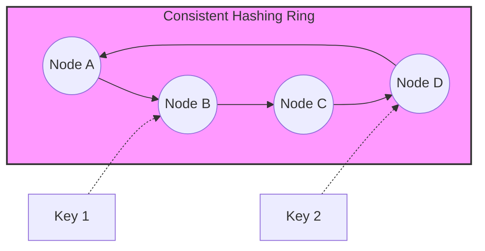

# CSE452: Dynamo

**[[CSE452/Case Studies/Dynamo|Dynamo]]** is Amazon's highly available, eventually consistent key-value store. It was designed to provide "always-on" write availability for services like the shopping cart, prioritizing availability over strong consistency.

---

## Core Philosophy: Availability > Consistency

In the context of the **[[CSE452/Consistency/Theoretical Foundations#CAP Theorem|CAP Theorem]]**, Dynamo chooses **Availability** and **Partition Tolerance** (AP) over **Consistency** (CP). 

### Business Motivation
- **Revenue and Latency**: Amazon's research showed that even small increases in latency (the **tail latency**, specifically the 99.9th percentile) directly correlate to a drop in revenue. 
- **Customer Obsession**: A "Service Oriented Architecture" where every team operates their own distributed system. If the shopping cart service is down, customers cannot spend money. Therefore, a write (adding to cart) must *always* succeed, even if the system is partitioned.
- **Service Level Agreements (SLAs)**: Dynamo guarantees a specific 99.9th percentile latency to other teams, ensuring predictable performance for the "worst-case" requests.

## Architecture and Mechanisms

Dynamo uses several decentralized techniques to achieve its goals without a single point of failure.

### Consistent Hashing
To map keys to nodes, Dynamo uses **[[CSE452/Sharding/Sharding|Consistent Hashing]]**.
- Nodes and keys are mapped onto a logical **circular identifier space** (the "ring").
- A key is assigned to the first node whose identifier is greater than or equal to the key's identifier.
- **Advantages**: Adding or removing a node only affects its immediate neighbors on the ring, minimizing data movement.
- **Replication**: For each key, Dynamo stores copies at $N$ successor nodes on the ring (the **preference list**).

### Quorum Parameters (N, R, W)
Dynamo allows per-service tuning of the trade-off between consistency, durability, and availability using three parameters:
- **$N$**: The number of replicas.
- **$R$**: The number of replicas that must respond to a read request.
- **$W$**: The number of replicas that must respond to a write request.

#### Performance and Consistency Trade-offs
- **$R + W > N$**: This is the "standard" quorum configuration (similar to **[[CSE452/Paxos/Paxos|Paxos]]**). It ensures that the read set and write set overlap, providing a higher likelihood of reading the latest value.
- **$W = 1$**: Provides maximum write availability but risks losing data if that single node fails before replicating.
- **Low $R, W$**: Lowers latency by requiring fewer network round-trips but increases the chance of stale reads or conflicts.

## Conflict Resolution: Vector Clocks

Since Dynamo allows writes during partitions, it must handle **conflicting versions** of the same data.

### Mechanism
- Dynamo uses **[[CSE452/Clocks/Vector Clock Algorithm|Vector Clocks]]** to track causality between different versions of an object.
- A vector clock is a list of `(node, counter)` pairs.
- If version $A$ has a vector clock that is "greater than" version $B$'s (all counters are $\ge$ and at least one is $>$), then $A$ is a descendant of $B$ and $B$ can be discarded.
- If the clocks are incomparable, the versions are **concurrent** (a "branch").

### Semantic Reconciliation
- When a client reads a key that has concurrent versions, Dynamo returns *all* current leaves of the version tree.
- The **application** must then resolve the conflict (e.g., merging two versions of a shopping cart by taking the union of items).
- The resolved value is then written back with a context that includes the vector clocks of the versions it replaced, "merging" the branches back into a single leaf.

## API
Dynamo provides a simple interface:
- `get(key)`: Returns an object or a set of conflicting objects, along with a **context** (opaque metadata containing vector clock info).
- `put(key, context, object)`: Writes a new version of the object. The context tells Dynamo which version(s) this write is intended to replace/update.

---

## Industry Standard Terms

| CSE452 Term | Industry / Standard Term |
| :--- | :--- |
| **Context** | Causal Metadata / Version Tag |
| **Branch/Leaf** | Divergent Versions / Sibling Records |
| **Preference List** | Replication Group |
| **SLA (99.9%)** | P99.9 Latency / Tail Latency |

---

## Related
- [[CSE452/Consistency/Theoretical Foundations#CAP Theorem|CAP Theorem]] — the theoretical basis for Dynamo's design
- [[CSE452/Clocks/Vector Clock Algorithm|Vector Clock Algorithm]] — the formal mechanism for tracking causality
- [[CSE452/Sharding/Sharding|Sharding]] — the general concept of partitioning data across nodes
- [[CSE452/Case Studies/Key Takeaways|Key Takeaways in Performance and Durability]] — broader context on why Dynamo's trade-offs matter