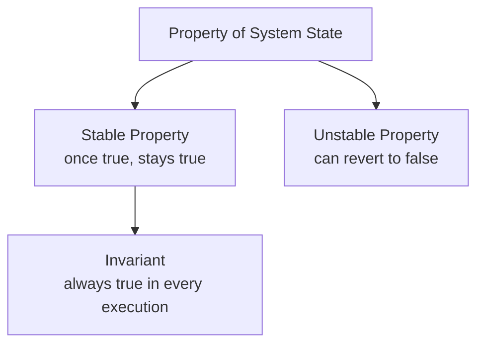

# CSE452: System State

When writing correctness proofs for a distributed protocol, it is essential to classify each property of the system's state by how it behaves over time. A property may be permanent once established, or it may come and go. This classification determines what a proof is allowed to assume.

## Properties of System State

### Invariants

An **invariant** is a property that is always true throughout every execution of the system. All invariants are stable properties (see below).

Examples from [[CSE452/Primary-Backup/Primary Backup|Primary-Backup]]:
- A client has at most one outstanding request at a time (a request is sent but no reply has been received, tracked using the client's sequence number)
- The sequence number saved by the server for each client is **monotonically increasing** (per client)
- All request messages in the network have a sequence number at most 1 greater than the server's saved sequence number for that client
- After state transfer completes in a given view, the backup has all the state the primary has — specifically, in the highest-numbered view the system has been in
  - With view changes you can arrive at another view number with the same backup and primary
- If the [[CSE452/Primary-Backup/View Server|View Server]] is in view $n+1$, then the primary of view $n$ completed state transfer in view $n$
  - If the system is not in view $n+1$, this is vacuously true (the antecedent is false)

### Stable Properties

A **stable property** is one that, once true, remains true for the rest of the execution. Formally, it is an implication:

$$p \rightarrow q$$

where $p$ being false makes the statement vacuously true — a property that hasn't become true yet is not violated. The key constraint is: a stable property **cannot go from true to false**.

Examples:
- Once a client ID is in the server's **AMO** (At-Most-Once) table, it stays there forever
- The client `c` is in the server's AMO application state
- There is a primary in the [[CSE452/Primary-Backup/View Server|View Server]]'s current (highest) view
- Once a server actually dies (not just the View Server's belief about it), it does not come back

### Unstable Properties

An **unstable property** is one that can become false after being true.

Example:
- "View $V$ has a backup" — whether this is stable or unstable depends on precise definition:
  - "View $V$ ever had a backup" is stable (once true, always true — views are immutable records)
  - "The current view has a backup" is unstable (the backup can fail, removing it from the current view)

The distinction matters when writing correctness proofs: you can always rely on stable properties once established, but must re-check unstable ones.

## Industry Standard Terms

| CSE452 Term | Industry / Standard Term |
| :--- | :--- |
| **Invariant** | Safety invariant / system invariant |
| **Stable Property** | Stable predicate (Chandy-Lamport sense) |
| **Unstable Property** | Transient predicate |
| **AMO Table** | Deduplication / idempotency table |

---

## Related

- [[CSE452/Primary-Backup/Primary Backup|Primary Backup]] — replication system where these invariants are applied
- [[CSE452/Primary-Backup/View Server|View Server]] — manages view transitions and maintains system-wide invariants
- [[CSE452/Clocks/Logical Clocks|Logical Clocks]] — happens-before reasoning used alongside invariants in correctness proofs
- [[CSE452/Knowledge/Knowledge|Knowledge in Distributed Systems]] — stable vs. unstable properties mirror common vs. transient knowledge
