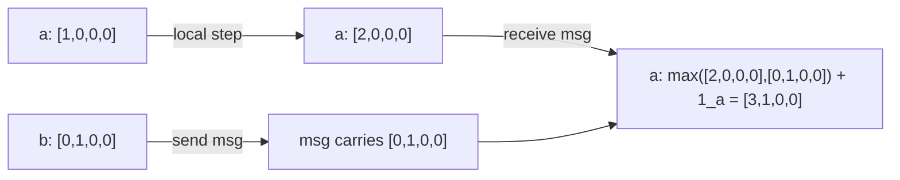

# CSE452: Vector Clock Algorithm

**Vector clocks** extend [[CSE452/Clocks/Logical Clocks|logical clocks]] to capture causality in both directions. Unlike [[CSE452/Clocks/Lamport Clock Algorithm|Lamport clocks]], vector clocks allow you to definitively determine whether two events are causally related or concurrent.

## Key Idea

Each node maintains a **vector** (list of numbers) of length equal to the number of nodes in the system. The $i$th component represents the highest clock value the node has heard about for node $i$.

**Claim**: $e_1$ happens-before $e_2$ **if and only if** $VC(e_1) \leq VC(e_2)$ (component-wise).

This biconditional is stronger than the Lamport clock condition, which only holds in one direction.

## Algorithm

1. **Initialize**: every node starts with a vector of zeros, except its own component is set to 1.
   - Node $a$: $[1, 0, 0, 0]$
   - Node $b$: $[0, 1, 0, 0]$
   - Node $c$: $[0, 0, 1, 0]$
   - Node $d$: $[0, 0, 0, 1]$
2. **Send**: include the current vector clock in every outgoing message.
3. **Receive**: take the component-wise max of the received vector and the local vector, then increment the receiver's own component by 1.
   - Example: $\max([1,0,0,0],\ [0,1,0,0]) + 1_b = [1, 2, 0, 0]$
4. **Local step**: increment only the node's own component by 1.

## Worked Example

The diagram below shows how a message from node $b$ to node $a$ carries causal information through the component-wise max.

After the receive, node $a$'s clock $[3,1,0,0]$ records that it has heard everything node $b$ knew up to its send event — this is what makes the biconditional hold.

## Comparison with Lamport Clocks

| Property | Lamport Clock | Vector Clock |
|---|---|---|
| Data structure | Single integer | Vector of integers |
| $e_1 \rightarrow e_2$ implies | $C(e_1) < C(e_2)$ | $VC(e_1) < VC(e_2)$ |
| $C(e_1) < C(e_2)$ implies | Nothing certain | $e_1 \rightarrow e_2$ |
| Can detect concurrency | No | Yes |

## Industry Standard Terms

| CSE452 Term | Industry / Standard Term |
| :--- | :--- |
| **Vector Clock** | Version vector / vector timestamp |
| **Component-wise Max** | Vector merge / join |
| **Biconditional Causality** | Exact causal-order detection |

## Related

- [[CSE452/Clocks/Logical Clocks|Logical Clocks]] — the core concepts and the happens-before relation
- [[CSE452/Clocks/Lamport Clock Algorithm|Lamport Clock Algorithm]] — the simpler single-counter implementation
- [[CSE452/Clocks/Vector Clock Pruning|Vector Clock Pruning]] — managing vector clock size at scale
- [[CSE452/Primary-Backup/Idempotence|Idempotence]] — causality helps ensure operations are not repeated incorrectly
