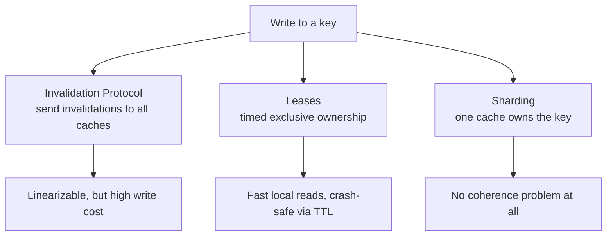

# CSE452: Architectural Consistency

Architectural consistency covers how consistency guarantees are implemented in physical hardware (CPUs) and through distributed caching layers.

## 1. Memory Consistency (Hardware)

### Memory Consistency Model (MCM)

#### Formal Definition
A contract between the hardware/system and the software programmer that specifies the rules for how memory operations (reads and writes) appear to different processors.

#### Simplified Explanation
It defines which reorderings (by the compiler or the CPU) are legal. It allows a programmer to reason about the correctness of concurrent code even when the hardware is optimizing execution order behind the scenes.

### Total Store Order (TSO)
The model used by **x86-64** processors. 
- **The Store Buffer**: CPUs use a local write buffer to hold stores so execution can continue. This is the hardware analog of asynchronous replication.
- **Self-Consistency**: A processor always sees its own writes immediately, but others see them only after the write drains from the buffer.
- **Invariant**: Writes from a single core always appear to all other cores in the same order.

### Release Consistency (Acquire/Release)
A common synchronization discipline in high-level programming.
- **Acquire (on Reads)**: Prevents subsequent reads/writes from being moved *before* the acquire.
- **Release (on Writes)**: Prevents preceding reads/writes from being moved *after* the release.

---

## 2. Distributed Cache Coherence

Distributed systems place caches close to users to reduce latency. Maintaining consistency across these caches requires a coherence protocol.

### Invalidation Protocols
- **Write-Through Caching**: Before a write completes, the system sends invalidations to all other caches. This ensures [[CSE452/Consistency/Strong Consistency Models#Linearizability|Linearizability]] because no cache can serve a stale value after the write finishes.
- **Server-Side Invalidation**: The server maintains a directory of which caches hold which keys and sends invalidations directly on every write.

### Leases
A **lease** grants a cache **timed, exclusive ownership** of a key.
- **Mechanism**: The server grants a lease for duration $T$. During this time, the server will not permit writes to that key.
- **Performance**: The leaseholder can serve reads as fast as possible without consulting the server.
- **Fault Tolerance**: If the leaseholder crashes, the server simply waits for the lease TTL to expire.

### Sharding (Partition-Based)
Instead of replicating data and solving coherence, [[CSE452/Sharding/Sharding|**shard**]] the data so each key lives in exactly one cache. With only one copy, there is nothing to keep coherent — a read or write always lands on the single authoritative cache.

---

## Industry Standard Terms

| CSE452 Term | Industry / Standard Term |
| :--- | :--- |
| **Memory Consistency Model (MCM)** | Memory model (e.g., C++11 memory model) |
| **Total Store Order (TSO)** | x86 / SPARC TSO memory model |
| **Store Buffer** | Write buffer / store queue |
| **Release Consistency** | Acquire/release ordering, memory fences |
| **Write-Through Caching** | Write-through cache with invalidation |
| **Lease** | Cache lease / time-bounded read lock |

---

## Related
- [[CSE452/Consistency/Theoretical Foundations|Theoretical Foundations]] — CAP, PACELC, and the strength hierarchy
- [[CSE452/Consistency/Strong Consistency Models|Strong Consistency Models]] — linearizability, which write-through caching preserves
- [[CSE452/Consistency/Weak Consistency Models|Weak Consistency Models]] — processor consistency, the distributed analogue of TSO
- [[CSE452/Sharding/Sharding|Sharding]] — partitioning data so each key has a single owner
- [[CSE351/Cache/Handling Writes|CSE351: Cache Handling]] — hardware cache write policies
- [[CSE452/RPC/Remote Procedure Call (RPC)|Remote Procedure Call (RPC)]] — the communication layer beneath cache coherence protocols
