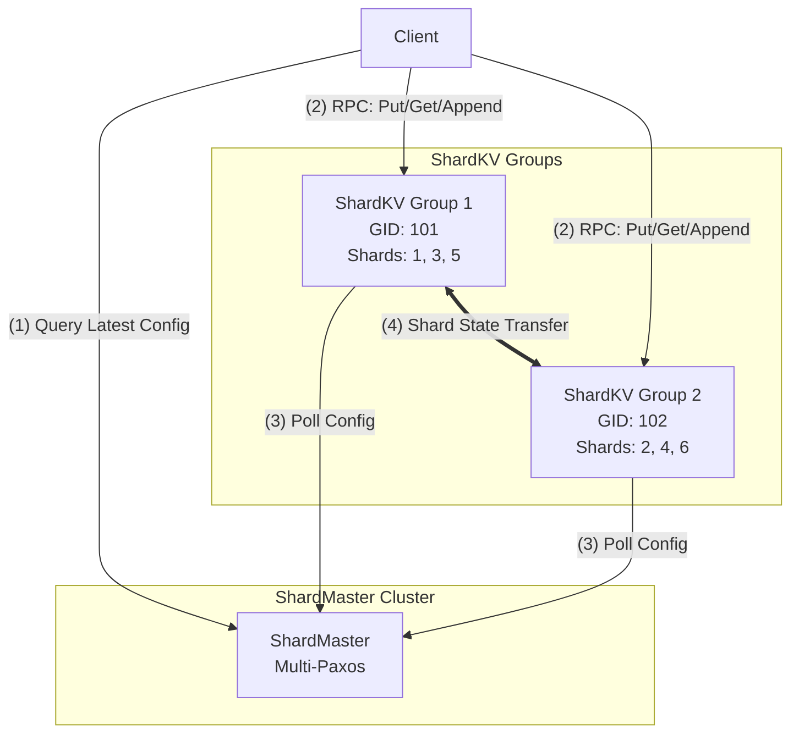

# CSE452: Partitioning

**Partitioning** (also known as **Sharding**) is the architectural pattern of horizontally scaling a system by dividing a single logical dataset into multiple smaller, autonomous subsets called **shards**. While [[CSE452/Primary-Backup/Primary Backup|Replication]] solves for **Availability** and **Fault Tolerance** by duplicating data, Partitioning solves for **Throughput** and **Capacity** by distributing the storage and computational burden across a cluster of independent nodes.

---

## Architectural Overview

The following diagram illustrates the interaction between the **ShardMaster**, the **ShardKV Groups**, and the **Clients**. Each ShardKV Group is composed of multiple **ShardKV Servers** that together implement a fault-tolerant key-value store.

### Flow of Operations

1. **Configuration Lookup**: The **Client** queries the **ShardMaster** to retrieve the latest **Configuration**. The client usually caches this mapping locally to avoid contacting the ShardMaster for every request.
2. **Request Routing**: For every operation (Put, Get, or Append), the client:
    - Hashes the key to determine the `ShardID`.
    - Looks up which `GID` is responsible for that `ShardID` in its current configuration.
    - Sends the RPC directly to the **ShardKV Servers** in that specific group.
3. **Configuration Polling**: **ShardKV Servers** periodically poll the **ShardMaster** for new configurations. If they detect a `config_num` higher than their current one, they initiate a reconfiguration.
4. **Shard State Transfer**: When a shard moves between groups (e.g., during a `Join` or `Leave`), the group receiving the shard must "pull" the data and duplicate-detection table from the previous owner before it can begin serving requests for those keys.

---

## Core Definitions & Concepts

### 1. Shard (The Unit of Data)
A **shard** is a discrete, contiguous or hashed subset of the total key-space. 
- **Formal Definition**: A disjoint partition $S_i$ of the set of all possible keys $K$, such that $\bigcup S_i = K$ and $S_i \cap S_j = \emptyset$ for $i \neq j$.
- **Implementation**: In Lab 4, the key-space is divided into a fixed number of shards (e.g., 10 shards). Each key is mapped to a shard using a deterministic hash function: `shard = hash(key) % num_shards`.

### 2. Group (The Unit of Computing)
A **group** (or Replica Group) is a fault-tolerant cluster of servers responsible for serving a specific set of shards.
- **Why a group instead of a node?**: A single node is a single point of failure. To ensure the shards remain available, we make each "partition" a [[CSE452/Paxos/Multi-Paxos|Multi-Paxos]] cluster.
- **Responsibility**: A group must maintain a [[CSE452/RPC/Deterministic State Machine|Replicated State Machine]] for every shard it owns.

### 3. Metadata: The System "Source of Truth"
**Metadata** is the authoritative state that describes the layout and membership of the distributed system. It is the "glue" that allows the system to function as a single logical unit.

#### Deep Dive: Metadata Structure
In a sharded system, metadata must track:
- **The Configuration Version (`config_num`)**: A monotonically increasing integer that sequences all metadata changes. Every participant (client, shard-server, master) uses this to detect stale state.
- **Shard-to-Group Mapping (The Routing Table)**: An array (or map) where `Metadata[ShardID] = GID`. This defines ownership.
- **Group-to-Server Mapping (The Membership Table)**: A map where `Metadata[GID] = {Server1, Server2, ...}`. This defines which physical machines constitute each fault-tolerant cluster.

---

## Evolution of Control: From View Server to ShardMaster

The **ShardMaster** in Lab 4 is essentially a **fault-tolerant, multi-group View Server**.

### Comparison: View Server vs. ShardMaster

| Feature | [[CSE452/Primary-Backup/View Server|View Server]] (Lab 2) | ShardMaster (Lab 4) |
| :--- | :--- | :--- |
| **Control Unit** | A single **View** (Primary/Backup pair). | A sequence of **Configurations** (Multi-Group mapping). |
| **Consensus Engine** | Single node (SPOF) or hardcoded logic. | **Multi-Paxos** (Fully fault-tolerant consensus). |
| **Responsibility** | Manages 1 partition (the whole DB). | Manages $N$ partitions (shards) across $M$ groups. |
| **State Transfer** | Primary $\to$ Backup on view change. | Group A $\to$ Group B on config change (shard migration). |

### Why the Evolution?
1. **Fault Tolerance**: A single View Server is a single point of failure. By running the ShardMaster on top of **Multi-Paxos**, the metadata service itself becomes resilient to node crashes.
2. **Scalability**: A View Server only handles one primary-backup pair. To scale beyond one machine, you need a service that can manage hundreds of groups simultaneously.

---

## Partitioning Strategies: Static vs. Dynamic

### 1. Static Partitioning
- **Mechanism**: The mapping is hardcoded (e.g., $GID = hash(key) \mod N$).
- **Trade-off**: Zero metadata lookup overhead, but fails in the face of **skew** (hot keys) and **elasticity** (adding/removing nodes).

### 2. Dynamic Partitioning
- **Mechanism**: Assignments are stored in a **Configuration** managed by the ShardMaster.
- **The "How"**: When a node becomes overloaded, the ShardMaster updates the metadata to move a shard to a cooler node. This provides a level of indirection between the key and its physical location.

---

## Linearizable Shard Handovers (The "Handover Dance")

Moving a shard is a complex network-level dance that must preserve **[[CSE452/Consistency/Definitions/Linearizability|Linearizability]]**. You cannot have a window where both Group A and Group B think they own Shard 5.

### Step-by-Step Mechanism
1. **Freeze (Group A)**: Group A sees that in `Config 11`, it no longer owns Shard 5. It immediately stops accepting client writes for Shard 5. It is now "Ready for Export."
2. **Pull (Group B)**: Group B sees it now owns Shard 5. It sends a `GetShard(ShardID, ConfigNum)` RPC to Group A.
3. **Transfer (A $\to$ B)**: Group A sends the entire KV-map for Shard 5, *plus* the **Duplicate Detection Table** (at-most-once state).
4. **Install (Group B)**: Group B merges this data into its own state machine.
5. **Acknowledge**: Group B tells Group A it has the data. Group A can now safely delete its local copy.

**Why move the Duplicate Detection Table?**
If a client sent a request to Group A just before the move, and Group A's response was lost, the client will retry. If Group B doesn't have the duplicate detection state, it might execute the same request a second time (violating [[CSE452/RPC/Remote Procedure Call (RPC)|exactly-once semantics]]).

---

## Multi-Key Operations: The Final Boss
Operations involving multiple keys (like `Swap(K1, K2)`) are the primary weakness of sharded systems.
- **The Problem**: If $K1$ and $K2$ are in different groups, there is no single Paxos log to order them.
- **The Result**: You cannot guarantee atomicity without a cross-group coordination protocol like **Two-Phase Commit (2PC)** or **Sagas**. 
- **Me**: Most modern sharded databases (like DynamoDB or BigTable) simply **forbid** cross-partition transactions or restrict them to "Entity Groups" to avoid this massive performance hit.

---

## Related
- [[CSE452/Paxos/Multi-Paxos|Multi-Paxos]] — The engine for both ShardMaster and ShardKV.
- [[CSE452/Primary-Backup/View Server|View Server]] — The conceptual ancestor of the ShardMaster.
- [[CSE452/Consistency/Distributed Cache Coherence|Distributed Cache Coherence]] — A different way to scale (replication vs partitioning).
- [[CSE452/RPC/Remote Procedure Call (RPC)|RPC At-Most-Once Semantics]] — Why we must move the duplicate detection table during handovers.
- [[CSE444/Index|CSE444: Database Systems]] — For more on 2PC and distributed joins.
- [[CSE344/Query Execution/Parallel Query Execution|CSE344: Horizontal vs. Vertical Partitioning]]
- [[CSE444/Replication and distribution/Distributed Databases|CSE444: Hash vs. Range Sharding Strategies]]
