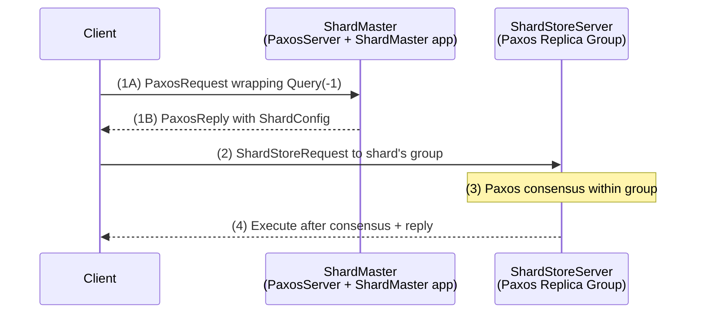

# CSE452: Sharded Key-Value Server

Each **ShardStoreServer** operates as part of a **[[CSE452/Sharding/Definitions/Replica Group|Replica Group]]**, serving client requests for the **[[CSE452/Sharding/Definitions/Shard|Shards]]** assigned to it by the **[[CSE452/Sharding/Definitions/ShardMaster|Shard Master]]**.

## System Architecture Overview

The full sharded system has two distinct tiers:

1. **The ShardMaster tier**: A single [[CSE452/Paxos/Multi-Paxos|Multi-Paxos]] group running the `ShardMaster` application. Instantiated as `new PaxosServer(address, shardMasters.clone(), new ShardMaster(numShards))` — the ShardMaster is an `Application` running inside a `PaxosServer`, not a standalone server.
2. **The ShardKV tier**: Multiple independent Paxos Replica Groups (`ShardStoreServer`s), each owning a subset of shards.

### The 4-Step Request Flow



1. **(1A/1B)** Client broadcasts a `Query` command wrapped in a `PaxosRequest` to all ShardMaster nodes and receives back a `PaxosReply` containing the current `ShardConfig`.
2. **(2)** Client maps the key to a shard (`keyToShard(key)`), looks up the owning group in the `ShardConfig`, and broadcasts a `ShardStoreRequest` to all servers in that group.
3. **(3)** Paxos consensus runs within the replica group.
4. **(4)** Servers execute the command after Paxos commits it and reply to the client.

## Internal Architecture: The Sub-Node Pattern

To ensure fault tolerance within each partition, every replica group implements its own [[CSE452/Paxos/Multi-Paxos|Multi-Paxos]] cluster using a **Composite Node** pattern.

### Sub-Node Paxos Setup
The `ShardStoreServer` acts as the "Root Node" and instantiates a `PaxosServer` as a sub-node. Instead of executing commands directly, the Paxos sub-node notifies the parent `ShardStoreServer` of every decision in order.

```java
// ShardStoreServer.init() — full sub-node initialization
paxosAddress = Address.subAddress(address(), PAXOS_ADDRESS_ID);
Address[] paxosAddresses = new Address[group.length];
for (int i = 0; i < paxosAddresses.length; i++) {
    paxosAddresses[i] = Address.subAddress(group[i], PAXOS_ADDRESS_ID);
}
PaxosServer paxosServer = new PaxosServer(paxosAddress, paxosAddresses, address());
addSubNode(paxosServer);
paxosServer.init();
```

For Lab 4, `PaxosServer` must be modified to accept a `parentAddress` so it can route decisions back up to the `ShardStoreServer`:

```java
// Modified PaxosServer constructor (Lab 4 addition)
public PaxosServer(Address address, Address[] servers, Address parentAddress) {
    super(address);
    this.servers = servers;
    this.parentAddress = parentAddress;
    // Note: there is no app. The ShardStoreServer is the application.
}
```

Everywhere in `PaxosServer` that a value is chosen and executed (where `app.execute()` was previously called), instead send a `PaxosDecision` up to the parent:

```java
// Replace app.execute(command) with:
handleMessage(new PaxosDecision(slot, command), parentAddress);
```

For `Query` commands from the ShardMaster poll: you may repropose them through Paxos to guarantee linearizability, or allow stale reads if the sender has flagged them as stale-read-safe.

### Decision Flow
1.  **Client Request**: A client sends an RPC to the `ShardStoreServer`.
2.  **Proposal**: The server wraps the request in a `Command` and passes it to the local `PaxosServer` via `handleMessage`.
3.  **Consensus**: The `PaxosServer` runs Multi-Paxos with its peers in the replica group.
4.  **Notification**: Once a value is chosen for a slot, the `PaxosServer` notifies the parent `ShardStoreServer`.
5.  **Execution**: The parent node executes the command and returns the result to the client.

### State Machine Structure (The AMO Wrapper)
The server wraps a `KVStore` inside an **`AMOApplication`** (At-Most-Once). This is the key to maintaining [[CSE452/RPC/Remote Procedure Call (RPC)|exactly-once semantics]] in a sharded environment.

- **Internal State**: The `AMOApplication` tracks a mapping of `ClientID -> {LastSequenceNumber, LastResult}`.
- **Deduplication Logic**: Before execution, the application checks if the sequence number has already been seen for that client. If so, it returns the cached result.
- **Shard Transfer Impact**: When a shard moves, this state must move with it. If Group B receives Shard 5 but not the AMO metadata for the clients using Shard 5, Group B might execute a retried request a second time.

## ShardStoreClient

The `ShardStoreClient` is the client-side component that routes requests to the correct replica group. It is similar in structure to the Lab 2 client (Primary/Backup/ViewServer), extended to handle the multi-group topology.

### Getting the Current Configuration
The client must know the current configuration before routing any request. It uses `broadcastToShardMasters(...)`, a helper defined in `ShardStoreNode`, to broadcast a `Query` wrapped in a `PaxosRequest` to all ShardMaster nodes. The ShardMaster cluster responds with a `PaxosReply`; the client extracts the `ShardConfig` by implementing `handlePaxosReply`.

### Routing a Request
For each `KVStore` operation (`Put`, `Get`, `Append`):
1. Determine the target shard: `keyToShard(key)` maps a key to a shard number.
2. Determine the target group: use `getGroupIdForShard(shard)` on the `ShardConfig` to find the responsible group's ID, then look up that group's server addresses.
3. Wrap the command in a `ShardStoreRequest` and broadcast to all servers in that group.

### Error Handling
- **Timeout**: If no response is received, the client assumes its configuration is stale. Re-query the ShardMaster and retry.
- **Error response**: If a server returns an error (e.g., it no longer owns the shard), the client re-queries and retries with the updated configuration.

## Communication & Fault Tolerance

- **Inter-Group Communication**: The easiest way for a replica/group to send a message to a different group is by **broadcasting** the message to the entire group.
- **Fault Tolerance Assumptions**: A majority of servers in each replica group must be alive and able to communicate with:
    - A majority of the **Shard Master** servers.
    - A majority of every other replica group.
- **Paxos Optimization**: Your Paxos implementation should be able to reach agreement in a **single step** when there is only one server in the group. This is crucial for efficient search testing.

## Configuration Polling

Servers periodically send `Query` operations to the Shard Master to learn about new configurations.
- **Read-Only Queries**: To avoid unnecessary sequence numbers, `Query` operations can be handled as non-AMO read-only commands in Paxos.
- **Sequential Processing**: Servers must process configurations one at a time, in order. A server cannot move to `Config 12` until it has fully completed the transition to `Config 11`.

## Message Types in ShardStoreServer

A `ShardStoreServer` receives four categories of incoming messages:

| Message | Source | Description |
| :--- | :--- | :--- |
| `PaxosReply` | ShardMaster | Reply to a periodic `Query` poll; contains new `ShardConfig` if the configuration has changed. |
| `ShardStoreRequest` | Clients | A KV operation (`SingleKeyCommand`) or a cross-group `Transaction` (Part 3). |
| `ShardMove` / `ShardMoveAck` | Other ShardStoreServers | Shard data transfer during [[CSE452/Sharding/Reconfiguration|Reconfiguration]]. |
| `PaxosDecision` | Local Paxos Subnode | A command chosen by the Paxos group and ready to execute. |

**Critical invariant**: A `ShardStoreServer` **cannot act on any message until it has been replicated** through Paxos. The only exception is an AMO cache hit — if the result for a given `(clientId, seqNum)` is already cached, the server can reply immediately without re-proposing. All `ShardMove`s and `SingleKeyCommand`s must be serialized on each shard via Paxos, even in the face of failures.

## Recommended Implementation Pattern

Managing the pre/post-replication distinction across all message types can become complex. The recommended approach is a single generic `process` dispatch method:

```java
// Central dispatch — called by BOTH incoming request handlers AND PaxosDecision handler
void process(Command c, boolean replicated) {
    if (c instanceof AMOCommand)  processAMOCommand((AMOCommand) c, replicated);
    else if (c instanceof ShardMove) processShardMove((ShardMove) c, replicated);
    // ... other command types
}

// Request handler: command has NOT been replicated yet
void handleShardStoreRequest(ShardStoreRequest r, Address sender) {
    // validate (e.g., is this the correct group for this shard?)
    process(r.command(), false);
}

// Paxos decision handler: command HAS been replicated
void handlePaxosDecision(PaxosDecision d, Address sender) {
    process(d.command(), true);
}

// Example processXX method
void processAMOCommand(AMOCommand c, boolean replicated) {
    if (!replicated) {
        // Not yet in the log — forward to Paxos
        handleMessage(new PaxosRequest(c), paxosSubnode);
        return;
    }
    // Committed — execute and reply to client
    AMOResult result = app.execute(c);
    // send reply...
}
```

This pattern cleanly separates validation/routing logic (in the `handleXXX` methods) from execution logic (in the `processXX` methods). All Paxos decisions flow through the same code path as direct requests, making the pre/post-replication split explicit and consistent.

## Implementation Notes
- **Complexity**: A typical solution for Part 2 takes approximately 350 lines of code.
- **Paxos Obliviousness**: As a sub-node, Paxos should be oblivious to `AMOApplication` logic and should be able to decide the same command for different slots. Avoid overly aggressive de-duplication at the Paxos level.

## Industry Standard Terms

| CSE452 Term | Industry / Standard Term |
| :--- | :--- |
| **ShardStoreServer** | Shard server / partition server |
| **Sub-Node Pattern** | Composite / embedded consensus module |
| **AMOApplication** | At-most-once / deduplicated state machine |
| **keyToShard** | Hash partitioning function |
| **Configuration Polling** | Topology refresh / config watch |

---

## Related
- [[CSE452/Sharding/Sharding|Sharding Overview]] — the architecture this server is part of
- [[CSE452/Sharding/Shard Master|Shard Master]] — the service that assigns shards to this server
- [[CSE452/Sharding/Reconfiguration|Reconfiguration]] — shard handoff between servers
- [[CSE452/Sharding/Two-Phase Commit|Two-Phase Commit]] — the inside-out Paxos pattern and cross-group operations
- [[CSE452/Paxos/Multi-Paxos|Multi-Paxos]] — the consensus engine of each replica group
- [[CSE452/RPC/Remote Procedure Call (RPC)|Remote Procedure Call (RPC)]] — at-most-once semantics via the AMO wrapper
- [[CSE452/RPC/Deterministic State Machine|Deterministic State Machine]] — the replicated state machine model
