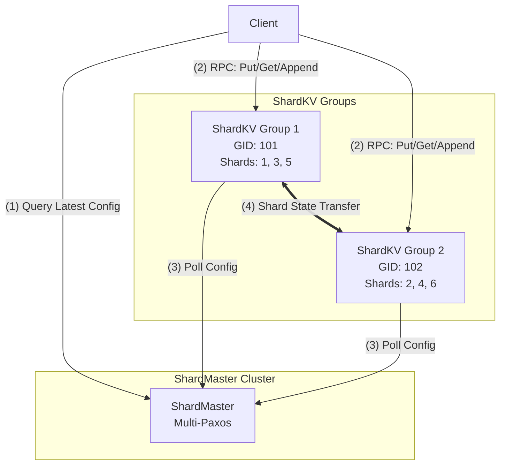

# CSE452: Sharding

**Sharding** (or **Partitioning**) is the architectural pattern of horizontally scaling a system by dividing a single logical dataset into multiple smaller, autonomous subsets called **shards**. While [[CSE452/Primary-Backup/Primary Backup|Replication]] solves for **Availability** and **Fault Tolerance** by duplicating data, Partitioning solves for **Throughput** and **Capacity** by distributing the storage and computational burden across a cluster of independent nodes.

---

## Why Sharding?

The primary driver for sharding is **performance** and **elasticity**. While replication (like [[CSE452/Primary-Backup/Primary Backup|Primary-Backup]]) provides fault tolerance, it does not scale write throughput because every node must process every write.

1.  **Throughput**: By partitioning keys, each replica group handles requests for only a fraction of the data. Since groups operate in parallel, total system throughput increases in proportion to the number of groups.
2.  **Capacity**: Sharding allows the system to store more data than can fit on a single machine. Total storage capacity is the aggregate of all groups.
3.  **Load Balancing**: If certain shards become "hot" (more popular), they can be moved to less loaded groups to balance the computational burden.
4.  **Elasticity**: Replica groups can join the system to increase capacity or leave for repair/retirement without taking the entire service offline.

---

## Pros & Cons of Sharding

### Pros
- **Horizontal Scalability**: Add more hardware to handle more requests.
- **Fault Isolation**: A failure or corruption in one replica group only affects a subset of the data (the shards it owns), rather than the entire database.
- **Parallelism**: Multiple independent consensus groups ([[CSE452/Paxos/Multi-Paxos|Multi-Paxos]]) can decide and execute commands simultaneously.

### Cons
- **Architectural Complexity**: Requires a dedicated metadata service ([[CSE452/Sharding/Shard Master|Shard Master]]) and complex [[CSE452/Sharding/Reconfiguration|Reconfiguration]] logic to handle shard migrations.
- **Multi-Key Operations**: Operations involving multiple shards (e.g., cross-group transactions) are significantly slower and more complex, requiring protocols like **[[CSE452/Sharding/Transactions|Two-Phase Commit (2PC)]]**.
- **The "Hot Shard" Problem**: If the hashing strategy doesn't distribute keys evenly, or if a few keys are extremely popular, specific groups can become bottlenecks despite the overall system having idle capacity.
- **Implementation Limitations (Lab 4)**: In this specific implementation, shard handoff is relatively slow and does not allow concurrent client access during the migration window.

---

## Architectural Overview

A sharded storage system (like Lab 4) consists of two main components:
1.  **[[CSE452/Sharding/Definitions/ShardMaster|The Shard Master]]**: A fault-tolerant metadata service that manages the mapping of shards to replica groups.
2.  **[[CSE452/Sharding/Definitions/Replica Group|Replica Groups]]**: Clusters of servers that store and serve a subset of the shards.

### Visual Representation

---

## Lab 4: Building a Sharded Service

The implementation of a sharded key-value store is divided into three core phases:

### Phase 1: [[CSE452/Sharding/Shard Master|The Shard Master]]
The **Shard Master** manages a sequence of numbered configurations. It is responsible for re-balancing shards when replica groups join or leave the system. It uses [[CSE452/Paxos/Multi-Paxos|Multi-Paxos]] to ensure the configuration metadata is fault-tolerant and linearizable.

### Phase 2: [[CSE452/Sharding/Sharded Key-Value Server|Sharded Key-Value Server]] & [[CSE452/Sharding/Reconfiguration|Reconfiguration]]
Each replica group serves a subset of the key-space. When the configuration changes, groups must perform a **[[CSE452/Sharding/Reconfiguration|Shard Handoff]]** to transfer data while maintaining [[CSE452/Consistency/Definitions/Linearizability|Linearizability]].

### Phase 3: [[CSE452/Sharding/Transactions|Cross-Group Transactions]]
To support operations that span multiple shards (and thus multiple groups), the system uses **[[CSE452/Sharding/Transactions|Two-Phase Commit (2PC)]]** with distributed locking.

---

## Comparison: View Server vs. ShardMaster

The **ShardMaster** in Lab 4 is essentially a **fault-tolerant, multi-group View Server**.

| Feature | [[CSE452/Primary-Backup/View Server|View Server]] (Lab 2) | ShardMaster (Lab 4) |
| :--- | :--- | :--- |
| **Control Unit** | A single **View** (Primary/Backup pair). | A sequence of **Configurations** (Multi-Group mapping). |
| **Consensus Engine** | Single node (SPOF) or hardcoded logic. | **[[CSE452/Paxos/Multi-Paxos|Multi-Paxos]]** (Fully fault-tolerant consensus). |
| **Responsibility** | Manages 1 partition (the whole DB). | Manages $N$ partitions (shards) across $M$ groups. |
| **State Transfer** | Primary $\to$ Backup on view change. | Group A $\to$ Group B on config change (shard migration). |

---

## Partitioning Strategies: Static vs. Dynamic

### 1. Static Partitioning
- **Mechanism**: The mapping of keys to shards is fixed (e.g., $GID = hash(key) \mod N$).
- **Trade-off**: Zero metadata lookup overhead, but fails in the face of **skew** (hot keys) and **elasticity** (adding/removing nodes).

### 2. Dynamic Partitioning
- **Mechanism**: Assignments are stored in a **Configuration** managed by the ShardMaster.
- **Benefits**: When a node becomes overloaded, the ShardMaster updates the metadata to move a shard to a cooler node. This provides a level of indirection between the key and its physical location.

---

## Core Concepts

### Shard (The Unit of Data)
A **shard** is a discrete subset of the total key-space used as the unit of partitioning. 

- **Formal Definition**: A disjoint partition $S_i$ of the set of all possible keys $K$, such that $\bigcup S_i = K$ and $S_i \cap S_j = \emptyset$ for $i \neq j$.
- **Simplified Explanation**: A slice of the database. Instead of one giant table, we cut it into 10 pieces (shards) so different machines can handle different pieces.
- **Implementation**: Keys are mapped to shards using a deterministic hash function: `shard = hash(key) % num_shards`.

### Replica Group
A **replica group** is a fault-tolerant cluster of servers responsible for serving a specific set of shards.

- **Formal Definition**: A set of nodes $N = \{n_1, n_2, ... n_m\}$ that implement a [[CSE452/RPC/Deterministic State Machine|Replicated State Machine]] (via [[CSE452/Paxos/Multi-Paxos|Multi-Paxos]]) to provide [[CSE452/Consistency/Definitions/Linearizability|Linearizability]] for a subset of the system's data.
- **Simplified Explanation**: A "team" of servers. Instead of trusting one machine with your data, you give it to a group of 3 or 5 machines that use Paxos to stay in sync.
- **Responsibility**: A group must maintain a state machine for every shard assigned to it by the ShardMaster.

### ShardMaster
The **ShardMaster** is the fault-tolerant metadata service that manages configurations and shard assignments.

- **Formal Definition**: The authoritative source of truth for the system's **Configuration**. It sequences all membership and assignment changes into a linearizable, numbered sequence of states.
- **Simplified Explanation**: The "Boss" or "Traffic Controller." It decides which group of servers is responsible for which slice of data and tells the clients where to go.
- **Reliability**: The ShardMaster is itself a [[CSE452/Paxos/Multi-Paxos|Multi-Paxos]] cluster, ensuring that the system's metadata is never lost and remains consistent even if some master nodes crash.

### Configuration (The Metadata)
The **Configuration** is the authoritative metadata describing the layout and membership of the distributed system at a specific point in time.

- **Formal Definition**: A tuple $C = \langle config\_num, M_{shard}, M_{group} \rangle$ where:
    - $config\_num$ is a monotonically increasing version identifier.
    - $M_{shard}: ShardID \to GID$ is the routing mapping.
    - $M_{group}: GID \to \{Address_1, ... Address_n\}$ is the membership mapping.
- **Simplified Explanation**: The system's "Map." It tells you:
    1. What version of the map this is.
    2. Which group (GID) owns which slice of data (Shard).
    3. Where those groups are located (Server Addresses).
- **Lifecycle**: Configurations are numbered sequentially. Clients and servers use the `config_num` to detect when their local map is stale and must be updated from the ShardMaster.

---

## Related
- [[CSE452/Paxos/Multi-Paxos|Multi-Paxos]] — The consensus engine for the entire system.
- [[CSE452/Primary-Backup/View Server|View Server]] — The conceptual ancestor of the Shard Master.
- [[CSE452/Consistency/Definitions/Linearizability|Linearizability]] — The consistency model guaranteed for client operations.
- [[CSE452/RPC/Remote Procedure Call (RPC)|RPC At-Most-Once Semantics]] — Crucial for safe state transfer.
- [[CSE444/Index|CSE444: Database Systems]] — For more on 2PC and distributed joins.
- [[CSE344/Query Execution/Parallel Query Execution|CSE344: Horizontal vs. Vertical Partitioning]]
- [[CSE444/Replication and distribution/Distributed Databases|CSE444: Hash vs. Range Sharding Strategies]]
