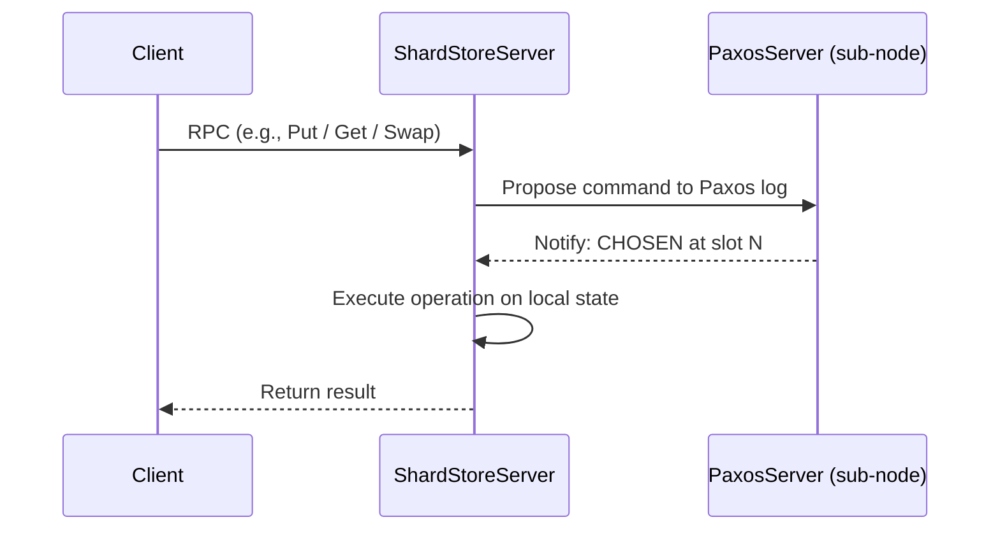
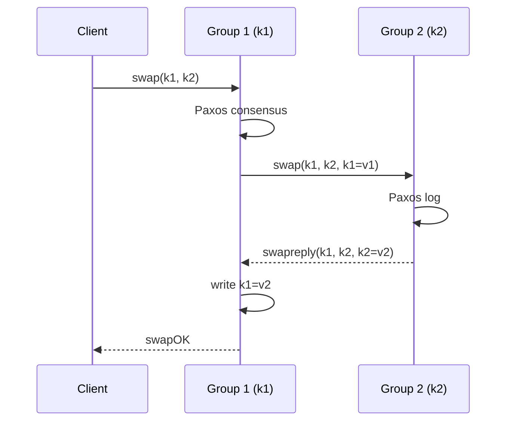
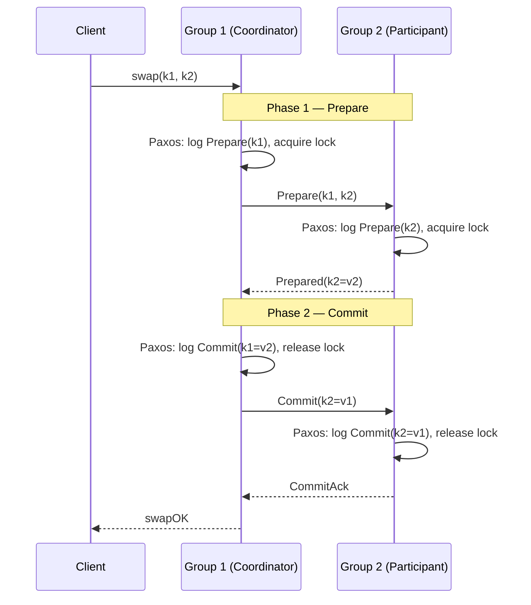

# CSE452: Two-Phase Commit

## ShardStore and Paxos Architecture

![[ShardStore and PaxosServer.png]]

A core constraint of the **[[CSE452/Sharding/Sharded Key-Value Server|ShardStoreServer]]** is that no server may communicate directly with another ShardStoreServer without first obtaining consensus from its own [[CSE452/Paxos/Multi-Paxos|PaxosServer]] sub-node. This enforces the invariant that the Paxos log is the single source of truth for all state changes — a server that acts on its own risks diverging from the rest of the group.

Every operation is executed in two steps:

1. **Get consensus**: Propose the operation to the local Paxos layer and wait for it to be **CHOSEN**.
2. **Execute**: Once the operation is CHOSEN in the log, execute it on the ShardStoreServer's local state.

### Inside-Out Paxos Application

The ShardStoreServer is an **inside-out Paxos application**. In a standard AMO setup, Paxos sits below the application and the application is an `AMOApplication`. Here, the relationship is inverted: the ShardStoreServer owns the Paxos sub-node and uses it internally to decide what operations to run on itself.

- The **ShardStoreServer is not an `AMOApplication`**. Its state lives directly in the fields of the `ShardStoreServer` class, not inside an AMO wrapper.
- When an operation arrives, the server checks the Paxos log:
  - If the slot is already **CHOSEN**, execute the operation.
  - If not yet chosen, insert the operation into the log and drive it to CHOSEN.
  - If the operation was already executed, calling the method again returns the cached CHOSEN result.

---

## Cross-Group Transactions

![[Shard Paxos Cluster.png]]

Single-key operations are handled within one Paxos replica group. However, multi-key operations like `swap(k1, k2)` become problematic when `k1` and `k2` live in **different groups**. The goal is to maintain [[CSE452/Consistency/Definitions/Linearizability|Linearizability]] — the swap must appear to happen atomically at a single instant, with no interleaved operations from other clients visible between its two halves.

### Naive Protocol

The intuitive approach is for the group receiving the client request to drive the operation by directly messaging the other group.

**Walkthrough for `swap(k1, k2)`** (where `k1` is owned by Group 1, `k2` by Group 2):

1. Client sends `swap(k1, k2)` to Group 1.
2. Group 1 reaches internal consensus via Paxos.
3. Group 1 reads `v1 = get(k1)` and sends `swap(k1, k2, k1=v1)` to Group 2.
4. Group 2 adds the operation to its own Paxos log.
5. Group 2 reads `v2 = get(k2)`, writes `k2 = v1`, and replies with `swapreply(k1, k2, k2=v2)`.
6. Group 1 receives the reply, writes `k1 = v2`, and sends `swapOK` to the client.

This protocol only works under perfect network conditions with no failures or concurrency. In practice, it breaks in multiple ways.

### Issues with the Naive Protocol

![[APpend Swap issues.png]]

The root problem is that the swap executes over an extended **region of time**. Group 1 and Group 2 commit their halves at different moments, and any operation from another client that arrives during this window can land between the two halves, breaking linearizability. There are five distinct failure modes:

**Issue 1: Dropped Reply — Lost Value**

If the `swapreply` message from Group 2 is dropped, Group 1 never learns the value of `k2`. The value is effectively lost with no way to recover it.

- **Mitigation**: Group 2 keeps the reply in a retransmission buffer until it receives a `swapReplyAck` from Group 1 confirming delivery.

**Issue 2: Concurrent Swap Requests — Non-Linearizable Interleaving**

If two clients issue swap operations simultaneously, their respective operations can interleave inside the Paxos logs of both groups, producing a combined execution history that cannot be explained by any single linearizable ordering.

**Issue 3: Operations in the Middle of a Swap — Non-Linearizable**

A non-swap operation (e.g., `append(k2, x)`) from another client can commit inside Group 2's log at any point during the swap window — after Group 1 has read `k1` but before Group 2 has written `k2`. The result is a state that is inconsistent with the swap appearing atomic.

**Issue 4: Uncoordinated Participant — Group 2 Does Not Block**

Group 2 has no knowledge that a swap affecting its keys is in progress. From its perspective, it is free to accept and commit other operations on `k2` at any time. There is no mechanism to prevent Group 2 from serving conflicting requests during the swap.

**Issue 5: Premature Execution at the Coordinator**

The originating group (Group 1) may commit its own half of the swap — writing the new value of `k1` — immediately after sending the request to Group 2, before Group 2 has confirmed. If Group 2 then fails or aborts, the system is left in a split state where one group has committed and the other has not.

---

## Two-Phase Commit

**[[CSE452/Sharding/Transactions|Two-Phase Commit (2PC)]]** solves all five failure modes by ensuring that a cross-group operation either commits at **all** participating groups or at **none**. Every step in the 2PC protocol must itself reach consensus within its local Paxos cluster before taking effect — the Paxos log is the durability guarantee behind every 2PC state transition.
- some node in the system is responsible for coordination (coordinator)
	- also participates as it has data relevant to the transaction
	- in DS labs it should always be the participant but in theory it doesn't always need to be
- some other groups are called participants
- some are just none

### Phase 1: Prepare

The coordinator group sends a `Prepare` request to all participating groups. Each participant:

1. Acquires a **distributed lock** on the keys it is responsible for.
2. Promises not to modify those keys until the transaction is resolved.
3. Replies `Prepared` if it successfully acquired the lock, or `Abort` if it could not.

The core insight of the Prepare phase is that messages sent over the network make promises about state that is inherently unstable. By locking the relevant keys before any values are exchanged, the protocol makes that state temporarily stable — preventing conflicting operations from inserting themselves into the middle of the transaction. This directly addresses Issues 3 and 4.

### Phase 2: Execute (Commit or Abort)

Once **all** participants have responded `Prepared`, the coordinator:

1. Sends a `Commit` message containing the final values to all participants.
2. Each participant writes the new value, then **releases the lock**.

If **any** participant responded `Abort` (or timed out during Prepare), the coordinator sends `Abort` to all, and every participant releases its locks without making changes. This guarantees atomicity — no partial commits.
- Why do we need to abort
	- some key we need to lock is already locked

---

## Industry Standard Terms

| CSE452 Term | Industry / Standard Term |
| :--- | :--- |
| **Two-Phase Commit (2PC)** | Two-Phase Commit — also called Atomic Commitment Protocol (ACP) |
| **Prepare Phase** | Voting Phase |
| **Execute Phase** | Commit Phase |
| **Transaction Coordinator** | Transaction Manager (TM) |
| **ShardKV Group (participant)** | Resource Manager (RM) |
| **Distributed Lock** | Pessimistic Write Lock |
| **Paxos CHOSEN** | Committed to the replicated log |

---

## Related

- [[CSE452/Sharding/Transactions|Transactions]] — full 2PC protocol detail: locking mechanisms, deadlock avoidance, reconfiguration interactions, and the one-configuration rule
- [[CSE452/Sharding/Sharding|Sharding Overview]] — architecture of the ShardMaster and replica groups
- [[CSE452/Sharding/Sharded Key-Value Server|Sharded Key-Value Server]] — ShardStoreServer internals and the sub-node Paxos pattern
- [[CSE452/Consistency/Definitions/Linearizability|Linearizability]] — the consistency guarantee 2PC is designed to preserve
- [[CSE452/Paxos/Multi-Paxos|Multi-Paxos]] — the consensus layer used within each replica group
