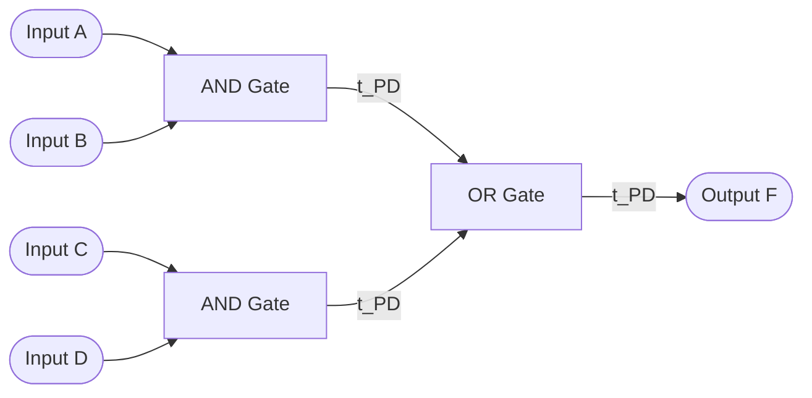

# CSE369: Combinational Logic

**Combinational logic** is a type of digital logic where the output is a pure function of the present inputs only. There is no memory or internal state — the circuit produces an output the moment inputs are applied (ignoring propagation delay). This contrasts with sequential logic, which depends on prior inputs through stored state.

## Core Concepts

### Logic Gates

**Logic gates** are the basic building blocks of digital circuits. They perform Boolean operations on one or more binary inputs to produce a single binary output. Each gate is an idealized model of a physical electronic device implementing a Boolean function.

| Gate | Behavior |
|---|---|
| **AND** | Output is high only if all inputs are high |
| **OR** | Output is high if at least one input is high |
| **NOT** | Inverts the single input |
| **NAND** | Complement of AND; universal gate — can implement any Boolean function |
| **NOR** | Complement of OR; universal gate — can implement any Boolean function |
| **XOR** | Output is high if the number of high inputs is odd |

NAND and NOR gates are particularly important in practice because any Boolean function can be expressed entirely using only NAND gates or entirely using only NOR gates, making them efficient to fabricate on silicon.

### Boolean Algebra

Logic circuits can be represented and manipulated mathematically using **Boolean algebra**, where variables take values in $\{0, 1\}$ and operations follow specific identities.

Two canonical forms are used to represent any Boolean function:

- **Sum-of-Products (SOP)**: A logic expression consisting of OR-ed terms, where each term is an AND-ed group of variables. Example: $F = AB + \bar{A}C + BCD$. Each AND term is called a **minterm**.
- **Product-of-Sums (POS)**: A logic expression consisting of AND-ed terms, where each term is an OR-ed group of variables. Example: $F = (A+B)(\bar{A}+C)$. Each OR term is called a **maxterm**.

SOP is generally easier to derive from a truth table: look at every row where the output is 1, write an AND term for that input combination, and OR all terms together.

## Implementation

### Formal Definition

A combinational circuit is fully specified by its **truth table** — a mathematical table that exhaustively lists the output for every possible combination of input values. For $n$ inputs, there are $2^n$ rows, one for each binary combination of the inputs. The truth table is the ground truth from which all logic expressions and implementations are derived.

### Simplified Explanation

The output changes immediately based on what you feed into the inputs right now. There is no clock and no memory. If the inputs change, the output eventually settles to a new value after propagation delay passes through each gate.

## Propagation Delay

Every physical gate introduces a small delay — the **propagation delay** $t_{PD}$ — between when an input changes and when the output settles to the correct value. In a chain of gates, delays accumulate. This is the primary reason timing analysis (see [[Timing Constraints]]) is required in real digital design: the combinational logic between two registers must complete within one clock period.

The diagram above shows an SOP expression $F = AB + CD$ realized as a two-level AND-OR circuit. The total propagation delay is $2 \times t_{PD}$ (one AND layer plus one OR layer).

## Related

- [[Karnaugh Maps]] — graphical method for minimizing Boolean expressions derived from truth tables
- [[Building Blocks]] — standard combinational components (MUX, decoder, adder) built from logic gates
- [[Verilog Fundamentals]] — hardware description language used to implement combinational logic
- [[Timing Constraints]] — propagation delay and how combinational logic interacts with the clock
- [[Binary and Hexadecimal]] — binary encoding that all combinational logic operates on

## Industry Standard Terms

| Course Term | Industry / Textbook Equivalent |
|---|---|
| Combinational Logic | Combinational / Combinatorial Logic |
| Sum-of-Products (SOP) | Disjunctive Normal Form (DNF) |
| Product-of-Sums (POS) | Conjunctive Normal Form (CNF) |
| Minterm | Canonical product term |
| Universal gate (NAND/NOR) | Functionally complete gate set |
