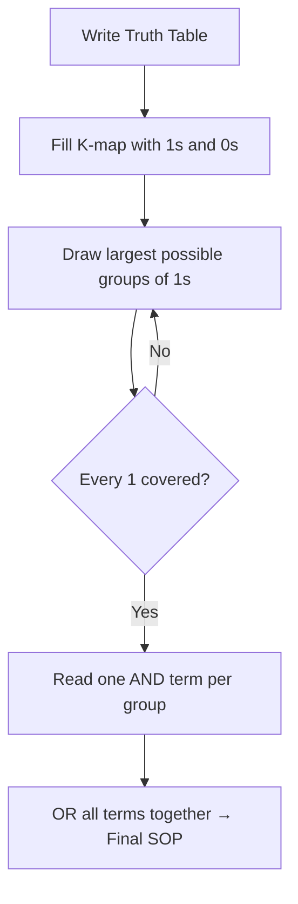

# CSE369: Karnaugh Maps

**Karnaugh Maps** (K-maps) are a graphical method used to simplify Boolean algebra expressions. They provide a visual way to find the minimum Sum-of-Products (SOP) or Product-of-Sums (POS) forms without applying complex algebraic identities by hand. K-maps are most practical for functions with 2–4 input variables; beyond 4 variables, computer-aided minimization tools (such as the Quine-McCluskey algorithm) are preferred.

## Structure

A K-map is a grid where each cell represents a **minterm** of the Boolean function — one unique input combination. The cells are ordered using **Gray Code** (e.g., 00 → 01 → 11 → 10) so that every pair of geometrically adjacent cells differs by exactly one bit.

This adjacency property is the key insight: it allows the algebraic identity $XY + X\bar{Y} = X$ to be applied visually. Any two adjacent 1-cells can be combined, eliminating the variable that differs between them.

Example layout for a 2-variable K-map ($A$, $B$):

|   | $B=0$ | $B=1$ |
|---|---|---|
| $A=0$ | $m_0$ | $m_1$ |
| $A=1$ | $m_2$ | $m_3$ |

For a 4-variable K-map ($A$, $B$, $C$, $D$), the columns are ordered 00, 01, 11, 10 (Gray Code) on both axes, and the map wraps around — the leftmost column is adjacent to the rightmost column, and the top row is adjacent to the bottom row.

### Formal Definition

A K-map is a diagrammatic method for reducing Boolean expressions to their simplest form by exploiting the adjacency of minterms in $n$-dimensional Boolean space, projected onto a 2D grid using Gray code ordering. Grouping $2^k$ adjacent minterms eliminates $k$ variables from the resulting product term, because those $k$ variables take on all possible combinations within the group.

### Simplified Explanation

A K-map is a way to find patterns in a truth table that show which input variables do not actually affect the output. If an output is 1 regardless of whether input $A$ is 0 or 1 (all else equal), then $A$ can be dropped from that term — you need fewer gates. Adjacent 1s in the grid are exactly the groups where one variable doesn't matter.

## Simplification Process

1. **Map the truth table**: Place a `1` in the K-map cell for every input combination (minterm) where the output is high. Place a `0` (or leave blank) for all others.
2. **Identify and group the 1s**: Draw loops around rectangular groups of 1s.
   - Groups must have a size that is a power of 2: $1, 2, 4, 8, \ldots$
   - Groups must be rectangular (in the toroidal sense — wrapping is allowed).
   - Groups can wrap around any edge of the map.
   - Groups should be made as large as possible — a larger group eliminates more variables.
   - A 1-cell may belong to multiple groups; overlap is allowed and encouraged.
3. **Write the simplified expression**: For each group, identify the variables that remain *constant* across all cells in the group. Variables that change within the group are eliminated. The surviving variables form the AND term for that group. OR all groups together for the final SOP expression.

## Don't-Care Conditions

A **don't-care** ($X$) is an input combination whose output is irrelevant — either because it can never occur in the system, or because we do not care what the output is in that case. Don't-cares are placed in the K-map as `X` and can be treated as either 0 or 1, whichever allows for a larger group. Using don't-cares strategically results in a more minimal expression.

## Related

- [[Combinational Logic]] — K-maps minimize the Boolean expressions that describe combinational circuits
- [[Finite State Machines]] — K-maps are used in FSM design to minimize next-state and output logic
- [[Building Blocks]] — minimized logic is what gets realized as physical gate networks

## Industry Standard Terms

| Course Term | Industry / Textbook Equivalent |
|---|---|
| Karnaugh Map (K-map) | Veitch diagram (historical); Karnaugh map (universal) |
| Minterm | Canonical product term; fundamental product |
| Don't-care ($X$) | Don't-care condition; irrelevant input combination |
| Sum-of-Products (SOP) | Disjunctive Normal Form (DNF) |
| Gray Code ordering | Reflected binary code; used in K-maps and shaft encoders |
| Quine-McCluskey | Tabular minimization method; algorithmic K-map equivalent |
