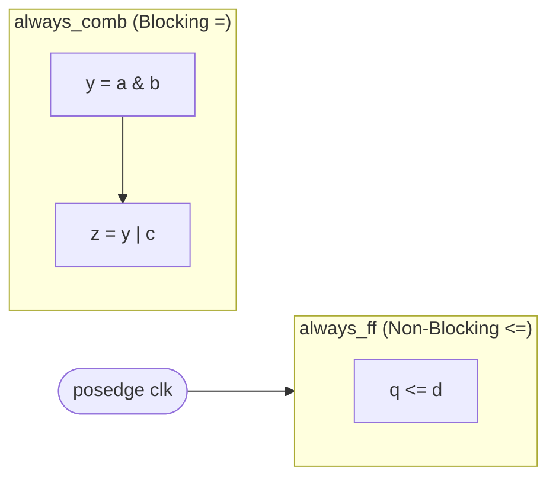

# CSE369: Verilog Fundamentals

**Verilog** is a Hardware Description Language (HDL) used to model electronic systems. Unlike C or Java, Verilog describes *structure* and *concurrency* rather than sequential instructions. Writing Verilog is more like drawing a circuit schematic than writing a program — each statement corresponds to a physical connection or a hardware element.

## Module Structure

A Verilog design is organized into **modules**. A module declares its ports (inputs and outputs), then describes the logic that connects them. Modules can be instantiated inside other modules, enabling hierarchical design.

```verilog
module half_adder (
    input  logic a,
    input  logic b,
    output logic carry,
    output logic sum
);
    assign carry = a & b;
    assign sum   = a ^ b;
endmodule
```

The `assign` keyword creates a **continuous assignment** — a permanent wire connection that re-evaluates whenever the right-hand side changes. It directly models a combinational logic path with no clock involvement.

### Formal Definition

Verilog is a concurrent hardware description language where statements like `assign` represent physical wires connecting components. Execution is driven by *events* (changes in signal values) rather than a program counter. All concurrent `assign` statements and `always` blocks execute simultaneously in simulation, just as real hardware runs in parallel.

### Simplified Explanation

You are not writing a recipe for a computer to follow. You are drawing a map of how wires and gates should be connected. When you write `assign carry = a & b`, you are telling the synthesizer to place an AND gate with `a` and `b` as inputs and `carry` as the output — permanently.

## Logic Types

Two primary procedural block types correspond to the two classes of digital logic:

- **Combinational Logic (`always_comb`)**: Used for logic that depends only on the current inputs. The CAD synthesizer will check for unintended **latches** (state storage caused by incomplete `if`/`case` branches) and report an error, which helps catch design mistakes.
- **Sequential Logic (`always_ff`)**: Used for logic triggered by a clock edge — specifically, registers implemented as [[Building Blocks#Adder|flip-flops]]. The `@(posedge clk)` sensitivity list means the block only evaluates when the clock transitions from low to high.

### Blocking vs. Non-Blocking Assignments

The choice of assignment operator determines how signal updates interact within and between procedural blocks:

| Assignment | Symbol | When Update Takes Effect | Used In |
|---|---|---|---|
| **Blocking** | `=` | Immediately, before the next statement | `always_comb` |
| **Non-Blocking** | `<=` | All RHS values captured first, all LHS values updated simultaneously at end of time step | `always_ff` |

Non-blocking assignments model the behavior of flip-flops correctly: all registers read their old values, compute the next values, and all registers update together at the clock edge. Using blocking assignments inside `always_ff` is a common bug that causes race conditions in simulation and synthesizes incorrect hardware.



## Advanced Features

- **Parameters**: Allow reusable, generic modules by making constants configurable at instantiation time. For example, `parameter WIDTH = 8` lets the same adder module be used for 8-bit or 32-bit addition by passing a different value.
- **Generate Blocks**: Use `for` loops at elaboration time to programmatically instantiate multiple copies of a module or gate, such as building an $n$-bit ripple-carry adder from $n$ full-adder instances.

## Related

- [[Combinational Logic]] — the Boolean logic that `assign` and `always_comb` describe
- [[Finite State Machines]] — FSMs are the primary application of `always_ff` sequential blocks
- [[Timing Constraints]] — the synthesized circuit must meet setup and hold time requirements
- [[Memory and FPGAs]] — Verilog is compiled and placed onto an FPGA target

## Industry Standard Terms

| Course Term | Industry / Textbook Equivalent |
|---|---|
| Verilog | Verilog HDL; also compare to VHDL (alternate HDL) |
| `always_comb` | Combinational always block (SystemVerilog); `always @(*)` in older Verilog |
| `always_ff` | Clocked always block; flip-flop inference block |
| Continuous assignment (`assign`) | Dataflow modeling |
| Non-blocking assignment (`<=`) | Registered / clocked assignment |
| Module | Design unit; component; entity (VHDL term) |
| Parameters | Generics (VHDL); template parameters |
| Generate block | Elaboration-time loop; structural generation |
