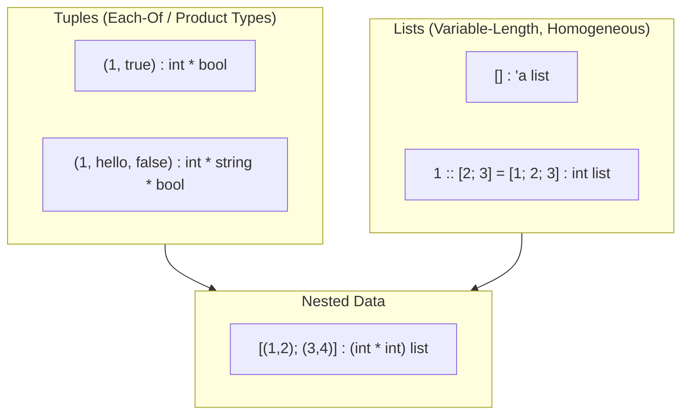

# CSE341: Lists and Tuples

OCaml builds complex programs from a sequence of bindings, each type-checked in a **[[Classes I didnt take/Programming Languages/Definitions/Part1/Static Environment|Static Environment]]** and evaluated in a **[[Classes I didnt take/Programming Languages/Definitions/Part1/Dynamic Environment|Dynamic Environment]]**. To handle data with multiple parts, OCaml uses compound data types, primarily **[[Tuple|Tuples]]** and **[[List|Lists]]**.

## Pairs and Tuples

A **[[Tuple|Tuple]]** is an "Each-Of" type (a **[[Product Type|Product Type]]**) that holds a fixed number of pieces of potentially different types.

### Building Tuples (Introduction)

- **Syntax**: `(e1, e2, ..., en)`
- **Type Checking**: If $e_i$ has type $t_i$, then the tuple has type $t_1 * t_2 * \dots * t_n$.
- **Evaluation**: Each expression $e_i$ evaluates to a value $v_i$, resulting in the tuple value `(v1, v2, ..., vn)`.

```ocaml
let my_pair : int * bool = (1, true)
let my_triple : int * string * bool = (1, "hello", false)
let nested_pair : (int * int) * int = ((1, 2), 15)
```

### Using Tuples (Elimination)

For pairs (2-tuples), OCaml provides `fst` and `snd`:

- `fst e`: Returns the first component of a pair.
- `snd e`: Returns the second component of a pair.

For larger tuples, OCaml typically uses **[[Classes I didnt take/Programming Languages/Definitions/Part1/Pattern Matching|Pattern Matching]]** (introduced later), as `fst` and `snd` are restricted to pairs.

```ocaml
let x = (5, 10)
let y = fst x (* 5 *)
let z = snd x (* 10 *)
```

---

## Lists

A **[[List|List]]** holds any number of elements, but all must have the same type.

### Building Lists

- **Empty List**: `[]` has type `'a list` (polymorphic).
- **Cons Operator**: `e1 :: e2` (pronounced "cons") prepends an element $e_1$ of type $t$ to a list $e_2$ of type $t \text{ list}$.
- **Syntactic Sugar**: `[e1; e2; ...; en]` is shorthand for `e1 :: e2 :: ... :: en :: []`.

```ocaml
let empty = []
let my_list = 1 :: [2; 3] (* [1; 2; 3] *)
let sugar_list = [7; 8; 9]
```

### Using Lists

- **Null Check**: `e = []` returns `true` if the list is empty.
- **Head**: `List.hd e` returns the first element. Raises an exception if the list is empty.
- **Tail**: `List.tl e` returns the list containing all elements except the first. Raises an exception if the list is empty.

### Recursive Processing

Functions over lists are almost always recursive, following the "Code Follows Data" principle:

1. **Base Case**: What is the result for `[]`?
2. **Recursive Case**: What is the result for `hd :: tl` (often expressed as `1 + f(tl)` or similar)?

```ocaml
let rec length (l : 'a list) : int =
  if l = [] then 0 
  else 1 + length (List.tl l)
```

## Design Principles

Whenever designing a new type $t$, we must define:

1. **Introduction Rules**: How to build values of type $t$.
2. **Elimination Rules**: How to use/extract values of type $t$.

### Nested Data

Nesting is a consequence of orthogonality in language design. Since a tuple is an expression, and a list contains expressions, you can have lists of tuples, tuples of lists, etc.

```ocaml
let list_of_pairs : (int * int) list = [(1, 2); (3, 4)]
```



## Related

- [[Options and Let Expressions|Options and Let Expressions]]
- [[Records and Variants|Records and Variants]]

## Industry Standard Terms

| Course Term | Industry/Standard Term |
| :--- | :--- |
| Each-Of Type / Product Type | Record Type / Struct / Product Type |
| Cons Operator (`::`) | Prepend / Head-Cons |
| Syntactic Sugar for lists | List Literal Syntax |
| Introduction / Elimination Rules | Constructors / Destructors (or Accessors) |
