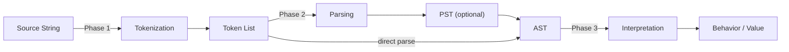

# CSE341: Implementing Programming Languages

Implementing a programming language involves translating source code into desired behavior. There are two primary approaches to this:

1. **[[Classes I didnt take/Programming Languages/Definitions/Part3/Interpreter|Interpretation]]**: Running the program directly by evaluating its source code (or an intermediate representation) on the fly.
2. **[[Compiler|Compilation]]**: Translating the source code into another language (target language) which is then executed.

## The Anatomy of an Interpreter

A modern interpreter typically breaks the execution into several discrete phases:

```
Input String → [Tokenization] → Token List → [Parsing] → AST → [Interpretation] → Behavior
```



### Phase 1: Tokenization

The goal of **[[Tokenization|Tokenization]]** is to break the raw input string into indivisible units called **tokens**.

- **Tokens in Trefoil v1**: Integer literals and operators (`+`, `-`, `*`, `.`).
- **Implementation**: Often uses whitespace splitting followed by a mapping to a `token` variant type.

```ocaml
type token = 
  | IntTok of int 
  | Plus 
  | Minus 
  | Times 
  | Dot
```

### Phase 2: Parsing

**[[Classes I didnt take/Programming Languages/Definitions/Part3/Parsing|Parsing]]** converts the flat list of tokens into a tree structure.

- **[[Classes I didnt take/Programming Languages/Definitions/Part3/Parenthesized Syntax Tree (PST)|Parenthesized Syntax Tree (PST)]]**: A simpler intermediate tree using parentheses (S-expressions) to represent structure.
  - `(+ 1 (* 2 3))` is easier to parse than `1 + 2 * 3` because the structure is explicit.
- **[[Classes I didnt take/Programming Languages/Definitions/Part3/Abstract Syntax Tree (AST)|Abstract Syntax Tree (AST)]]**: The final representation that strips away syntax details like parentheses and focuses on the semantics.

```ocaml
type expr =
  | Int of int
  | Add of expr * expr
  | Mul of expr * expr
```

### Phase 3: Evaluation (The Recursive Recipe)

The actual "running" of the code happens by recursively traversing the AST.

```ocaml
let rec interpret (ast : expr) : int =
  match ast with
  | Int i -> i
  | Add (l, r) -> interpret l + interpret r
  | Mul (l, r) -> interpret l * interpret r
```

## Case Study: The Trefoil Language

**Trefoil** is an instructional language that evolves through several versions:

### Trefoil v0.5: Command-based

A simple language where programs are strings like `"3 5"` which evaluates to `8` (implicit addition).

```ocaml
let interpret (s : string) : int =
  match String.split_on_char ' ' s with
  | [ x; y ] -> int_of_string x + int_of_string y
  | _ -> failwith "syntax error"
```

### Trefoil v1: Stack-based

Introduces a stack for evaluation. Tokens like `1 2 + .` result in pushing `1` and `2`, adding them, and then printing the result.

### Trefoil v2: Prefix/S-expression Arithmetic

Uses PSTs and ASTs to handle complex nested expressions.

- **Input**: `(+ (+ 1 7) (* (- 3 5) 6))`
- **PST**: `Node [Atom "+"; Node [Atom "+"; Atom "1"; Atom "7"]; ...]`
- **AST**: `Add(Add(Int 1, Int 7), Mul(Sub(Int 3, Int 5), Int 6))`

## Bootstrapping Compilers

A **[[Compiler|Compiler]]** for language `S` can be written in language `S` itself. This creates a circular dependency that is resolved as follows:

1. Write the initial `S` compiler in a metalanguage `M`.
2. Use the `M`-compiled `S` compiler to compile the `S` compiler (written in `S`).
3. Now you have a self-hosting compiler that can be used to add new features to `S` using `S` itself.

## Related

- [[Classes I didnt take/Programming Languages/Definitions/Part3/Interpreter|Definition: Interpreter]]
- [[Compiler|Definition: Compiler]]
- [[Classes I didnt take/Programming Languages/Definitions/Part3/Abstract Syntax Tree (AST)|Definition: AST]]
- [[Trefoil Language Design|Trefoil Language Design]]

## Industry Standard Terms

| Course Term | Industry/Standard Term |
| :--- | :--- |
| Tokenization | Lexical Analysis / Lexing / Scanning |
| Parenthesized Syntax Tree (PST) | S-expression / Concrete Syntax Tree (CST) |
| Abstract Syntax Tree (AST) | Abstract Syntax Tree (AST) |
| Interpreter | Interpreter / Tree-Walking Interpreter |
| Compiler | Compiler / Transpiler (if targeting high-level language) |
| Trefoil | Pedagogical Language / Teaching Language |
| Bootstrapping | Self-Hosting / Compiler Bootstrapping |
