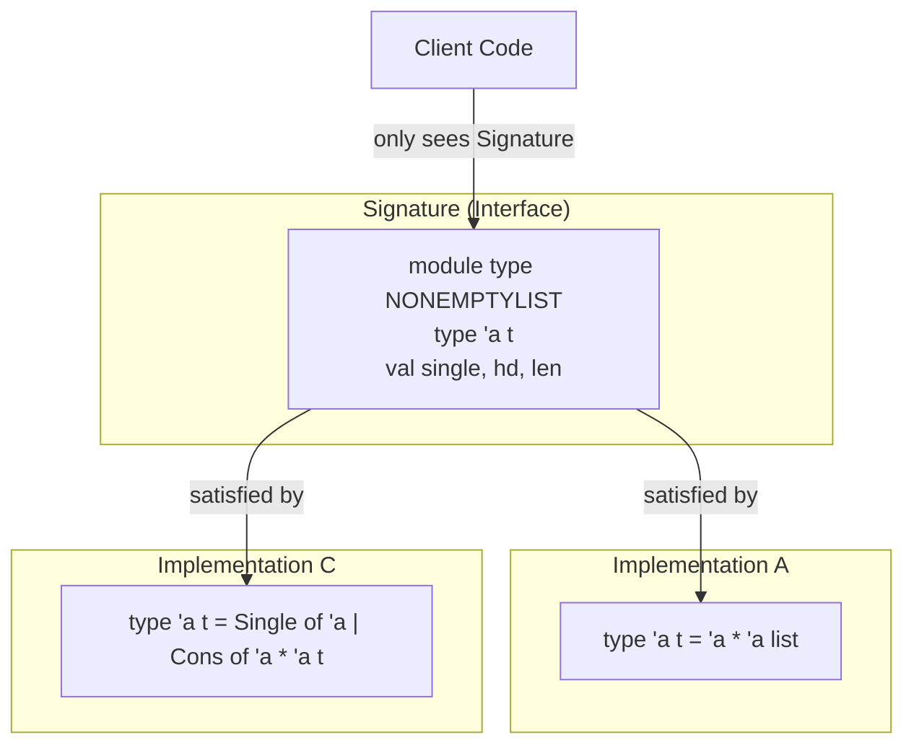

# CSE341: Modules and Abstraction

As software grows, managing complexity requires more than just functions. OCaml's **[[Module|Module]] system** provides powerful tools for namespace management and implementation hiding.

## Structures and Modules

A **structure** is a sequence of bindings. You define a module using the `module` keyword:

```ocaml
module MyMathLib = struct
  let rec fact x = if x = 0 then 1 else x * fact (x - 1)
  let half_pi = Float.pi /. 2.0
end
```

Accessing bindings is done via dot notation: `MyMathLib.fact 5`.

### Implicit Modules

In OCaml, every file `foo.ml` implicitly defines a module named `Foo`. If a corresponding `foo.mli` file exists, it acts as the module's **[[Signature|Signature]]**.

## Signatures and Implementation Hiding

A **[[Signature|Signature]]** (or module type) is the "type" of a module. It defines which components (types, values, exceptions) are visible to clients of the module.

### Hiding Bindings

By omitting a binding from a signature, you make it **private** to the module.

```ocaml
module type MATHLIB = sig
  val fact : int -> int
  (* half_pi is hidden from the client *)
end

module MyMathLib : MATHLIB = struct
  let rec fact x = ...
  let half_pi = 3.14 /. 2.0 (* Private helper *)
end
```

### Abstract Data Types (ADTs)

The most powerful use of signatures is hiding the **definition** of a type. This creates an **Abstract Data Type**.

```ocaml
module type POSITIVE = sig
  type t (* Abstract type: client doesn't know it's an int *)
  val of_int : int -> t option
  val to_int : t -> int
  val add : t -> t -> t
end

module Positive : POSITIVE = struct
  type t = int
  let of_int x = if x > 0 then Some x else None
  let to_int x = x
  let add a b = a + b
end
```

**Why this is useful**:

1. **Invariants**: The `Positive` module ensures that any value of type `t` is actually positive because the only way to create a `t` is through `of_int`.
2. **Flexibility**: You can change the implementation of `type t` (e.g., from `int` to `float`) without breaking any client code, as long as the signature remains the same.

## Example: Non-Empty Lists

Implementing a non-empty list structure shows how different implementations can satisfy the same signature.

```ocaml
module type NONEMPTYLIST = sig
  type 'a t
  val single : 'a -> 'a t
  val hd : 'a t -> 'a
  val len : 'a t -> int
end

(* Implementation A: Using a pair *)
module NelA : NONEMPTYLIST = struct
  type 'a t = 'a * 'a list
  let single x = (x, [])
  let hd (x, _) = x
  let len (_, xs) = 1 + List.length xs
end

(* Implementation C: Using a custom variant *)
module NelC : NONEMPTYLIST = struct
  type 'a t = Single of 'a | Cons of 'a * 'a t
  let single x = Single x
  let hd = function Single x -> x | Cons(x, _) -> x
  let rec len = function Single _ -> 1 | Cons(_, tl) -> 1 + len tl
end
```



## Related

- [[Module|Definition: Module]]
- [[Signature|Definition: Signature]]
- [[Classes I didnt take/Programming Languages/Type Systems/Type Inference|Type Inference]]

## Industry Standard Terms

| Course Term | Industry/Standard Term |
| :--- | :--- |
| Module | Module / Namespace / Package |
| Signature (Module Type) | Interface / Protocol / API Contract |
| Abstract Data Type (ADT) | Abstract Data Type / Opaque Type |
| Implementation Hiding | Encapsulation / Information Hiding |
| `.mli` file | Header File / Interface File |
