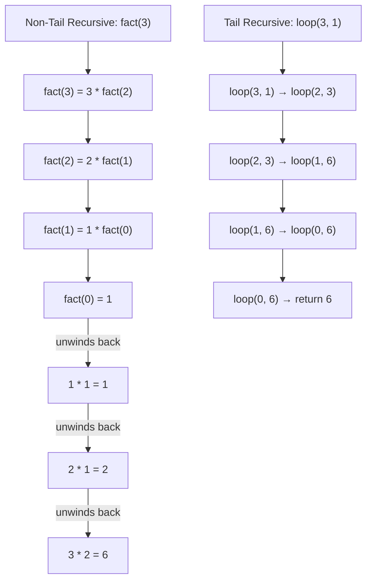

# CSE341: Nested Patterns and Tail Recursion

Pattern matching is even more powerful when patterns are nested. Additionally, understanding how recursion executes on the call stack allows for significant performance optimizations.

## Nested Pattern Matching

Anywhere a variable can appear in a pattern, another pattern can be placed. This allows for deconstructing complex, nested data structures in a single match.

### Examples

- **Multiple items**: `match (xs, ys) with ([], []) -> ...`
- **Lists with specific lengths**: `match xs with a::b::[] -> ...` (exactly 2 elements).
- **Deep nesting**: `match xs with (a, (b, c)) :: tl -> ...`

### General Pattern Syntax

A pattern $p$ can be:

- `x`: A variable (matches anything, binds $x$).
- `_`: A wildcard (matches anything, no binding).
- `(p1, ..., pn)`: A tuple of patterns.
- `C p`: A constructor applied to a pattern.

### Match Semantics (Recursive)

A pattern $p$ matches a value $v$ if:

1. $p$ is a variable $x$ (always matches).
2. $p$ is `_` (always matches).
3. $p$ is $(p_1, \dots, p_n)$ and $v$ is $(v_1, \dots, v_n)$, and each $p_i$ matches $v_i$.
4. $p$ is $C p_1$ and $v$ is $C v_1$, and $p_1$ matches $v_1$.

---

## Tail Recursion

Every function call typically pushes a "stack frame" onto the call stack. Deep recursion can lead to "stack overflow" because the stack has finite space.

### Tail Calls

A **tail call** is a function call where the caller has no more work to do after the call returns. The result of the call is the result of the caller.

### Tail-Call Optimization (TCO)

In OCaml, if a call is in **tail position**, the compiler performs **tail-call optimization**. It pops the current stack frame before making the next call, allowing recursion to use $O(1)$ stack space. This makes recursion as efficient as a loop.

### Methodology: Accumulators

To make a function tail-recursive, we often use a helper function with an **accumulator** (`acc`) that carries the "result-so-far."

#### Example: Factorial

Non-tail recursive (Space: $O(n)$):

```ocaml
let rec fact n = if n=0 then 1 else n * fact(n-1)
```

Tail-recursive (Space: $O(1)$):

```ocaml
let fact n =
  let rec loop (n, acc) =
    if n=0 then acc 
    else loop (n-1, acc * n)
  in loop (n, 1)
```

### Precise Tail Position Rules

An expression is in tail position if it is the "last thing to happen."

- In `let f x = e`, `e` is in tail position.
- In `if e1 then e2 else e3`, `e2` and `e3` are in tail position (if the `if` itself was). `e1` is **not**.
- In `let x = e1 in e2`, `e2` is in tail position. `e1` is **not**.
- In `e1 + e2`, neither subexpression is in tail position (because `+` must happen after both return).



## Related

- [[Records and Variants|Records and Variants]]
- [[Lists and Tuples|Lists and Tuples]]

## Industry Standard Terms

| Course Term | Industry/Standard Term |
| :--- | :--- |
| Tail Call | Tail Call / Proper Tail Call |
| Tail-Call Optimization (TCO) | Tail-Call Elimination (TCE) / Tail-Call Optimization |
| Accumulator Pattern | Continuation-Passing Style (CPS) / Accumulator |
| Nested Pattern | Nested Destructuring / Deep Pattern Match |
