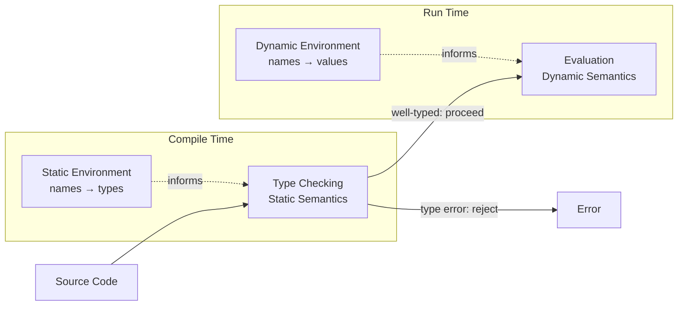

# CSE341: Syntax and Semantics

In the study of programming languages, there is a fundamental distinction between how a program is written and what it means.

## Syntax

**Syntax** dictates how programs are written down — roughly analogous to the spelling and grammar of a natural language. It defines the valid combinations of symbols, keywords, and characters that form expressions.

## Semantics

**Semantics** dictates what programs actually mean. In CSE 341, semantics is considered the essence of a programming language, whereas syntax is largely a matter of design taste.

Semantics is split into two phases:

1. **Static Semantics (Type Checking):** Occurs at compile time. It proves invariants about the program before it runs (e.g., ensuring a variable always resolves to an integer). If a program fails static semantics, it is rejected entirely.
2. **Dynamic Semantics (Evaluation):** Occurs at run time. Because the program has already passed type checking, many runtime errors become impossible by definition.

## Environments

Programming languages manage state and scope using environments, which map names (variables) to their specific properties.

- **[[Classes I didnt take/Programming Languages/Definitions/Part0/Static Environment|Static Environment]]**: Maps names to their types. Used during type checking.
- **[[Classes I didnt take/Programming Languages/Definitions/Part0/Dynamic Environment|Dynamic Environment]]**: Maps names to their runtime values. Used during evaluation.

## Related

- [[Variable Bindings|Variable Bindings]]
- [[Classes I didnt take/Programming Languages/OCaml Fundamentals/Functions|Functions]]
- [[Classes I didnt take/Programming Languages/Type Systems/Type Inference|Type Inference]]

## Industry Standard Terms

| Course Term | Industry/Standard Term |
| :--- | :--- |
| Static Semantics | Type System / Static Analysis |
| Dynamic Semantics | Operational Semantics / Evaluation Rules |
| Static Environment | Type Environment ($\Gamma$) |
| Dynamic Environment | Runtime Environment / Store |
