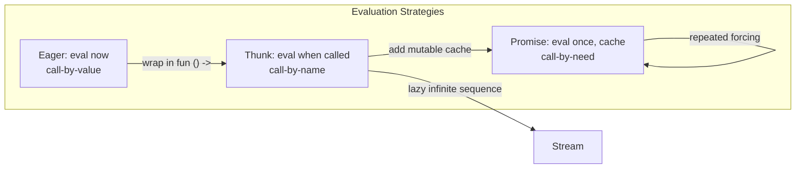

# CSE341: Delayed Evaluation

This unit explores techniques to control when expressions are evaluated, enabling lazy evaluation, performance optimizations, and infinite data structures.

## Thunks

By default, OCaml uses **eager evaluation** (call-by-value), where arguments are evaluated before the function is called. We can delay evaluation using a **[[Thunk|Thunk]]**.

- **Mechanism**: Wrap an expression in a zero-argument function `fun () -> e`.
- **Trigger**: Evaluate the expression by calling the function `f ()`.

### Example: Custom If

```ocaml
let my_if c t e = if c then t () else e ()

let _ = my_if (x > 0) 
          (fun () -> print_endline "Positive") 
          (fun () -> print_endline "Non-positive")
```

## Promises (Lazy Evaluation)

A **[[Promise|Promise]]** combines a thunk with a mutable cell to ensure a computation happens **at most once**. This is known as **call-by-need**.

### Implementation

```ocaml
type 'a promise_state = 
  | Unevaluated of (unit -> 'a)
  | Evaluated of 'a

type 'a promise = 'a promise_state ref

let delay th = ref (Unevaluated th)

let force p =
  match !p with
  | Evaluated v -> v
  | Unevaluated th ->
      let v = th () in
      p := Evaluated v;
      v
```

### Performance Trade-offs

| Strategy | Good When | Bad When |
| :--- | :--- | :--- |
| **Thunk** | Value is never needed | Value is needed many times (recomputes each time) |
| **Promise** | Value is never needed OR needed many times (caches result) | Slightly more overhead than a thunk for the first access |

## Streams

A **[[Stream|Stream]]** is an idiom for representing infinite sequences. It is a thunk that, when called, returns the first element and a new thunk for the rest of the sequence.

### Formal Definition in OCaml

```ocaml
type 'a stream = Stream of (unit -> 'a * 'a stream)
```

### Simplified Explanation

A stream is an infinite list that is only ever computed one element at a time. Each "node" is a frozen computation (a thunk) that, when forced, produces the current head value and another frozen computation for the rest of the stream. This allows representing sequences that would be impossible to store in memory all at once.

### Examples

- **Infinite Ones**:
  ```ocaml
  let rec ones = Stream (fun () -> (1, ones))
  ```
- **Natural Numbers**:
  ```ocaml
  let nats =
    let rec helper n = Stream (fun () -> (n, helper (n + 1))) in
    helper 0
  ```

### Consuming Streams

To use a stream, we must "unfold" it recursively.

```ocaml
let rec take n (Stream s) =
  if n = 0 then []
  else
    let (hd, tl) = s () in
    hd :: take (n - 1) tl
```

### Stream Combinators

We can define `map` and `filter` for streams, which return new streams.

```ocaml
let rec stream_map f (Stream s) =
  Stream (fun () ->
    let (hd, tl) = s () in
    (f hd, stream_map f tl))
```



## Related

- [[First Class Functions and Closures|First Class Functions and Closures]]
- [[Mutation and Aliasing|Mutation and Aliasing]]

## Industry Standard Terms

| Course Term | Industry/Standard Term |
| :--- | :--- |
| Thunk | Thunk / Suspended Computation / Lazy Value |
| Promise (call-by-need) | Lazy Evaluation / Memoized Thunk / Future (in concurrent contexts) |
| Stream | Lazy List / Generator / Iterator |
| Eager Evaluation | Call-by-Value / Strict Evaluation |
| `force` | Force / Evaluate / Realize |
