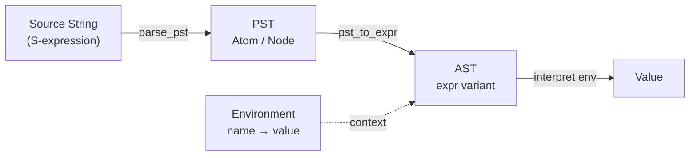

# CSE341: Trefoil Language Design

Trefoil is a simple functional language used to demonstrate the principles of language implementation. The implementation follows a structured pipeline: **String -> [[Classes I didnt take/Programming Languages/Definitions/Part4/Parenthesized Syntax Tree (PST)|PST]] -> [[Classes I didnt take/Programming Languages/Definitions/Part4/Abstract Syntax Tree (AST)|AST]] -> [[Classes I didnt take/Programming Languages/Definitions/Part4/Interpreter|Interpreter]]**.

## The Implementation Pipeline

Implementing a new language feature requires three main steps:

1. **Define the [[Classes I didnt take/Programming Languages/Definitions/Part4/Abstract Syntax Tree (AST)|AST]]**: Represent the new construct as a variant in an OCaml `type`.
2. **Implement PST -> AST**: Update the parser to convert the parenthesized structure into the internal AST.
3. **Implement AST -> Behavior**: Update the recursive `interpret` function to define the semantics of the new construct.



### Parenthesized Syntax Trees (PST)

**PSTs** represent the nested structure of S-expressions. They serve as an intermediate step to avoid the complexity of full tokenization and parsing in the early stages of language design.

```ocaml
type pst =
  | Atom of string
  | Node of pst list
```

## Core Expressions and Variables

The base version of Trefoil (v2) supports integer arithmetic and local variable bindings using `let`.

### Formal Definition of Let

In Trefoil, a `let` expression has the form `(let ((x e1)) e2)`.

### Formal Definition

- `e1` is evaluated in the current **[[Environment|Environment]]** to a value `v1`.
- `e2` is evaluated in an extended environment where `x` is bound to `v1`.
- The resulting value of the entire expression is the value of `e2`.

### Simplified Explanation

A `let` expression creates a temporary "bubble" where a name stands for a value. Once you leave the `let` expression (the body `e2` finishes), that binding disappears and the outer environment is restored.

### Implementation

The **[[Environment|Environment]]** is typically implemented as a Map or an association list.

```ocaml
type expr =
  | Int of int
  | Var of string
  | Add of expr * expr
  | Let of string * expr * expr
  (* ... other arithmetic ops ... *)

let rec interpret (env : env) (ast : expr) : int =
  match ast with
  | Int i -> i
  | Var x -> (
      match lookup x env with
      | None -> failwith "unbound var"
      | Some i -> i)
  | Let (x, e1, e2) ->
      let v1 = interpret env e1 in
      let extended_env = bind x v1 env in
      interpret extended_env e2
  | Add (l, r) -> interpret env l + interpret env r
```

## Booleans and Control Flow

Trefoil v2.5 introduces a `value` type to handle both integers and booleans, along with `if` and `cond` expressions.

### Value Type

To support multiple types, the interpreter must return a `value` instead of a raw `int`.

```ocaml
type value =
  | Int of int
  | Bool of bool

type expr =
  | Val of value
  | If of expr * expr * expr
  | Cond of (expr * expr) list
  (* ... *)
```

### If Expressions

The `if` expression `(if predicate then_branch else_branch)` follows standard branching logic.

- **Semantics**: The `predicate` is evaluated. If it evaluates to `Bool false`, the `else_branch` is evaluated. Otherwise (for `Bool true` OR any other value, depending on "truthy" rules), the `then_branch` is evaluated.

```ocaml
  | If (predicate, then_branch, else_branch) -> (
      match interpret env predicate with
      | Bool false -> interpret env else_branch
      | _ -> interpret env then_branch)
```

### Cond Expressions

`cond` is a multi-way branch, similar to a `switch` or `match` statement but based on boolean predicates.

- **Interpret Logic**: Iterate through `(predicate, body)` pairs. Evaluate each predicate. The first one that is "truthy" triggers the evaluation of its corresponding body.

```ocaml
  | Cond clauses ->
      let rec handle_clauses cs =
        match cs with
        | [] -> failwith "cond: no clause matched"
        | (pred, body) :: rest ->
            if is_truthy (interpret env pred) then
              interpret env body
            else
              handle_clauses rest
      in handle_clauses clauses
```

## Lists in Trefoil

Trefoil supports Racket-style lists with `cons`, `car`, `cdr`, and `nil`.

### Proper vs Improper Lists

- **[[Proper List|Proper List]]**: Ends in `nil`. Example: `(cons 1 (cons 2 nil))` -> `[1, 2]`.
- **[[Improper List|Improper List]]**: Ends in a non-list value. Example: `(cons 1 2)` -> `(1 . 2)`.

### List Operations Walkthrough

1. `(cons 1 2)`: Creates a pair (improper list).
2. `(car (cons 1 2))`: Returns `1`.
3. `(cdr (cons 1 2))`: Returns `2`.
4. `(nil? nil)`: Returns `true`.

### Deep Technical Context: Recursive List Processing

The `dsum` function demonstrates recursive processing of arbitrary list structures (deep sum):

```racket
(define (dsum l)
  (cond
    ((nil? l) 0)
    ((cons? l) (+ (dsum (car l)) (dsum (cdr l))))
    (true l)))
```

This function works because it handles three cases:

1. The list is empty (base case 1: return 0).
2. The current element is a pair (recursive case: sum `car` and `cdr`).
3. The current element is a leaf value (base case 2: return the value itself).

### Comparison: Trefoil vs OCaml Lists

| Feature | Trefoil Lists | OCaml Lists |
| :--- | :--- | :--- |
| Typing | Dynamic/Heterogeneous | Static/Homogeneous |
| Structure | Pairs (`cons`) | Built-in List type |
| Termination | `nil` | `[]` |
| Flexibility | Supports [[CSE341/Definitions/Part4/Improper List|Improper Lists]] | Only [[CSE341/Definitions/Part4/Proper List|Proper Lists]] |

## Related

- [[Trefoil Functions and Scoping|Trefoil Functions and Scoping]]
- [[Environment|Environment]]
- [[Classes I didnt take/Programming Languages/Definitions/Part4/Abstract Syntax Tree (AST)|Abstract Syntax Tree (AST)]]
- [[Implementing Languages|Implementing Programming Languages]]

## Industry Standard Terms

| Course Term | Industry/Standard Term |
| :--- | :--- |
| Trefoil | Pedagogical Interpreter / Teaching Language |
| PST / S-expression | Concrete Syntax Tree (CST) / S-expression |
| AST | Abstract Syntax Tree (AST) |
| `cons` / `car` / `cdr` | Linked List Node / Head / Tail (Lisp heritage) |
| Proper List | Proper List / Singly Linked List |
| Improper List / Dotted Pair | Dotted Pair / Non-null-terminated pair |
| Truthy | Truthy / Falsy (JavaScript, Python, Ruby convention) |
