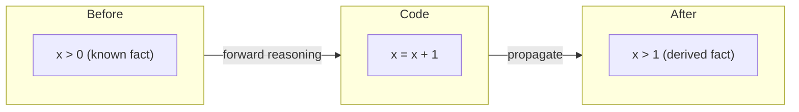
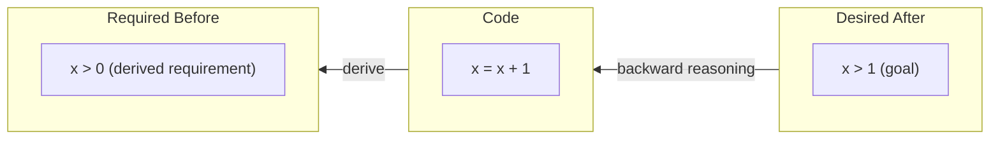

# CSE 403: Program Analysis Overview

**Program analysis** is the practice of reasoning about programs without necessarily running them. Rather than executing a program on concrete inputs and observing what happens, program analysis seeks to establish facts about a program's behavior across all possible inputs — or to automatically find inputs that cause undesired behavior. This is one of the most powerful tools available to software engineers for building reliable, correct software.

## Use Cases

Program analysis is used in several complementary ways:

- **Verification and testing**: automatically proving that a program is correct with respect to a specification, or finding counterexamples (bugs) that demonstrate it is not. This includes automated test generation and formal verification.
- **Proving facts about program state**: establishing that a property always holds across all executions — for example, that a variable `x` is never `null`, that `y` is always greater than 0, or that an array is always sorted before being passed to binary search. These are invariant properties.
- **Debugging**: narrowing down where and why a fault occurs, often by propagating constraints backward from an observed failure to identify the root cause.

CSE 403 covers four program analysis approaches: testing (covered earlier in the course), delta debugging (covered earlier in [[Static and Dynamic Analysis]]), abstract interpretation (primer, see [[Static Analysis]]), and theorem proving / solver-aided reasoning via [[Z3 and SMT Solvers|Z3]].

## Pre-conditions, Post-conditions, and Loop Invariants

Before reasoning forward or backward through code, we need a language for expressing what is true at various points in a program. The standard vocabulary consists of three types of logical facts.

### Pre-conditions

A **pre-condition** is a logical fact that must be true when entering a function or code block. The caller is responsible for establishing the pre-condition before invoking the function. The function itself is not required to check whether its pre-condition holds — it is simply guaranteed by contract that it does. If a caller violates a pre-condition, the behavior of the function is undefined by the contract.

For example, a binary search function might have the pre-condition that its input array is sorted. The function can assume this without checking it on every call.

### Post-conditions

A **post-condition** is a logical fact that must be true when leaving a function or code block. The function is responsible for establishing the post-condition, given that the pre-condition held on entry. Together, the pre-condition and post-condition form a contract — a caller that satisfies the pre-condition is guaranteed to receive a result satisfying the post-condition.

### Loop Invariants

A **loop invariant** is a logical fact that must be true at the beginning and at the end of every single iteration of a loop. Loop invariants are the key to reasoning about what a loop computes without having to trace through each individual iteration. The reasoning follows a pattern identical to mathematical induction:

1. **Base case**: Before the loop body executes for the first time (i.e., when the loop begins), the invariant must hold.
2. **Inductive step**: Assuming the invariant holds at the start of some iteration, and the loop body executes, the invariant must still hold at the end of that iteration.
3. **Termination**: When the loop exits (i.e., the loop condition becomes false), the invariant still holds. Combined with the negation of the loop condition, this gives you the post-condition — the invariant tells you what is structurally maintained, and the exit condition tells you what additionally became true.

Loop invariants connect directly to material from [[Loop invariants with pictures|CSE 331 Loop Invariants]], where this framework is developed in depth.

## Forward vs. Backward Reasoning

Program analysis can proceed in two directions through code. The choice of direction is not about correctness — both directions lead to sound conclusions — but about which direction is more natural and useful for a given task.

### Forward Reasoning

**Forward reasoning** starts from a known fact that is true before some code executes, and derives what must be true after that code runs. You push a known fact forward through the program, statement by statement, updating it to reflect the effect of each operation.

Example: Suppose we know that `x > 0` is true before executing the assignment `x = x + 1`. After this statement executes, we can conclude that `x > 1`. The reasoning is purely mechanical: if `x` was strictly positive, and we added 1 to it, the result is strictly greater than 1.

Forward reasoning is most useful for propagating facts from a known starting state (such as a set of valid pre-conditions on function entry) through a program to determine what holds at arbitrary points in the execution.

### Backward Reasoning

**Backward reasoning** starts from a fact you want to be true after some code executes, and derives what must have been true before the code ran in order for that post-condition to hold. You work backwards from the desired result through the program.

Example: Suppose we want `x > 1` to hold after executing `x = x + 1`. Working backwards: for `x > 1` to hold after the addition, we need `x > 0` to hold before the addition. So the pre-condition required to guarantee the post-condition is `x > 0`.

Backward reasoning is generally more useful for verification because you typically start with the desired correctness property (what you want the program to guarantee) and work backwards to discover what pre-conditions are needed to make it hold. This also underlies the concept of **weakest pre-conditions**: for a given post-condition and statement, the weakest pre-condition is the most general condition that, if true before the statement, guarantees the post-condition after.

## Abstract Interpretation (Primer)

**Abstract interpretation** is a systematic framework for building sound static analyses. The central idea is to reason not about the exact, concrete values a program variable takes at runtime, but about an abstract approximation of those values — one that is simpler to compute with and that deliberately over-approximates what is possible.

### The Core Idea

Instead of tracking that `x = 5`, an abstract interpreter might track only that `x` is *positive*. Instead of tracking that `y = -3`, it tracks that `y` is *negative*. The **abstract domain** is the set of possible abstract values. A common example is the **sign domain**: `{positive, negative, zero, ⊤ (top/unknown), ⊥ (bottom/unreachable)}`.

- `positive` means the variable is definitely greater than zero.
- `negative` means it is definitely less than zero.
- `zero` means it is definitely equal to zero.
- `⊤` (top) means it could be anything — the analysis has lost precision.
- `⊥` (bottom) means this program point is unreachable.

### Abstract Operations

Operations on abstract values are defined to be sound: the abstract result must over-approximate all possible concrete results.

- `positive + positive = positive` — the sum of two positive numbers is always positive.
- `positive + negative = ⊤` — the sum of a positive and negative number could be anything.
- `positive * negative = negative` — the product of a positive and negative is always negative.
- `zero * anything = zero` — anything multiplied by zero is always zero.

The key soundness guarantee: if the abstract analysis concludes that a variable cannot be zero at some point, then no concrete execution of the program can produce zero at that point. This means the analysis can safely report "no division-by-zero is possible" if the abstract value of the divisor is never `zero` or `⊤`.

### The Soundness Trade-off

Abstract interpretation achieves soundness — no bugs are missed — at the cost of precision. When the abstract domain cannot determine the exact sign (e.g., after adding a positive and a negative number), it returns `⊤`, which may cause the analysis to report a possible error where none actually exists. This is an acceptable false positive: the analysis is conservative, erring on the side of reporting potential problems rather than missing real ones.

---

## Related

- [[Static and Dynamic Analysis]]
- [[Static Analysis]]
- [[Z3 and SMT Solvers]]
- [[Delta Debugging]]
- [[Loop invariants with pictures]]
- [[Loop to Tail Recursion]]

## Industry Standard Terms

| CSE 403 Term | Industry / Research Equivalent |
|---|---|
| Pre-condition | Precondition, contract assumption |
| Post-condition | Postcondition, contract guarantee |
| Loop invariant | Loop invariant (universal term) |
| Forward reasoning | Forward dataflow analysis, strongest postcondition |
| Backward reasoning | Backward dataflow analysis, weakest precondition calculus |
| Abstract interpretation | Abstract interpretation (Cousot & Cousot framework) |
| Abstract domain | Lattice, abstract domain |
| ⊤ (top) | Unknown / imprecise abstract value |
| ⊥ (bottom) | Unreachable / infeasible state |
