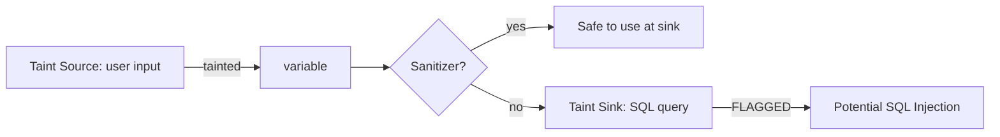

# CSE 403: Static Analysis

**Static analysis** is the examination of source code (or compiled artifacts) without executing the program. The "static" refers to analyzing the program text itself — its structure, types, data flow, and control flow — rather than observing runtime behavior. Static analysis tools find classes of defects that dynamic testing often misses, and they can analyze the *entire* codebase, not just paths exercised by a test suite.

---

## Static vs. Dynamic Analysis

The fundamental distinction:

| Dimension | Static Analysis | Dynamic Analysis (Testing) |
|---|---|---|
| When it runs | At compile time or build time | At runtime |
| What it observes | Program text, structure, types | Actual execution behavior |
| Coverage | Can analyze all code paths | Only paths exercised by test inputs |
| False positives | May report issues that are not real bugs | Reports only observed failures (no false positives) |
| False negatives | May miss bugs that require specific runtime state | Misses untested paths |
| Performance | Fast (no test execution) | Depends on test suite size |

Static and dynamic analysis are complementary. Static analysis catches structural and type-level issues early and broadly; dynamic testing catches behavioral errors on specific inputs.

---

## The Undecidability Problem

A fundamental theoretical result (Rice's Theorem) states that any non-trivial property of a program's runtime behavior is **undecidable** — no algorithm can determine it exactly for all possible programs. This means perfect static analysis is impossible: any static analyzer must either:

- **Over-approximate**: report some false positives (warn about code that is actually safe) but never miss a real bug. Called **sound** analysis.
- **Under-approximate**: never produce false positives, but may miss real bugs. Called **complete** analysis.

In practice, most production static analyzers accept a configurable level of false positives in order to catch a meaningful number of real bugs. Soundness is the property of "if there is a bug of type X, we will report it." Completeness is "everything we report is a real bug."

---

## Linting

A **linter** is the simplest form of static analysis: it checks source code for stylistic and simple syntactic/semantic issues, enforcing a coding standard.

Linters catch:
- Unused variables and imports
- Inconsistent naming conventions
- Code style violations (indentation, line length, spacing)
- Simple logic errors (assignment in an if condition, unreachable code)
- Missing null checks on obvious cases

Common linters:
- **Checkstyle**, **PMD**, **SpotBugs** (Java)
- **pylint**, **flake8**, **mypy** (Python)
- **ESLint** (JavaScript/TypeScript)
- **clang-tidy** (C/C++)

Linting is typically integrated into CI pipelines as a fast first check that runs before compilation.

---

## Type Checking

**Type checking** is a form of static analysis that verifies the program's type annotations are consistent — that values of the correct types flow to the correct places. In statically typed languages (Java, C, Go), type checking is performed by the compiler. In dynamically typed languages (Python, JavaScript), optional static type checkers can be added:

- **mypy** for Python checks type annotations added via `typing` module hints
- **TypeScript** adds a compile-time type layer over JavaScript

Type checking catches:
- Calling a method on an object that does not have that method
- Passing an argument of the wrong type
- Returning the wrong type from a function
- Null pointer dereferences (in null-safe type systems like Kotlin or TypeScript with strict null checks)

Type systems are a particularly powerful form of static analysis because they are decidable for well-designed type systems, have zero false positives (in sound type systems every type error is real), and check the entire program.

---

## Dataflow Analysis

**Dataflow analysis** tracks how values propagate through a program. It is used to answer questions like:

- Is this variable always initialized before it is used? (**Uninitialized variable analysis**)
- Can a null value reach this dereference? (**Null pointer analysis**)
- Can user-controlled input reach this SQL query without sanitization? (**Taint analysis**)
- Is this resource always closed on every path that opens it? (**Resource leak analysis**)

### Reaching Definitions

**Reaching definitions** is a classic dataflow analysis that, for each use of a variable, computes which assignment statements (definitions) could have set the variable's current value. If an uninitialized variable "reaches" a use, that is a bug.

### Formal Definition

A definition d **reaches** a point p in the program if there exists a path from d to p along which d is not **killed** (overwritten by another definition of the same variable).

$$\text{Reach}_{in}(B) = \bigcup_{P \in pred(B)} \text{Reach}_{out}(P)$$
$$\text{Reach}_{out}(B) = \text{Gen}(B) \cup (\text{Reach}_{in}(B) \setminus \text{Kill}(B))$$

Where Gen(B) is the set of definitions generated in block B and Kill(B) is the set of definitions overwritten in B.

### Simplified Explanation

For each block, start with all definitions that could flow in from predecessor blocks. Remove any that are overwritten within this block. Add any new definitions created in this block. Propagate forward. If a variable's only reaching definition is "uninitialized," flag it as a potential bug.

### Taint Analysis

**Taint analysis** is a dataflow analysis used for security. **Tainted** values are those that originate from untrusted sources (user input, network data, environment variables). The analysis tracks tainted values as they flow through the program. If a tainted value reaches a **sink** — a security-sensitive operation like a SQL query, shell command, or HTML render — without passing through a **sanitizer**, it is flagged as a potential injection vulnerability.

---

## Abstract Interpretation

**Abstract interpretation** is a theoretical framework for static analysis, developed by Patrick and Radhia Cousot. It provides a rigorous way to define what it means for a static analysis to be sound (guaranteed to catch all bugs of a type) and to construct sound analyzers systematically.

The key idea: instead of tracking the exact concrete values a program manipulates, the analysis tracks **abstract values** from a **abstract domain** that over-approximate the concrete behavior.

**Example — Sign Analysis**: Instead of tracking the exact value of an integer variable, track only its sign: {positive, negative, zero, unknown}. If the analysis determines a variable's value is always positive, you know a `sqrt` call on it cannot fail due to a negative argument — even without knowing the exact value.

The abstract domain must form a **lattice**, and the analysis must be a **monotone function** on that lattice, guaranteeing that the fixed-point iteration terminates with a sound over-approximation.

---

## Model Checking

**Model checking** is a technique for formally verifying properties of a system by exhaustively exploring its state space. The system is modeled as a finite state machine, and the property to verify is expressed in a temporal logic formula (e.g., "on every path, if a request is sent, a response is eventually received").

The model checker explores all reachable states and either:
- Confirms the property holds in all states
- Produces a **counterexample** — a specific execution trace that violates the property

Model checking is extremely powerful for concurrent systems (detecting deadlocks, race conditions, livelock) but suffers from **state explosion**: the state space grows exponentially with the number of concurrent components, making it infeasible for very large systems.

---

## Common Bug Categories Caught by Static Analysis

| Bug Category | Analysis Type |
|---|---|
| Null pointer dereference | Dataflow, type system |
| Uninitialized variable | Reaching definitions, linting |
| Resource leak (open file/DB connection never closed) | Dataflow, resource analysis |
| SQL / command injection | Taint analysis |
| Integer overflow | Abstract interpretation |
| Deadlock (in concurrent code) | Model checking |
| Division by zero | Abstract interpretation, dataflow |
| Array out of bounds | Abstract interpretation |
| Type mismatches | Type checking |
| Dead code (unreachable) | Control flow analysis, linting |

---

## False Positives and Alert Fatigue

The practical challenge of deploying static analysis is managing **false positives**. If a tool reports 500 warnings on a codebase and only 10 are real bugs, developers will quickly learn to ignore all warnings — this is **alert fatigue**. At that point, the tool provides no value (and may be worse than no tool, since it creates the illusion of safety).

Effective deployment of static analysis requires:
- Tuning the tool's sensitivity to reduce false positive rates
- Integrating into CI as a blocking gate (fail the build on new findings, never on pre-existing ones)
- Gradually ratcheting: start with only the highest-confidence checks enabled, add more over time
- Using **differential analysis** — only report issues introduced by the current change, not all historical issues

---

## Related

- [[Static and Dynamic Analysis]]
- [[Z3 and SMT Solvers]]
- [[Testing Fundamentals]]
- [[Test Design Techniques]]
- [[Code Review Practices]]

---

## Industry Standard Terms

| Course Term | Industry / Standard Term |
|---|---|
| Static Analysis | SAST (Static Application Security Testing), Linting, Static code analysis |
| Taint Analysis | Taint tracking, Data flow security analysis |
| Model Checking | Formal verification, Property checking |
| Abstract Interpretation | Abstract analysis, Sound static analysis |
| Alert Fatigue | Warning noise, Signal-to-noise ratio problem |
| Linter | Style checker, Code quality tool |
| Reaching Definitions | Def-use chain analysis |
| False Positive | False alarm, Spurious warning |
| False Negative | Missed bug, Under-detection |
| Sound Analysis | Over-approximating analysis |
