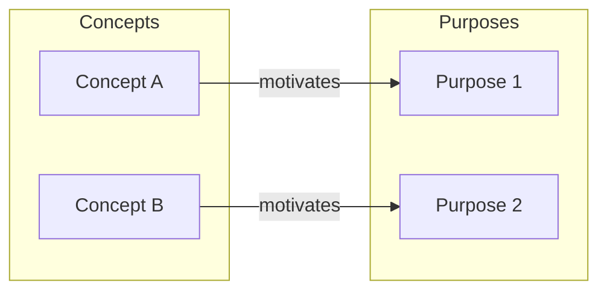

# CSE 403: Software Design Theory

This lecture introduces a theoretical framework for thinking rigorously about software design — not just patterns or heuristics, but a principled vocabulary for describing what a design is, why it exists, and how to evaluate whether it is good. The framework is drawn from the paper "Purposes, Concepts, Misfits, and a Redesign of Git" by Santiago Perez De Rosso and Daniel Jackson (MIT CSAIL).

## The Central Problem

Good software design requires more than choosing the right data structure or algorithm. At the system level, a bad design creates confusion, misuse, and unexpected behavior. The canonical motivation for design theory comes from Tony Hoare:

> "There are two ways of constructing a software design: one way is to make it so simple that there are obviously no deficiencies; the other is to make it so complicated that there are no obvious deficiencies."

The goal of software design and architecture is **separation of concerns** and **modularity** — breaking a system into pieces that are independently understandable, modifiable, and testable.

## Concepts and Motivating Purposes

### Concepts

A **concept** is something you need to understand in order to use an application — and also something a developer needs to understand to work effectively with its code. A concept is invented to solve a particular problem, and it encapsulates both the structure of the solution and the behavior that makes it work.

The Trash concept on macOS is a prototypical example: users must understand that dragging a file to the Trash does not immediately delete it, that files in the Trash persist until the Trash is emptied, and that files can be retrieved from the Trash. Without this mental model, users cannot predict what will happen when they drag a file there.

Use cases are a good starting point for identifying concepts and their motivating purposes — each use case typically maps to one or more concepts that exist to support it.

### Motivating Purpose

Each concept exists to solve a specific problem, called its **motivating purpose**. The motivating purpose is the reason the concept was invented in the first place. Understanding a concept's motivating purpose is essential for evaluating whether the concept is well-designed — a concept that cannot be connected to a clear purpose is suspect.

## Operational Principles and Misfits

### Operational Principle

A concept is defined by an **operational principle**: a scenario that illustrates how the concept fulfills its motivating purpose. The operational principle is a typical usage story — it shows the concept working as intended to solve the problem it was designed to solve. It is not a full specification of all possible behaviors, but rather the canonical success path.

For the Trash concept: the operational principle is "drag a file to Trash, continue working, later empty Trash to permanently delete it." This scenario shows how the concept fulfills its purpose (allowing safe, recoverable deletion).

### Operational Misfits

A concept may not be entirely fit for its purpose in all situations. An **operational misfit** is a scenario in which the concept's prescribed behavior does not meet a desired goal. Crucially, a misfit does not contradict the operational principle — the concept still works correctly in the canonical scenario — but it reveals that the concept fails in some other scenario.

For the Trash concept: a misfit is when a file deleted by a third-party application bypasses the Trash entirely and is permanently lost. The Trash concept still fulfills its purpose for files the user drags manually, but it fails for files deleted programmatically. This is a misfit between the concept's design and the broader goal of "recovering accidentally deleted files."

Identifying misfits is the primary way to diagnose design problems. A system full of misfits is hard to use and leads to unexpected behavior.

## Properties of a Good Software Design

The design framework defines five properties that relate concepts to purposes. These properties characterize what it means for a design to be well-structured.



### Motivation

**Motivation**: Each concept should be motivated by at least one purpose.

A concept with no motivating purpose is "dead weight" — it adds complexity to the system without solving any problem. If you cannot name the purpose of a concept, it should probably be removed.

### Coherence

**Coherence**: Each concept should be motivated by at most one purpose.

A concept that serves multiple independent purposes is doing too much. It will have a complicated operational principle, be harder to understand, and be harder to modify (changing the concept to better serve one purpose may harm its service to the other). A coherent concept has a single, clear reason for existing.

### Fulfillment

**Fulfillment**: Each purpose should motivate at least one concept.

A purpose with no concept to fulfill it means the system has an unsatisfied requirement. Something the user needs to accomplish has no mechanism in the design to support it.

### Non-division

**Non-division**: Each purpose should motivate at most one concept.

If two separate concepts both exist to fulfill the same purpose, one of them is redundant. Non-division pushes toward the DRY (Don't Repeat Yourself) principle at the conceptual level: a given problem should have exactly one concept designed to solve it.

### Decoupling

**Decoupling**: Concepts should not interfere with one another's fulfillment of purpose.

When one concept's behavior makes it harder for another concept to do its job, the two concepts are entangled. Decoupling requires that each concept can fulfill its purpose independently of what other concepts are doing. This is the conceptual analog of loose coupling in software modules.

## Git as a Case Study

Git provides a concrete illustration of concepts and purposes in a well-known system. The Git model has several identifiable concepts, each with a motivating purpose:

| Concept | Motivating Purpose |
|---|---|
| Working directory | Provide a workspace where files can be edited freely without affecting the repository |
| Staging area (index) | Allow selective, fine-grained control over which changes become part of the next commit |
| Local repository | Maintain a complete version history locally, enabling offline work and fast operations |
| Remote repository | Enable collaboration by sharing history with others |
| Branch | Support parallel lines of development without interfering with each other |
| Commit | Record a snapshot of the project state at a point in time, with author and message |

The staging area (index) is a concept that confuses many users because its motivating purpose — enabling selective commits — is not immediately obvious. This is an example of a concept with a clear purpose that has a poor operational principle from the user's perspective.

## Defensive Programming Code Patterns

This lecture also examined several code snippets to illustrate good and bad design practices at the code level — concrete manifestations of the principles above.

### Snippet 1: Returning Null Without Diagnostic Information (Bad)

```java
public File[] getAllLogs(Directory dir) {
    if (dir == null || !dir.exists() || dir.isEmpty()) {
        return null;  // Bad: which condition failed? Caller cannot tell.
    }
    ...
}
```

Returning `null` silently swallows the reason for failure. The caller receives `null` but has no diagnostic information about whether the directory was null, non-existent, or empty. The misfit: the concept of "error reporting" is not fulfilled — the operational principle of "call the function, get logs or an error" fails because the error carries no information. Better practice: throw a specific exception with a message explaining which precondition was violated.

### Snippet 2: Magic Literals and Lack of Defensive Assertion (Bad)

```java
public void addStudent(Student student, String course) {
    if (course.equals("CSE403")) {
        cse403Students.add(student);
    }
    allStudents.add(student);
}
```

Two problems: (1) the string literal `"CSE403"` is a magic constant — if it appears in multiple places and needs to change, all occurrences must be found and updated consistently; (2) there is no assertion guarding against accidental use with unexpected course strings. Defensive fix: use an enum or constant (`COURSE_CSE403`) to avoid literal duplication, and add an assertion (or write the literal in the `equals` call as `"CSE403".equals(course)`) so a `null` course does not throw a NullPointerException.

### Snippet 3: Type Safety with Enums and Defensive Default (Good)

```java
public enum PaymentType {DEBIT, CREDIT}

public void doTransaction(double amount, PaymentType payType) {
    switch (payType) {
        case DEBIT:
            ... // process debit card
            break;
        case CREDIT:
            ... // process credit card
            break;
        default:
            throw new IllegalArgumentException("Unexpected payment type");
    }
}
```

This is good because: (1) the parameter type is `PaymentType` (an enum), not a `String` — the compiler enforces that only valid values can be passed, eliminating a class of runtime errors; (2) the `default` case throws an exception for unexpected values, which protects against future extensions to the enum where a new case might otherwise be silently ignored. The design is both type-safe and future-proof.

### Snippet 4: Mutating Method Parameters (Bad)

```java
public int getAbsMax(int x, int y) {
    if (x < 0) {
        x = -x;   // Bad: mutates the parameter
    }
    if (y < 0) {
        y = -y;   // Bad: mutates the parameter
    }
    return Math.max(x, y);
}
```

Method parameters should be treated as `final` — they represent the caller's input and should not be overwritten. Mutating parameters makes the code harder to read (the variable `x` now means something different at different points in the method) and is a common source of bugs. The fix: introduce local variables (`int absX = Math.abs(x); int absY = Math.abs(y);`) to hold the sanitized values, leaving the original parameters unchanged.

### Snippet 5: Method Overloading with Autoboxing (Bad)

```java
public class ArrayList<E> {
    public E remove(int index) { ... }           // removes by position
    public boolean remove(Object o) { ... }      // removes by value
}

ArrayList<String> l = new ArrayList<>();
Integer index = Integer.valueOf(1);
l.add("Hello");
l.add("World");
l.remove(index);   // Which overload is called?
```

Java resolves overloaded methods **statically** at compile time based on the declared type of the argument. Since `index` is declared as `Integer` (a boxed integer), Java calls `remove(Object o)` — the value-removal overload — not `remove(int index)` — the index-removal overload. Autoboxing/unboxing adds additional confusion because an `Integer` is an `Object`, not an `int`. Avoid overloading methods in ways where autoboxing could cause the wrong overload to be selected silently. Use distinct method names (e.g., `removeAt(int index)` and `removeValue(E value)`) to make intent unambiguous.

### Snippet 6: Immutable Objects with Good Encapsulation (Good)

```java
public class Point {
    private final int x;
    private final int y;

    public Point(int x, int y) {
        this.x = x;
        this.y = y;
    }
    public int getX() { return this.x; }
    public int getY() { return this.y; }
}
```

This is good because: (1) fields are `private` — external code cannot directly access or modify `x` and `y`; (2) fields are `final` — once set in the constructor, they cannot be changed, making `Point` an **immutable object**. Immutability eliminates an entire class of bugs related to unexpected mutation. A `Point` passed to a function can never be silently modified. This design directly embodies coherence and decoupling: the concept of "a geometric point" is fully encapsulated, and no external code can interfere with its state.

---

## Related

- [[Software Architecture Patterns]]
- [[UML Class Diagrams]]

## Industry Standard Terms

| CSE 403 Term | Industry / Research Equivalent |
|---|---|
| Concept | Domain concept, abstraction, module |
| Motivating purpose | Design rationale, requirement |
| Operational principle | Use case scenario, happy path |
| Operational misfit | Design flaw, usability failure, requirement gap |
| Motivation (design property) | Necessity / YAGNI (You Aren't Gonna Need It violation if missing) |
| Coherence (design property) | Single Responsibility Principle (SRP) |
| Fulfillment (design property) | Coverage of requirements |
| Non-division (design property) | DRY (Don't Repeat Yourself) at concept level |
| Decoupling (design property) | Loose coupling, separation of concerns |
| Immutable object | Value object, immutable data type |
| Magic literal | Magic number / magic string |
