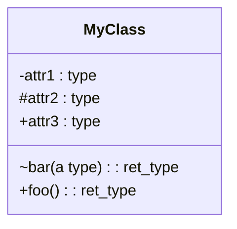
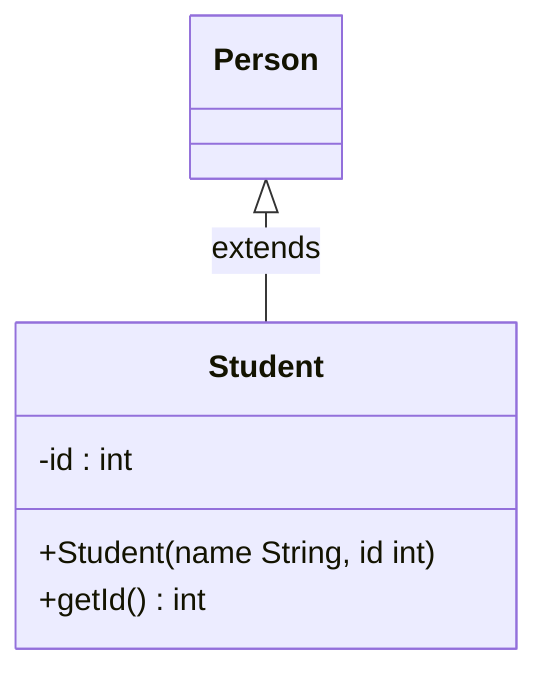
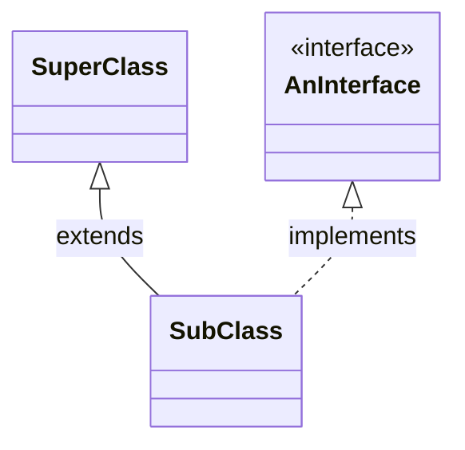
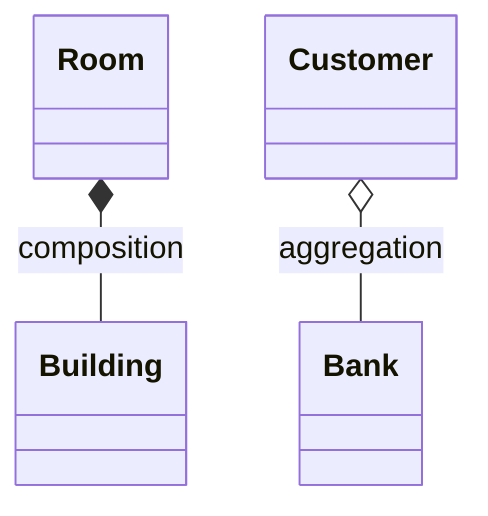

# CSE 403: UML Class Diagrams

**UML** (Unified Modeling Language) is a standardized notation for modeling object-oriented systems. Developed in the mid-1990s and continuously improved since, UML provides a collection of diagram types that represent a system from different viewpoints. In CSE 403, UML class diagrams are used primarily for visualization and discussion — as a communication tool, not as a rigid specification language.

## What is UML?

UML is a collection of diagram types, each capturing a different aspect of a system:

- **Use case diagrams**: show what the system does from a user's perspective — actors, use cases, and their relationships.
- **Component diagrams**: show the high-level software components and their dependencies.
- **Class and object diagrams**: show the static structure of the system — classes, their attributes and methods, and the relationships between them.
- **Sequence diagrams**: show how objects interact over time — the order of method calls in a scenario.
- **Statechart diagrams**: show the state machine of an object — the states it can be in and the transitions between them.

This note focuses on **class diagrams**, which are the most commonly used diagram type in design discussions.

## Why Use UML Diagrams?

UML class diagrams serve two distinct purposes:

### Communication (Forward Design)

Used before coding, during the design phase. Engineers draw diagrams on whiteboards or paper to brainstorm ideas, draft an initial design, and iterate over it with the team. This is the primary use in CSE 403.

- Brainstorm ideas before committing to code.
- Draft and iterate over software design with teammates.
- Communicate design decisions clearly across the team.

### Documentation (Backward Design)

Used after coding, to document the structure of existing code. Tools can often automatically generate UML class diagrams directly from source code. This is useful for onboarding new engineers or understanding an unfamiliar codebase.

The trade-off: a diagram generated from code is always up to date but may be too detailed to be readable; a diagram drawn by hand is selective and readable but may become stale as code evolves.

## Classes vs. Objects

UML class diagrams model **classes** and their relationships, not individual objects (instances). The distinction:

| Concept | Definition | Example |
|---|---|---|
| Class | A grouping of similar objects; an abstraction of common properties and behavior | `Student`, `Car` |
| Object | A specific entity from the real world; an instance of a class | `Joe (ID 4711)`, `Audi A6` |

A class diagram shows the template (the class); an object diagram shows a snapshot of specific instances at runtime. In practice, class diagrams are used far more often.

## UML Class Diagram: Basic Notation

A class in UML is represented as a rectangle divided into three horizontal sections:



### Sections

1. **Name** (top section): the class name, centered and often bold.
2. **Attributes** (middle section): the class's fields/instance variables. Format: `<visibility> <name> : <type>`.
3. **Methods** (bottom section): the class's operations. Format: `<visibility> <name>(<param>*) : <return type>`, where each `<param>` is `<name> : <type>`.

### Visibility Modifiers

| Symbol | Meaning |
|---|---|
| `-` | private |
| `~` | package-private (package visibility) |
| `#` | protected |
| `+` | public |

### Static Members

Static attributes or methods (class-level, not instance-level) are shown **underlined** in UML notation. For example, a static factory method `+ create() : MyClass` would appear underlined.

### Level of Detail

The level of detail shown in a class box varies with context and purpose. In a high-level architecture discussion, you might show only the class name. When discussing a specific interface, you show all public methods. When designing a component, you show full attribute and method signatures. There is no single correct level of detail — it depends on what the diagram is meant to communicate.

## Concrete Example: Class Diagram with Inheritance

The mapping from Java code to UML:

```java
public class Student extends Person {
    private int id;
    public Student(String name, int id) { ... }
    public int getId() { return this.id; }
}
```

Maps to a UML class box:



The hollow arrowhead pointing from `Student` to `Person` represents the **is-a relationship** (inheritance / `extends`).

## Classes, Abstract Classes, and Interfaces

Three types of classifiers are distinguished in UML:

| Type | UML Notation | Java Equivalent |
|---|---|---|
| Concrete class | Plain rectangle with class name | `public class MyClass` |
| Abstract class | Rectangle with `{abstract}` below the name | `public abstract class MyAbstractClass` |
| Interface | Rectangle with `<<interface>>` stereotype above the name | `public interface MyInterface` |

Abstract methods within an abstract class are typically shown in italics.

## Relationships Between Classes

The most important part of a class diagram is the relationships between classes. UML defines several distinct relationship types, each with specific semantics and notation.

### Inheritance (Is-a Relationship)

- **Extends** (class to superclass): solid line with a hollow triangular arrowhead pointing to the superclass.
- **Implements** (class to interface): dashed line with a hollow triangular arrowhead pointing to the interface.



Code equivalent: `public class SubClass extends SuperClass implements AnInterface`

### Aggregation and Composition (Has-a Relationship)

Both aggregation and composition model the "has-a" relationship — a Whole contains Parts. They differ in the strength of the ownership:

| Dimension | Aggregation | Composition |
|---|---|---|
| UML symbol | Hollow diamond on the Whole end | Filled diamond on the Whole end |
| Part's existence | Part can exist independently of Whole | Part cannot exist without Whole |
| Lifetime | Part's lifetime is independent | Part's lifetime is tied to Whole |
| Ownership | Part may be shared among multiple Wholes | Part is exclusively owned by one Whole |



**Examples from the slides**:
- `Room` and `Building`: **Composition** — a Room cannot exist without its Building. If the Building is destroyed, its Rooms cease to exist. One Building is the single exclusive owner of each Room.
- `Customer` and `Bank`: **Aggregation** — a Customer can exist independently of any Bank. A Customer might have accounts at multiple Banks. The Bank does not own the Customer.

The question of whether to use aggregation or composition is often subtle. For "class and students": aggregation (a student can exist independently of a given class, and may be enrolled in multiple classes). For "body and body parts": composition (a body part cannot meaningfully exist without the body it belongs to).

### Multiplicity

Multiplicity annotations on association lines describe how many instances of one class are associated with each instance of the other class.

| Notation | Meaning |
|---|---|
| `1` | Exactly one |
| `0..1` | Zero or one (optional) |
| `*` | Zero or more (any number) |
| `1..*` | One or more (at least one) |
| `1..2` | One or two |
| `0..500` | Zero to five hundred |

Reading multiplicity: the annotation near a class describes how many of that class are associated with one instance of the class at the other end of the line.

Example: `A —1..2——*— B` means: each `A` is associated with any number of `B`s; each `B` is associated with exactly one or two `A`s.

### Navigability

Navigability indicates the direction in which an association can be traversed (i.e., which object holds a reference to the other):

| Notation | Meaning |
|---|---|
| Plain line (no arrow) | Navigability not specified |
| Arrow pointing to B: `A ——> B` | Unidirectional — "can reach B from A"; A holds a reference to B |
| Arrows at both ends: `A <——> B` | Bidirectional — both objects hold references to each other |

## Comprehensive Example: Insulin Pump System

The slides show a real UML class diagram for a medical device — an insulin delivery system with a continuous glucose monitor (CGM). Key elements visible in this diagram demonstrate all the concepts above:

- `TimedDevice` is an `<<interface>>` with one method `+performTimedAction(a: Action)`.
- `CGMsensor` implements `TimedDevice` (dashed arrow).
- `AbstractCGMreceiver` is an abstract class with protected fields (`#dailyData`, `#batteryLevel`, etc.) and public methods.
- `Alert`, `Measurement`, and `Pump` are concrete classes.
- `Action` is shown as an `<<enumeration>>` with values `BATTERY`, `GLUCOSE`, `INSULIN`, `BASAL`, `MEASURE`.
- The `ReminderTimer` class has composition relationships to lists of `TimedDevice` objects.
- Multiplicity annotations like `0..*`, `0..500`, `3..*`, and `1` appear throughout.

This diagram illustrates how a real engineering team would use UML to communicate the structure of a safety-critical system before or alongside implementation.

---

## Related

- [[Software Architecture Patterns]]
- [[Software Design Theory]]

## Industry Standard Terms

| CSE 403 Term | Industry / Research Equivalent |
|---|---|
| UML | Unified Modeling Language (ISO/IEC 19501 standard) |
| Class diagram | UML class diagram (standard term) |
| Is-a relationship | Inheritance, generalization |
| Has-a relationship | Association, aggregation, composition |
| Aggregation | Aggregation (standard UML term, open diamond) |
| Composition | Composition (standard UML term, filled diamond) |
| Multiplicity | Cardinality, multiplicity (standard UML term) |
| Navigability | Navigability (standard UML term) |
| `<<interface>>` stereotype | Interface (standard UML stereotype) |
| `{abstract}` constraint | Abstract class (standard UML notation) |
| Forward design | Forward engineering, design-first |
| Backward design | Reverse engineering, code-first documentation |
