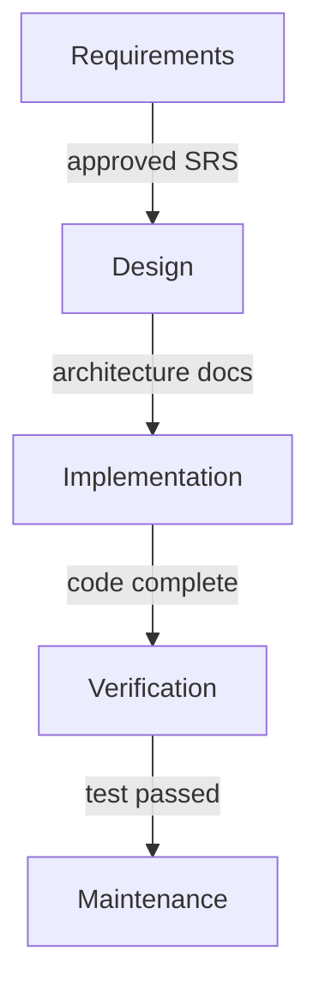
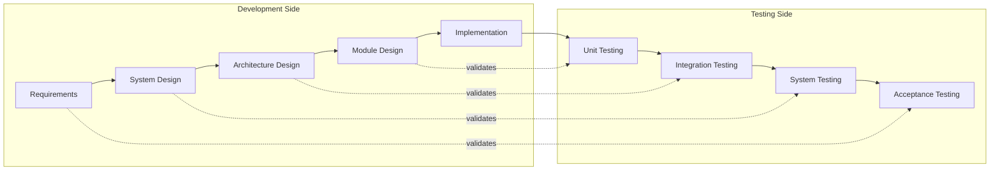
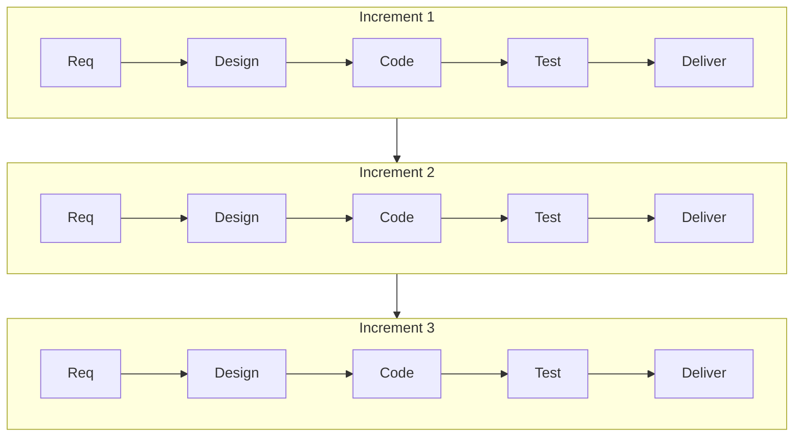
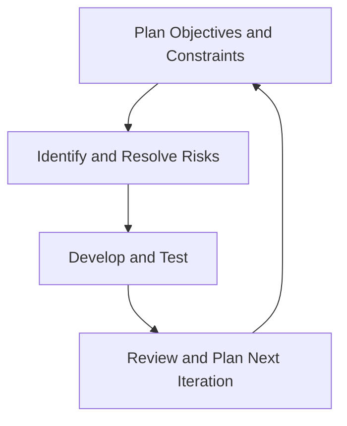
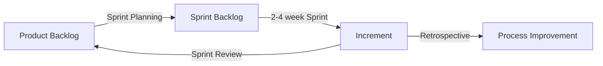

# CSE 403: Software Development Life Cycle (SDLC) Models

The **Software Development Life Cycle (SDLC)** is the structured process by which software is conceived, designed, built, tested, deployed, and maintained. Different **SDLC models** prescribe different orderings and emphases of these phases. Choosing a model is not just an organizational preference — it directly determines how risk is managed, how requirements are gathered, and how teams respond to change.

---

## Why Models Matter

Raw software development without a defined process leads to **ad-hoc chaos**: no predictable schedule, no clear ownership, and no systematic way to handle defects or changing requirements. SDLC models impose discipline by defining:

- **Phases**: discrete stages of work (e.g., requirements, design, implementation)
- **Artifacts**: the outputs of each phase (e.g., SRS documents, UML diagrams, test plans)
- **Transitions**: the criteria that must be met before moving from one phase to the next

Different models make fundamentally different assumptions about how stable requirements are, how much customer involvement is feasible, and how tolerant the project is of late-stage changes.

---

## Core Phases (Shared Across Models)

Most SDLC models involve some version of these phases:

1. **Requirements** — What does the software need to do?
2. **Design** — How will the system be structured to satisfy those requirements?
3. **Implementation** — Writing the actual code
4. **Verification / Testing** — Does the software meet its requirements?
5. **Maintenance** — Ongoing fixes and evolution after deployment

The models differ primarily in how these phases are ordered, how often they repeat, and how strictly each phase must be completed before the next begins.

---

## Waterfall Model

The **Waterfall Model** is the original sequential SDLC model, introduced by Winston Royce (1970), though Royce himself noted its inherent risks. It arranges all phases in a strict linear sequence — each phase must be fully completed and signed off before the next begins.

### How it Works

The defining characteristic of Waterfall is its **phase-gate discipline**: no phase begins until its predecessor is formally closed. The output of each phase is a document or artifact that serves as the input specification for the next phase. For example, the requirements phase produces a **Software Requirements Specification (SRS)**, which the design phase uses to produce architectural documents, and so on.

The rationale is that errors are cheapest to fix early. A mistake discovered in the requirements phase costs very little to correct — it is just changing a document. The same mistake discovered after deployment may require rewriting substantial portions of the system.

### Why Waterfall Fails in Practice

The core problem with Waterfall is that it assumes requirements are **fully known, stable, and correct at the start**. In reality:

- Customers often cannot articulate complete requirements upfront
- Requirements change as the business evolves
- Design problems may only become visible during implementation
- Testing may reveal that the design was fundamentally flawed

Because Waterfall treats backward movement as an exception (and a costly one), it is poorly suited to projects where change is expected. A late-discovered requirement change can require cascading revisions through design, implementation, and test documents.

### When Waterfall Is Appropriate

Waterfall remains appropriate when:
- Requirements are contractually fixed (e.g., government contracts)
- The domain is well-understood (building the tenth similar system)
- Regulatory compliance requires formal phase sign-offs (e.g., aerospace, medical devices)

---

## V-Model

The **V-Model** is a refinement of Waterfall that makes the relationship between development phases and testing phases explicit. Rather than treating testing as a single phase at the end, the V-Model pairs each development phase with a corresponding verification or validation activity.

### How it Works

The left side of the "V" represents the decomposition of requirements down to implementation. The right side represents the recomposition through testing. The key insight is that **each testing phase verifies the artifacts of its paired development phase**:

- **Unit Testing** verifies that individual modules match the Module Design
- **Integration Testing** verifies that assembled components match the Architecture Design
- **System Testing** verifies that the full system meets the System Design specification
- **Acceptance Testing** verifies that the delivered system meets the original Requirements

This pairing forces test plans to be written concurrently with the corresponding design documents — before implementation begins. This is a significant improvement over Waterfall, where test planning is often an afterthought.

### Strengths and Limitations

The V-Model shares Waterfall's assumption of stable requirements. It is still sequential and does not iterate. However, by forcing test planning early, it catches **specification ambiguities** that would otherwise only be discovered at the end.

---

## Incremental / Iterative Models

**Incremental models** decompose the system into a series of smaller deliverable subsets, called **increments**, and deliver them one at a time. Each increment is a fully working, tested portion of the system. The customer receives value continuously rather than all at once at the end.

**Iterative models** go further: rather than building distinct pieces, you build the entire system repeatedly, refining it with each pass. The first iteration is a rough prototype; each subsequent iteration adds correctness, completeness, and features based on feedback.

The distinction is subtle:
- **Incremental**: build the whole system piece by piece (add features)
- **Iterative**: build the whole system repeatedly (refine the whole)

In practice, most modern methodologies combine both.

---

## Spiral Model

The **Spiral Model**, proposed by Barry Boehm (1988), is risk-driven. Each "loop" of the spiral consists of four quadrants: planning, risk analysis, engineering, and evaluation. The model is specifically designed to handle projects with high uncertainty by making risk assessment an explicit, recurring activity.

### How Each Loop Works

1. **Plan**: Identify objectives for this loop, constraints, and alternative approaches
2. **Risk Analysis**: Evaluate each alternative, identify risks, and resolve the most critical ones — often by building a **prototype**
3. **Engineering**: Develop and test the product for this loop
4. **Customer Evaluation**: Review the results with stakeholders; plan the next loop

The spiral starts in the center (early loops are cheap prototyping exercises) and expands outward as the system becomes more defined and the investment increases.

### Why Risk Analysis is Central

The Spiral Model recognizes that the single biggest cause of project failure is **unresolved risk** — technical uncertainty, unclear requirements, or business feasibility questions that are never formally addressed. By forcing a risk assessment every loop, the model ensures that the team is always working on the highest-risk items first. If a risk cannot be resolved (e.g., the technology is not feasible), the project is terminated early before massive investment is wasted.

---

## Rational Unified Process (RUP)

The **Rational Unified Process (RUP)** is an iterative software development framework developed by Rational Software (later IBM). It organizes work along two axes: **phases** (time-based milestones) and **disciplines** (types of work).

### Phases

| Phase | Focus |
|---|---|
| **Inception** | Scope, feasibility, initial cost estimate |
| **Elaboration** | Architecture, risk mitigation, refined requirements |
| **Construction** | Iterative development of the system |
| **Transition** | Deployment, user training, final testing |

### Disciplines

RUP defines nine disciplines that occur across all phases but with varying intensity:
- Business Modeling, Requirements, Analysis & Design, Implementation, Test, Deployment, Configuration & Change Management, Project Management, Environment

The key insight is that **all disciplines are active in all phases** — you do some testing in Inception, some requirements work in Construction. The emphasis just shifts. This is a direct departure from Waterfall's sequential "one discipline at a time" approach.

---

## Agile Methods

**Agile** is a family of methodologies united by the values articulated in the **Agile Manifesto** (2001):

- Individuals and interactions over processes and tools
- Working software over comprehensive documentation
- Customer collaboration over contract negotiation
- Responding to change over following a plan

Agile does not prescribe a single process; it is a philosophy. Concrete Agile methodologies include **Scrum**, **Extreme Programming (XP)**, and **Kanban**.

### Scrum

**Scrum** is an Agile framework that organizes work into **Sprints** — fixed-length iterations (typically 2–4 weeks) that each produce a potentially shippable product increment.

Key roles:
- **Product Owner**: Maintains and prioritizes the **Product Backlog** (the ordered list of all desired features)
- **Scrum Master**: Facilitates the process, removes impediments
- **Development Team**: Self-organizing team that does the work

Key artifacts:
- **Product Backlog**: The full list of desired features, maintained by the Product Owner
- **Sprint Backlog**: The subset of Product Backlog items committed to for the current Sprint
- **Increment**: The working software produced at the end of a Sprint

Key events:
- **Sprint Planning**: Team selects items from the Product Backlog and defines the Sprint Goal
- **Daily Scrum (Stand-up)**: 15-minute daily sync — what did you do, what will you do, any blockers?
- **Sprint Review**: Demo of completed work to stakeholders
- **Sprint Retrospective**: Team reflects on process improvements

### Extreme Programming (XP)

**Extreme Programming (XP)** is an Agile methodology that emphasizes engineering practices. Where Scrum focuses on project management, XP focuses on the technical practices that make fast iteration sustainable:

- **Test-Driven Development (TDD)**: Write tests before writing code
- **Pair Programming**: Two developers work together at one machine
- **Continuous Integration**: Code is integrated and tested multiple times per day
- **Refactoring**: Continuously improve code structure without changing behavior
- **Simple Design**: Always implement the simplest design that works
- **Small Releases**: Release frequently to get real feedback

XP operates in short iterations (1–2 weeks) with the customer on-site and available continuously.

---

## Choosing a Model

| Model | Best When |
|---|---|
| Waterfall | Requirements fixed, domain well-understood, regulatory compliance required |
| V-Model | Safety-critical systems requiring rigorous verification traceability |
| Incremental | Can prioritize features; customer needs early partial delivery |
| Spiral | High-risk, innovative projects with significant technical uncertainty |
| RUP | Large teams, complex architecture, need for disciplined iterative approach |
| Scrum | Changing requirements, need rapid delivery, strong customer involvement |
| XP | Technically complex, small team, engineering quality is paramount |

---

## Related

- [[Waterfall Details]]
- [[Agile and Scrum Details]]
- [[Requirements Engineering]]
- [[Testing Fundamentals]]

---

## Industry Standard Terms

| Course Term | Industry / Standard Term |
|---|---|
| SDLC Model | Software Process Model |
| Sprint | Iteration (in generic Agile), Time-box |
| Product Backlog | Feature Backlog, Icebox |
| Sprint Retrospective | Iteration Retrospective, Post-mortem |
| Increment | Release Candidate, Shippable Product Increment |
| V-Model | Verification and Validation (V&V) Model |
